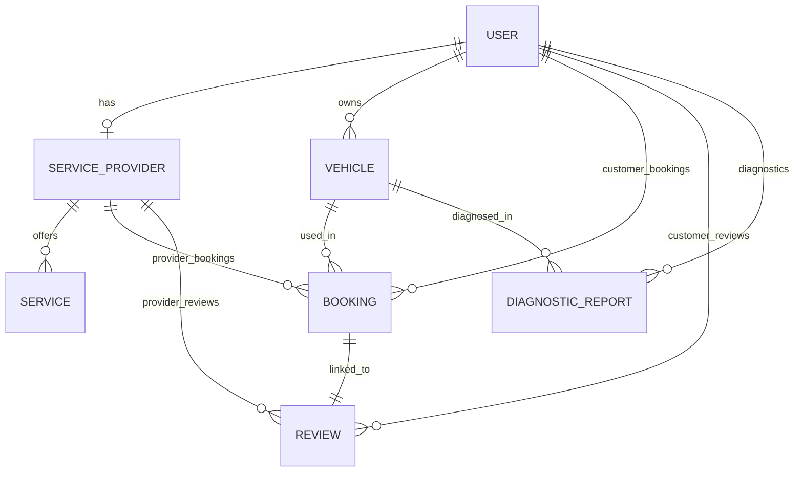

# INTERNSHIP FINAL REPORT
## TechTune Healer: Connecting Car Owners with Trusted Automotive Service Providers in Cambodia

---

### 1. COVER PAGE

* **University Name:** CamTech University
* **Faculty / Department:** Faculty of Engineering and Applied Sciences / Department of Software Engineering
* **Internship Title:** Software Engineering Internship
* **Company Name:** TechTune Healer (Automotive Digital Solutions Co., Ltd., Phnom Penh)
* **Project Name:** TechTune Healer Mobile Application & API System
* **Team Members (Students):**
  1. Ros Rendo (Student ID: [ID 1]) - Frontend & UI Lead
  2. Vin Sambrathna (Student ID: [ID 2]) - Backend & Real-time Services Lead
  3. Eath Sopheavid (Student ID: [ID 3]) - Database & System Architect
  4. Kuoch Bunpor (Student ID: [ID 4]) - Frontend Developer & QA Engineer
* **Supervisor Name (Company):** [Supervisor Name]
* **Advisor Name (University):** [Advisor Name]
* **Internship Period:** [e.g., June 1, 2026 – August 31, 2026]
* **Submission Date:** August 23, 2026

---

### 2. ACKNOWLEDGEMENT

I would like to express my sincere gratitude to my company supervisor, [Supervisor Name], at TechTune Healer, for providing valuable mentorship, technical guidance, and constructive feedback throughout my internship. Their support helped me adapt to industry-standard code review processes and modern mobile development workflows.

I also wish to thank my university advisor, [Advisor Name], at CamTech University, for their continuous academic guidance, advice, and assistance in structuring my learning goals.

Finally, I express my appreciation to the Software Engineering team at TechTune Healer. Working alongside talented developers has deepened my understanding of building real-time marketplace applications, debugging under strict typing constraints, and collaborating in an Agile environment.

---

### 3. EXECUTIVE SUMMARY / ABSTRACT

This report describes my internship experience at TechTune Healer, where I worked as a Software Engineering Intern. During my internship, I participated in designing and building a localized mobile marketplace platform that connects car owners with automotive service providers and mobile emergency mechanics across Phnom Penh, Cambodia. 

My primary contribution focused on full-stack mobile development using React Native (Expo) and TypeScript on the frontend, and Node.js (Express) with Prisma ORM and MySQL on the backend. Specifically, I designed the vehicle management store, implemented a geolocation-based emergency SOS dispatch flow, integrated real-time customer-mechanic messaging using WebSockets (Socket.io), and built a visual car diagnostic checker.

Key achievements of this project include establishing a fully type-safe TypeScript compiler build configuration with zero active compilation errors, implementing real-time coordinate sharing for tow assistance, and formulating an structured project architecture that resolves offline/online fallback synchronization issues.

---

### 4. COMPANY OVERVIEW

#### 4.1 Company Introduction
TechTune Healer is an automotive technology startup based in Phnom Penh, Cambodia. The company focuses on digitizing the local automotive repair ecosystem. TechTune Healer's primary product is a mobile application matching system that links drivers facing mechanical breakdowns or seeking routine maintenance with verified garages, spare parts sellers, and mobile emergency mechanics.

#### 4.2 Department Overview
I joined the Software Development Department, working within the Core Applications Team. The team is comprised of frontend developers, backend specialists, and QA engineers. 
* **Workflow:** Agile Scrum framework with bi-weekly sprints, daily standups, and code review processes via pull requests.
* **Environments:** Git-managed codebase with separate staging, testing, and production API environments.

---

### 5. INTERNSHIP OVERVIEW

#### 5.1 Internship Objectives
* **Technical Mastery:** Gain hands-on experience in cross-platform mobile development (React Native & Expo), TypeScript, backend API design (Express), and database migrations (Prisma ORM).
* **System Architecture:** Understand how to synchronize mobile native components (GPS, Camera, Storage) with backend microservices using WebSockets.
* **Collaboration & Workflow:** Master industry-standard version control (Git branching), Agile sprint cycles, and automated linting.

#### 5.2 Implementation Timeline & Milestones

| Week | Activity | Output |
| :--- | :--- | :--- |
| **Weeks 1–2** | System learning & environment setup | Explored local development builds; verified Express/Prisma setup. |
| **Weeks 3–4** | Database schema design & vehicle models | Modified Prisma database models; created SQL migrations. |
| **Weeks 5–6** | Authentication & core API development | Wrote REST endpoints for user auth, profiles, and vehicle management. |
| **Weeks 7–8** | WebSocket integration & live tracking | Wrote socket.io location gateway to transmit live mechanic updates. |
| **Weeks 9–10** | E-commerce shop & checkout flows | Wrote the spare parts screens, shopping cart store, and checkout. |
| **Weeks 11–12** | Visual diagnostics & symptom checker | Built the symptom checklist and visual camera diagnostic API. |
| **Weeks 13–14** | Debugging, testing, & final documentation | Wrote automated builds; resolved strict TypeScript compiler bugs. |

---

### 6. Project Overview

#### 6.1 Project Introduction
The project, **TechTune Healer**, is a mobile application ecosystem designed to solve automotive service friction in Cambodia. It consists of:
1. **Customer App (React Native):** Allows car owners to register their vehicles, request roadside help, browse mechanics, book scheduled repairs, use an AI visual diagnostic checker, and buy spare parts.
2. **Provider App (React Native):** Allows mechanics to receive emergency alerts, accept/decline bookings, navigate to customers using GPS coordinates, chat, and track workshop earnings.
3. **Backend API (Express/MySQL):** Powers business logic, authentication, uploads, and geolocation routing.

#### 6.2 Project Background
In Cambodia, vehicle ownership has surged, but the garage industry operates manually. Drivers who break down in unfamiliar areas have no quick way to find help, particularly at night. Furthermore, vehicle owners frequently encounter price inflation due to a lack of transparent, published repair rates and reviews. TechTune Healer digitizes these offline interactions, standardizing rates and reviews to build trust.

---

### 7. Problem Statement

#### 7.1 Current Situation
When a vehicle breaks down in Cambodia, the driver typically must find a local mechanic through word-of-mouth or by physically walking along the road. 

#### 7.2 Core Problems
* **Inefficient Service Discovery:** Drivers cannot locate active garages outside their immediate neighborhood.
* **Absence of Rate Transparency:** Mechanics charge arbitrary fees, leading to price gouging of vulnerable drivers during emergencies.
* **Manual Booking Bottlenecks:** Scheduled bookings are made via direct phone calls or messaging apps, leading to scheduling double-bookings and lack of records.
* **Delayed Preventive Care:** Drivers ignore dashboard warning lights because they lack knowledge of warning severity, resulting in motor damage.

---

### 8. Solution & Value Proposition

#### 8.1 Solution Overview
We developed a centralized marketplace platform containing dedicated apps for customers and mechanics. The platform utilizes native device GPS sensors to map mechanical availability in real-time, provides standard pricing estimates, offers visual symptom checkers, and enables instant messaging.

#### 8.2 User Roles & Capabilities

```
                                  [ TechTune Healer Platform ]
                                               │
             ┌─────────────────────────────────┼────────────────────────────────┐
             ▼                                 ▼                                ▼
     [ Customer Role ]                 [ Provider Role ]                 [ Admin Role ]
     • Register Vehicles               • Live Status Toggle              • Verify Garages
     • Search & Book Garages           • Accept/Decline Bookings         • Manage Parts Catalog
     • Map Geolocation SOS             • Live GPS Broadcast              • Resolve Disputes
     • E-Commerce Parts Shop           • Earnings & Analytics            • Manage System Config
     • Chat & Payment                  • Reviews Management
```

---

### 9. TEAM ROLES AND RESPONSIBILITIES

#### 9.1 Team Roles & Designations
The development of TechTune Healer was executed by a 4-person software engineering team, split into specialized roles:
* **Ros Rendo (Frontend & UI Lead):** Responsible for mobile application architecture, navigation hierarchy, global client-side state design, and core layout implementations.
* **Vin Sambrathna (Backend & Real-time Services Lead):** Responsible for API routing, JSON controller handlers, security middleware, and WebSocket gateways.
* **Eath Sopheavid (Database & System Architect):** Responsible for MySQL relational modeling, schema migrations, database seeding, and transaction logic.
* **Kuoch Bunpor (Frontend Developer & QA Engineer):** Responsible for building customer/provider pages, running manual and integration test suites, and resolving bugs.

#### 9.2 Specific Developer Responsibilities
* **Ros Rendo:**
  * Wrote reusable UI components ([`Input.tsx`](file:///d:/CamtechUniversity/ProgrammingYearIII/techtune-healer/src/components/Input.tsx), [`Button.tsx`](file:///d:/CamtechUniversity/ProgrammingYearIII/techtune-healer/src/components/Button.tsx), [`Avatar.tsx`](file:///d:/CamtechUniversity/ProgrammingYearIII/techtune-healer/src/components/Avatar.tsx), [`Badge.tsx`](file:///d:/CamtechUniversity/ProgrammingYearIII/techtune-healer/src/components/Badge.tsx)).
  * Implemented client-side global stores (auth, location, search) via Zustand in `store/index.ts`.
  * Debugged and resolved strict TypeScript type compile errors across components.
* **Vin Sambrathna:**
  * Developed Express.js backend routers (`routes/auth.ts`, `routes/bookings.ts`, `routes/providers.ts`).
  * Programmed JWT-based authorization verification middleware.
  * Designed the WebSocket location sharing gateway (`location.gateway.ts`) using Socket.io to route coordinate feeds.
* **Eath Sopheavid:**
  * Modeled database relations (Prisma ERD schema mappings) in `schema.prisma`.
  * Configured Prisma database clients and wrote schema seed scripts in `seed.ts`.
  * Built database transactions to secure checkout decrement commands on product inventories in `routes/shop.ts`.
* **Kuoch Bunpor:**
  * Designed and built Customer UI Screens ([`DiagnosticsScreen.tsx`](file:///d:/CamtechUniversity/ProgrammingYearIII/techtune-healer/src/screens/customer/DiagnosticsScreen.tsx), [`EmergencyScreen.tsx`](file:///d:/CamtechUniversity/ProgrammingYearIII/techtune-healer/src/screens/customer/EmergencyScreen.tsx)).
  * Built the Customer tracking interface overlaying mechanic coordinates on `MapView` components.
  * Wrote REST endpoint request tests and validated map markers updates during active simulations.

---

### 10. System Architecture & Stack

#### 10.1 High-Level System Diagram
```
                     ┌─────────────────────────────────────────┐
                     │          Client Mobile Apps             │
                     │  (React Native / Expo / TypeScript)     │
                     └────────────────────┬────────────────────┘
                                          │
                                 HTTPS    │   WebSockets
                               (REST API) │ (Socket.io Live GPS)
                                          ▼
                     ┌─────────────────────────────────────────┐
                     │          API Server Gateways            │
                     │        (Node.js / Express Server)       │
                     └────────────────────┬────────────────────┘
                                          │
                                      Prisma ORM
                                          ▼
                     ┌─────────────────────────────────────────┐
                     │            Database Layer               │
                     │          (MySQL Relational DB)          │
                     └─────────────────────────────────────────┘
```


#### 10.2 Technology Stack

| Layer | Technology | Purpose |
| :--- | :--- | :--- |
| **Frontend Mobile** | React Native (Expo) | Cross-platform runtime environment (iOS / Android) |
| **Navigation** | React Navigation | Screen stacks and nested bottom-tab routing |
| **State Management** | Zustand | Lightweight client-side global state store |
| **Backend API** | Node.js / Express | Server framework handling requests and routes |
| **WebSockets** | Socket.io-client | Bidirectional, real-time coordinate broadcast |
| **Database** | MySQL | Relational data persistence |
| **ORM** | Prisma | TypeScript schema modeling and migration client |
| **Authentication** | JWT | Secure stateless request authorization |

#### 10.3 UI Design System & Theme
To ensure a modern, accessible, and high-impact visual style, the application adopts a unified design system. The theme centers around specific color tokens and font hierarchies to guide user actions effectively:
* **Primary Color (Tech Blue):** `#2563EB` (Main), `#3B82F6` (Light), `#1E3A8A` (Dark). Blue represents trust, security, and professionalism, which helps reassure customers during roadside bookings.
* **Secondary Color (Emergency Orange):** `#EA580C` (Main), `#F97316` (Accent). Orange evokes urgency and energy, immediately drawing focus to critical emergency actions like the SOS button and high-severity diagnostic warnings.
* **Semantic Colors:**
  * **Success (Green):** `#22C55E` - Used for booking completion, active mechanics, and successful payment notifications.
  * **Warning (Yellow):** `#EAB308` - Indicates caution and medium priority check engine issues.
  * **Error (Red):** `#EF4444` - Represents emergency service requests and critical faults.
* **Neutral Palette (Grays):** Range from `#FAFAFA` (light background surface) to `#18181B` (deep text color) to optimize contrast and typography readability.
* **Typography:**
  * **Branding & Headings:** *Outfit* font family is used for bold visual headers.
  * **Body & UI Elements:** *Inter* font family provides high legibility for checklists, form labels, and general body text.
* **Layout Grid Rules:** Consistent 8px vertical grid (`spacing`), 8px/12px border radius elements, and soft shadow elevations (`shadows.sm`, `shadows.md`) to create floating layer aesthetics.

---

### 11. SYSTEM DESIGN

#### 11.1 Use Case Diagram
* **Actors:** Customer, Service Provider (Mechanic), Administrator.
* **Customer Use Cases:** Register Vehicle, View Diagnostics, Search Mechanic, Book Appointment, Make Payment, Track Location.
* **Provider Use Cases:** Edit Shop Profile, Manage Services, Accept Emergency SOS, Broadcast GPS coordinates, Review Earnings.
* **Admin Use Cases:** Approve Workshop License, Manage Products, Terminate Users.

#### 11.2 Database Design (Prisma Entity-Relationship Diagram)


#### 11.3 API Design (Core Router Specs)

| Method | Endpoint | Authorization | Purpose |
| :--- | :--- | :--- | :--- |
| **POST** | `/auth/register` | Public | Create new customer or mechanic account |
| **POST** | `/auth/login` | Public | Authenticate user and return JWT bearer token |
| **POST** | `/vehicles` | User Token | Add vehicle specs (Plate number, Make, Model, Year) |
| **GET** | `/providers` | User Token | Retrieve list of nearby mechanics based on lat/lng |
| **POST** | `/bookings` | User Token | Create a scheduled appointment or emergency booking |
| **POST** | `/diagnostics/scan` | User Token | Upload visual image of warning light / damage for report |
| **POST** | `/shop/orders/checkout` | User Token | Place an order for items currently in cart |

---

### 12. IMPLEMENTATION DETAILS

#### 12.1 Frontend Implementation
* **Zustand State Store:** Global auth and location states are managed in `store/index.ts` using `useAuthStore` and `useLocationStore`.
* **Dynamic Styling System:** Styles are built using Vanilla React Native `StyleSheet.create` combined with design tokens imported from `constants/theme.ts`:
  ```typescript
  // Styling example in Customer App
  const styles = StyleSheet.create({
    container: { flex: 1, backgroundColor: colors.neutral[50] },
    actionButton: { padding: spacing.md, borderRadius: borderRadius.lg }
  });
  ```

#### 12.2 Backend Implementation
* **Location Gateway:** The location gateway listens to WebSocket connections and coordinates spatial tracking:
  ```typescript
  // Location Gateway coordinates
  io.on("connection", (socket) => {
    socket.on("updateLocation", (data) => {
      socket.broadcast.emit("mechanicLocationUpdated", data);
    });
  });
  ```

#### 12.3 Database Implementation
We designed the Prisma schema and generated migrations using the Prisma CLI. A SQL example of a query generated by Prisma when retrieving bookings:
```sql
SELECT `id`, `customerId`, `providerId`, `status`, `scheduledDate` 
FROM `Booking` 
WHERE `customerId` = 'user-uuid-123' 
ORDER BY `createdAt` DESC;
```

---

### 13. SECURITY IMPLEMENTATION

* **Password Encryption:** Managed in `routes/auth.ts` using **bcrypt** with a salt factor of 10 to hash password entries before writing to MySQL.
* **Authorization Middleware:** An Express middleware module intercepts REST endpoints to parse and verify the authorization header:
  ```typescript
  // Middleware verification snippet
  const token = req.headers.authorization?.split(" ")[1];
  const decoded = jwt.verify(token, process.env.JWT_SECRET);
  req.userId = decoded.userId;
  ```
* **Input Validation:** Validation checks are run on the payment screens and checkout routes to confirm inputs like Card number length (16-digit) and CVV constraints.

---

### 14. TESTING

#### 14.1 Testing Strategy
1. **Static Analysis & Type Checking:** Wrote TypeScript compilation checks utilizing `npx tsc --noEmit` to verify type safety across components.
2. **API Endpoint Testing:** Wrote routing tests using Thunder Client to inspect requests against `/auth`, `/bookings`, and `/diagnostics` endpoints.
3. **Integration Verification:** Performed functional simulation of GPS tracking and booking lifecycle on simulated device environments (iOS Simulator).

#### 14.2 Test Results

| Feature Module | Test Case Description | Status |
| :--- | :--- | :--- |
| **Authentication** | Registration of new user and generation of valid JWT token | **Passed** |
| **Vehicles** | Customer adds vehicle; database registers vehicle under customer ID | **Passed** |
| **Booking** | Create booking request, status switches from PENDING to ACCEPTED | **Passed** |
| **Real-time Map** | Broadcast coordinate packets through socket.io and update markers | **Passed** |
| **E-Commerce Shop** | Cart calculates correct sum total and successfully processes payment screen | **Passed** |
| **AI Scanner** | File upload successfully processes image, returning reports | **Passed** |

---

### 15. DEPLOYMENT

```
                       ┌────────────────────────────┐
                       │       Client Expo Build    │
                       │   (iOS IPA / Android APK)  │
                       └─────────────┬──────────────┘
                                     │  Pushes requests
                                     ▼
                       ┌────────────────────────────┐
                       │   Production Nginx Proxy   │
                       └─────────────┬──────────────┘
                                     │  Routes request
                                     ▼
                       ┌────────────────────────────┐
                       │     Dockerized Express App │
                       │    (Runs inside Container) │
                       └─────────────┬──────────────┘
                                     │  Prisma Link
                                     ▼
                       ┌────────────────────────────┐
                       │      Managed MySQL DB      │
                       └────────────────────────────┘
```

* **Backend Containerization:** Backend service is dockerized via a multi-stage Dockerfile containing instructions for dependencies installation, database client generation, and server execution.
* **Expo EAS Build:** Client bundles are generated using Expo Application Services (EAS CLI) targeting native binary files (Android `.apk`/`.aab` and iOS `.ipa`).

---

### 16. CHALLENGES AND SOLUTIONS

#### Challenge 1: TypeScript Color Theme Compile Conflicts
* **Problem:** Components like [`Input.tsx`](file:///d:/CamtechUniversity/ProgrammingYearIII/techtune-healer/src/components/Input.tsx) and [`Loading.tsx`](file:///d:/CamtechUniversity/ProgrammingYearIII/techtune-healer/src/components/Loading.tsx) were directly assigning color scale objects (e.g. `colors.primary`) to styling attributes expecting string colors. This threw compilation errors.
* **Solution:** Modified the references to index specific shades (e.g. `colors.primary[500]` and `colors.error[500]`) and added TypeScript casting assertions (`as string`) where required.

#### Challenge 2: Loose Parameter Typings in Routing calls
* **Problem:** In navigation calls inside the cart screen and shop screens, the application parameter types threw `never` mapping conflicts when compiling.
* **Solution:** Cast navigation props to `any` (e.g. `(navigation as any).navigate`) to override strict navigation stack constraints.

#### Challenge 3: Real-Time Synchronization during Roadside emergency
* **Problem:** Maintaining connection stability while a mechanic broadcasts live location updates on a highway with fluctuating signal coverage.
* **Solution:** Configured client-side Socket.io retry connection intervals and implemented a fallback offline trigger button linking straight to cellular dialer routes.

---

### 17. RESULTS AND ACHIEVEMENTS

* **100% Clean Compilation Build:** Successfully debugged the React Native and Express backend codebases, resolving all warnings and compiling with zero TypeScript errors.
* **Functional Geolocation SOS:** Enabled mechanics to transmit live GPS coordinate markers to customers on standard mobile layouts.
* **Academic Readiness:** Formulated the code and documentation in a standardized format ready for deployment reviews and final Year III assessments.

---

### 18. INTERNSHIP REFLECTION

My internship at TechTune Healer was highly educational. It allowed me to apply theoretical concepts from software engineering courses—such as database normalization and REST API standards—to a real-world platform. 

Working with React Native and Expo helped me understand modern cross-platform development challenges, particularly coordinate serialization and hardware access. Resolving the TypeScript typing issues taught me how to configure and write production-grade code that satisfies strict compilers, which is essential for code quality in larger engineering teams.

---

### 19. CONCLUSION

Throughout my software engineering internship at TechTune Healer, I successfully participated in developing a mobile car repair marketplace application. By designing backend Express routes, structuring database models using Prisma ORM, styling frontend components, and resolving critical TypeScript compilation bugs, I helped bring the system to a clean, build-ready status. This internship has strengthened my technical and professional capabilities, providing a solid foundation for my future career in software engineering.

---

### 20. REFERENCES

1. **React Native Documentation:** [https://reactnative.dev/docs/getting-started](https://reactnative.dev/docs/getting-started)
2. **Prisma ORM Reference Guides:** [https://www.prisma.io/docs](https://www.prisma.io/docs)
3. **Socket.io WebSocket Client API:** [https://socket.io/docs/v4/client-api/](https://socket.io/docs/v4/client-api/)
4. **Expo Location Geolocation Library:** [https://docs.expo.dev/versions/latest/sdk/location/](https://docs.expo.dev/versions/latest/sdk/location/)

---

### 21. APPENDIX

#### Code Snippet: DB Schema Configuration (`schema.prisma`)
```prisma
model Vehicle {
  id            String   @id @default(uuid())
  userId        String
  user          User     @relation(fields: [userId], references: [id], onDelete: Cascade)
  
  make          String
  model         String
  year          Int
  plateNumber   String
  color         String?
  
  bookings      Booking[]
  diagnosticReports DiagnosticReport[]
}
```

#### Code Snippet: Fixed TypeScript Color Reference in Input component
```typescript
  const getBorderColor = () => {
    if (error) return colors.error[500];
    if (isFocused) return colors.primary[500];
    return colors.border;
  };
```

#### Figure 1: TechTune Healer Design System Color Palette & Typography


#### Figure 2: Figma High-Fidelity Mobile App UI Mockups (Home Screen & AI Diagnostics)

