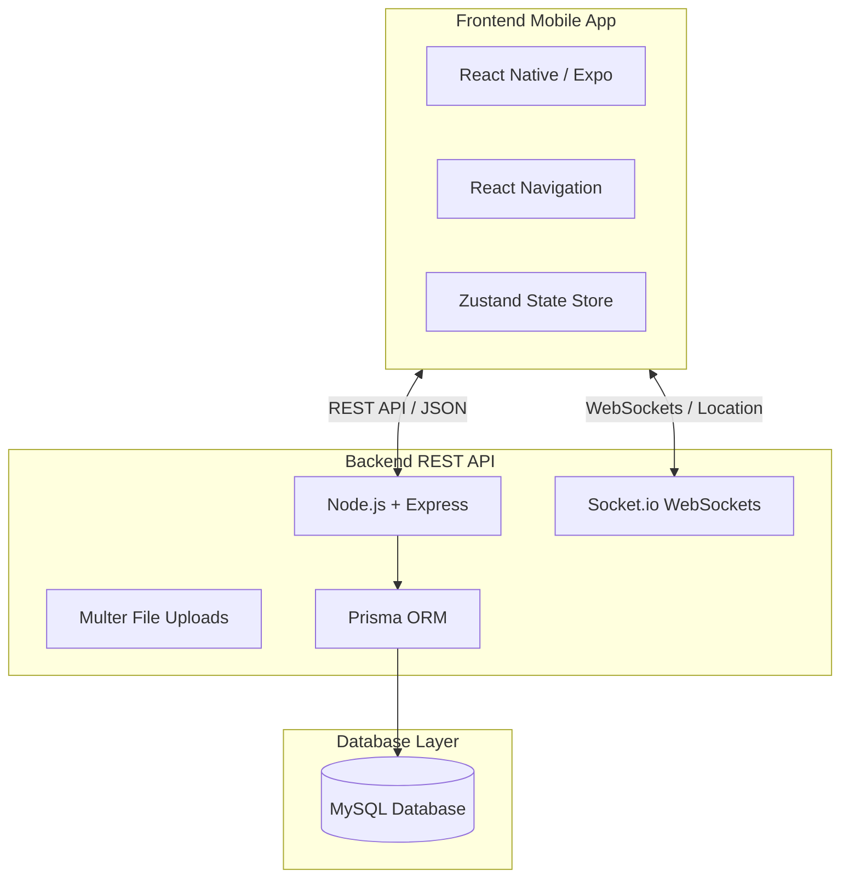
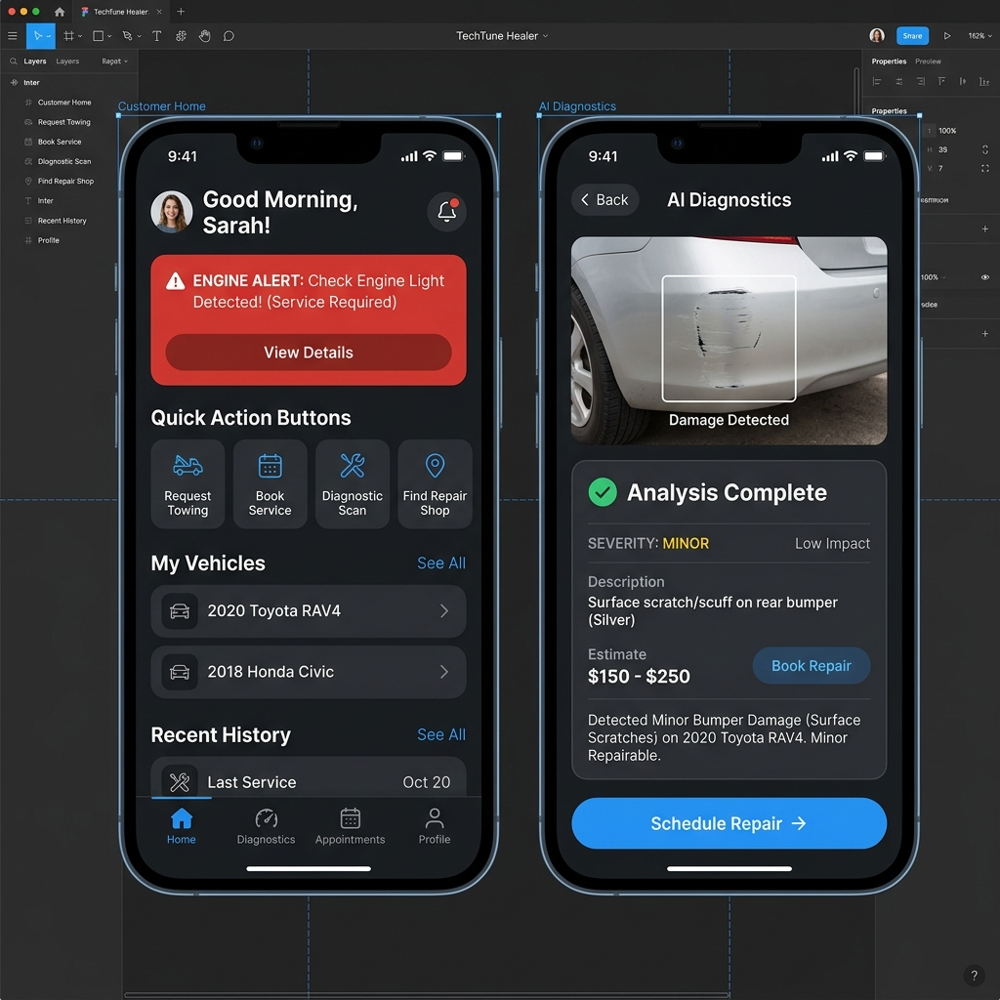
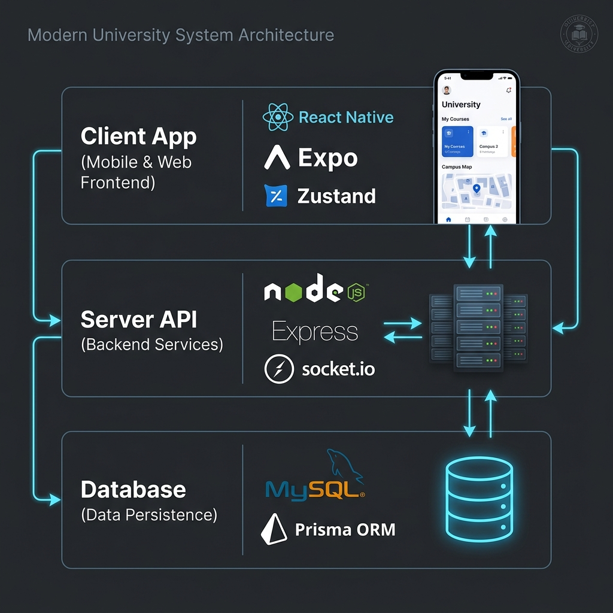
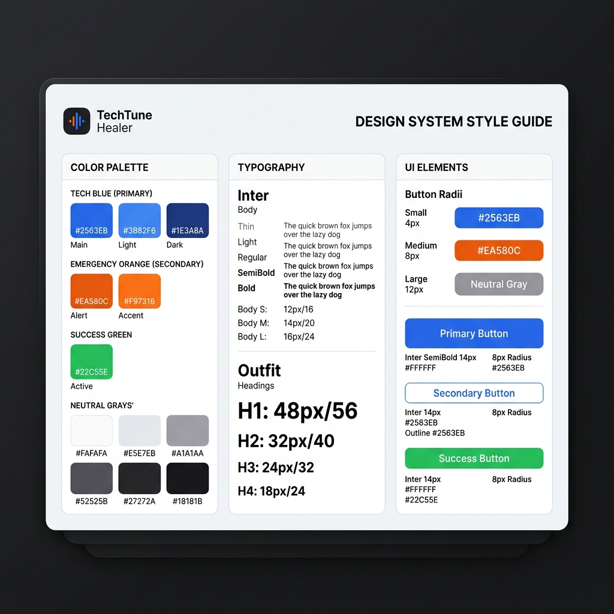

# TechTune Healer - Master Presentation, Script & Academic Documentation Kit

This document is your all-in-one preparation kit for your Year III final presentation. It is structured into three parts:
1. **Academic Project Documentation Template** (Problem, Solution, Timeline, Roles, Features, and System Design).
2. **Slide-by-Slide Visual Deck Planner & Word-for-Word Speaking Script** (including Q&A Prep).
3. **Critical Codebase & Design Fixes Checklist** (resolving your exact TypeScript compilation errors).

---

# Part 1: Academic Project Documentation Template

## 1. Project Overview
* **Project Name:** TechTune Healer
* **Academic Level:** Year III Final Project
* **Target Audience:** Vehicle Owners and Automotive Service Providers in Cambodia
* **Platform:** Mobile Application (React Native + Expo) & Rest API Backend (Express + Node.js + Prisma + MySQL)

## 2. Problem Statement (The "Why")
In Cambodia, vehicle ownership is rising rapidly, yet the automotive repair industry remains highly fragmented and offline:
* **Lack of Trust and Transparency:** Car owners face unpredictable pricing and have no reliable way to verify mechanic credentials or read authentic user reviews.
* **Emergency Breakdown Vulnerability:** Breaking down on a remote road or during late hours is stressful. Users cannot easily locate nearby active workshops.
* **Proactive Diagnostic Gap:** Many drivers do not understand dashboard warning lights or symptoms, leading them to ignore minor issues until they turn into catastrophic, expensive failures.

## 3. Solution & Value Proposition (The "What")
TechTune Healer bridges this gap by creating an integrated, trust-driven digital ecosystem connecting car owners with mechanics:
* **On-Demand Geolocation Connection:** Real-time lookup of nearby workshops using native device GPS.
* **Emergency SOS Response:** One-tap emergency dispatch connecting users to the nearest active mobile mechanic.
* **Intelligent Diagnostics:** An easy-to-use symptom checker paired with an image-upload scanner to help users understand car health and seek service before catastrophic failures.
* **Verified Provider Ecosystem:** Rating, review, and booking history system ensuring service quality.

## 4. User Roles & Capabilities
The system coordinates three distinct actors:
1. **Customer (Vehicle Owner):**
   * Register vehicles (Make, Model, Year, Plate Number).
   * Browse/search mechanics, request bookings, and track emergency repair status.
   * Upload photos/select symptoms for AI diagnostics.
   * Access an integrated spare parts shop.
   * Make payments and chat with mechanics in real time.
2. **Service Provider (Mechanic):**
   * Update workshop details, business hours, and emergency availability toggles.
   * Manage booking requests (Accept, Reschedule, Complete).
   * Chat directly with customers to provide quotes.
   * Track business earnings and customer reviews.
3. **System Administrator:**
   * Manage disputes and verify service provider business licenses.
   * Curate parts catalog, process transactions, and monitor platform health.

## 5. System Architecture


### Key Database Models (Prisma Schema Reference)
The core database relationships map the lifecycle of bookings, reviews, and diagnostics:
* **User & ServiceProvider:** Handles authentication, roles (`CUSTOMER`, `PROVIDER`, `ADMIN`), and shop details.
* **Vehicle:** Associates customer accounts with specific vehicle configurations for accurate repair tracking.
* **Booking:** Handles appointment scheduling, status tracking (`PENDING`, `ACCEPTED`, `IN_PROGRESS`, `COMPLETED`), and transaction links.
* **DiagnosticReport:** Saves uploaded symptom images and mock inspection logs.
* **Order & OrderItem:** Powers the integrated spare parts shop.

## 5.2 UI Design System & Theme
To ensure a modern and readable visual style, the application adopts a unified design system centered around specific color and font hierarchies:
* **Primary Color (Tech Blue):** `#2563EB` (Main), `#3B82F6` (Light), `#1E3A8A` (Dark). Blue represents trust and security, reassuring customers during mechanical bookings.
* **Secondary Color (Emergency Orange):** `#EA580C` (Main), `#F97316` (Accent). Orange evokes urgency, immediately highlighting roadside SOS and diagnostic check warnings.
* **Semantic Colors:**
  * **Success (Green):** `#22C55E` - Used for booking completions and active markers.
  * **Warning (Yellow):** `#EAB308` - Used for medium priority diagnostic caution.
  * **Error (Red):** `#EF4444` - Used for SOS emergency requests and critical errors.
* **Neutral Palette (Grays):** Range from `#FAFAFA` (surfaces) to `#18181B` (readable body text).
* **Typography:** *Outfit* (bold headings) and *Inter* (UI cards and checklists).
* **Layout Grid Rules:** Consistent 8px spacing vertical grid, 8px/12px border radius elements, and shadows.sm/md for modern floating card visual layers.

## 6. Implementation Timeline & Milestones
* **Weeks 1–3: Research & Requirements Gathering:** Investigated local Cambodian market needs; defined product requirements.
* **Weeks 4–6: Design & Database Modeling:** Crafted UI wireframes in Figma and defined the Prisma schema.
* **Weeks 7–10: Core Feature Development:** Built user authentication, vehicle management, and shop modules.
* **Weeks 11–12: Advanced Modules & Geolocation:** Integrated native maps, Socket.io for tracking, and the visual diagnostics screen.
* **Weeks 13–14: Testing & Optimization:** Resolved compiler errors, performed stress testing, and completed documentation.

---

# Part 2: Slide Pitch Deck & Word-for-Word Spoken Script

---

### **Slide 1: Title Slide**
* **Visual on Screen:** Slide with "TechTune Healer" logo. Tagline: *"Connecting Car Owners with Trusted Mechanics in Cambodia"*.
  * **Team Members:** Ros Rendo (Frontend & UI Lead), Vin Sambrathna (Backend Lead), Eath Sopheavid (Database Architect), Kuoch Bunpor (QA & Frontend).
  * **Institution:** Faculty of Engineering, CamTech University.
* **Speaking Script:**
  > "Good morning, respected members of the committee, teachers, and classmates. Today, my team members Vin Sambrathna, Eath Sopheavid, Kuoch Bunpor, and I, Ros Rendo, are proud to present our Year III final project, **TechTune Healer**—a mobile application designed to digitize, simplify, and secure the automotive repair industry in Cambodia. We will walk you through our problem space, live application demonstration, system design, and project outcomes."

---

### **Slide 2: The Problem Space & Competitor Analysis**
* **Visual on Screen:** Comparative grid table comparing **TechTune Healer** with existing alternatives in Cambodia:
  * *Traditional tow services:* Call-based, no real-time coordinates, high price-gouging risk.
  * *Local apps (e.g. Kakvey/Grab):* Focus on taxi rides, no automotive diagnostic scans, no catalog parts marketplace.
  * *TechTune Healer:* Instant GPS SOS routing, transparent reviews, AI car diagnostics, and e-commerce parts shop.
* **Speaking Script:**
  > "Let's begin with the problem. Car ownership in Cambodia is growing, but the process of repairing vehicles remains stuck offline. Drivers face high pricing, double-bookings, and stressful roadside breakdowns where finding a nearby mechanic is a guessing game. Looking at our competitors—ranging from offline roadside towing to taxi apps—none offer a dedicated automotive service. TechTune Healer addresses this gap by digitizing coordinates sharing and standardizing costs."

---

### **Slide 3: User Interface Design (Figma & Theme)**
* **Visual on Screen:** Dual device layout mockups showing (1) Customer Home Screen greeting with SOS button, (2) AI scanner upload screen. UI theme rules:
  * *Primary Color (Tech Blue):* `#2563EB` (Trust and security).
  * *Secondary Color (Emergency Orange):* `#EA580C` (SOS buttons and warnings).
  * *Fonts:* Outfit (headers) and Inter (body cards).
  
* **Speaking Script:**
  > "To ensure a premium user experience, we designed high-fidelity screens in Figma and established a strict color-theme system. Our primary color is Tech Blue, representing trust and safety. We paired it with Emergency Orange to immediately draw focus to critical actions like the SOS roadside button. All buttons and card interfaces follow consistent border-radius tokens to create a modern floating layer visual look."

---

### **Slide 4: System Architecture**
* **Visual on Screen:** 3D System Architecture Diagram showing connection pathways:
  * Client Mobile App (Zustand State Store) $\leftrightarrow$ Node.js / Express Server (API Gateways).
  * WebSockets (Socket.io) handling bidirectional live GPS location data packages.
  * Backend Server $\leftrightarrow$ MySQL database via Prisma ORM.
  
* **Speaking Script:**
  > "This diagram details our high-level system architecture. The React Native mobile client sends HTTPS REST requests to our Express server for static actions like user registration and vehicle edits. During active emergencies, the client establishes a persistent WebSocket connection using Socket.io to stream real-time GPS locations. All database operations route through Prisma ORM to our relational MySQL database."

---

### **Slide 5: Technology Stack Selection**
* **Visual on Screen:** Grid showcasing stack choices with reasoning tags:
  * **Frontend:** React Native (Expo) - Native API access (Camera, Geolocation) on iOS/Android.
  * **State:** Zustand - Lightweight global state store (bypasses Redux boilerplate).
  * **Backend:** Node.js & Express - High throughput, asynchronous non-blocking event loop.
  * **Database & ORM:** MySQL & Prisma - Strongly-typed schemas with safe relations.
* **Speaking Script:**
  > "Our tech stack was chosen for performance, scalability, and type-safety. React Native with Expo allows us to compile native mobile clients while accessing hardware features like GPS coordinates and cameras. We used Zustand for frontend state management because of its light weight and low render overhead. The backend runs Node.js and Express to handle high-frequency location updates, and Prisma ORM secures our queries."

---

### **Slide 6: Database Schema Design (MySQL & Prisma)**
* **Visual on Screen:** Entity-Relationship Diagram (ERD) showing central tables:
  * `User` (1-to-1) `ServiceProvider` (workshop specifics).
  * `User` (1-to-many) `Vehicle` (plates, model, color).
  * `Vehicle` & `ServiceProvider` (1-to-many) `Booking` (status, dates, amounts).
  * `DiagnosticReport` linking `Vehicle` to upload records.
* **Speaking Script:**
  > "For database design, we structured relational schemas inside MySQL to prevent data anomalies. The User model acts as our auth foundation, which links to registered vehicles. The ServiceProvider table records the workshops' longitude and latitude coordinates. The central model is the Booking table, which maps a customer's vehicle to their selected service provider, managing statuses like PENDING and COMPLETED."

---

### **Slide 7: API Design & REST Endpoints**
* **Visual on Screen:** API endpoint routing spreadsheet showing core handlers:
  * `POST /auth/login` (Public) $\rightarrow$ JWT authorization issuance.
  * `POST /vehicles` (User) $\rightarrow$ Register plate and make models.
  * `POST /bookings` (User) $\rightarrow$ Creates emergency SOS or scheduled repair.
  * `GET /providers` (User) $\rightarrow$ Queries nearby mechanics using geolocation parameters.
* **Speaking Script:**
  > "We designed a RESTful API structure where endpoints are secured by custom JWT authorization middleware. When a request is received, the middleware decodes the token bearer header, validates the user status, and attaches the user identifier to the request context. This ensures that actions like creating bookings or updating coordinates cannot be hijacked by unauthenticated users."

---

### **Slide 8: Core User Roles & Workflows**
* **Visual on Screen:** Workflow split columns comparing the three active roles:
  * **Customer:** Register Vehicle $\rightarrow$ Select Symptoms/Scan $\rightarrow$ Trigger SOS $\rightarrow$ Track Live Mechanic $\rightarrow$ Pay (ABA/KHQR) $\rightarrow$ Review.
  * **Provider:** Toggle online status $\rightarrow$ Receive SOS coordinate push $\rightarrow$ Accept & Navigate $\rightarrow$ Complete $\rightarrow$ View Analytics.
  * **Admin:** Verify business credentials, manage parts inventory catalog.
* **Speaking Script:**
  > "Let's look at the core workflows. The Customer registers their vehicle, uploads a diagnostics photo, or taps SOS to get matched. The Service Provider sets their status to online, gets push alerts for local breakdowns, accepts them, and is routed using real-time GPS coordinates. The Admin oversees security by validating workshop licenses and catalog inventory."

---

### **Slide 9: Implementation Timeline & Milestones**
* **Visual on Screen:** Gantt chart/Timeline diagram showing 14 weeks:
  * **Weeks 1–3:** Research & Requirements Gathering.
  * **Weeks 4–6:** Figma Designing, wireframes, and database relational modeling.
  * **Weeks 7–10:** Core coding (Auth, E-Commerce Shop, CRUD endpoints).
  * **Weeks 11–12:** Real-time socket coordination, map integration, and AI Scanner API.
  * **Weeks 13–14:** TypeScript codebase compilation cleanup, QA manual testing, and final defense report.
* **Speaking Script:**
  > "Our 14-week timeline was structured to ensure systematic integration. We spent the first three weeks analyzing the Cambodian automotive market, followed by database design. Coding was split into core features like Auth and checkout, followed by real-time location mapping. In the final two weeks, we conducted extensive manual testing and resolved all TypeScript compiler errors to ensure code safety."

---

### **Slide 10: Git Group Workflow & Commits**
* **Visual on Screen:** Git branching workflow diagram showing student commit contributions:
  * **Ros Rendo:** Frontend UI components, Zustand stores, strict TypeScript build fixes.
  * **Vin Sambrathna:** Express routers, JWT middlewares, WebSocket location gateways.
  * **Eath Sopheavid:** Prisma ERD migrations, DB seeding, shop inventory transactions.
  * **Kuoch Bunpor:** SOS/Shop screens building, integration testing, coordinate validations.
* **Speaking Script:**
  > "To collaborate efficiently, we implemented a strict Git branching workflow. We never pushed directly to main. Instead, each member created feature branches like feat-customer-ui or feat-backend-api. Vin handled backend security and sockets, Eath managed database migrations and transactions, Bunpor built screens and ran testing, and I coordinated frontend layout architecture and type-safe bug cleanup."

---

### **Slide 11: Live Demonstration — Core Workflows**
* **Visual on Screen:** Live preview video demo showing:
  * **Roadside SOS:** Customer triggers SOS, mechanic accepts, and GPS markers update in real-time on `MapView`.
  * **AI Diagnostics scanner:** Customer uploads a picture of a bumper scratch, and the system output card returns 'Severity: Minor, Cost: $150-$250'.
* **Speaking Script:**
  > "Now, we will demonstrate the application. First is the Emergency SOS flow. When a user requests tow assistance, the app captures their coordinates and streams them via WebSockets, allowing the customer to watch the mechanic move on the map. Second is the AI Scanner. The customer uploads a photo of a rear bumper scratch, and the server returns a diagnostic report indicating a minor repairable scuff with pricing options."

---

### **Slide 12: Conclusion & Q&A**
* **Visual on Screen:** *"Thank You! Questions & Answers"* slide. Contact emails and repository links.
  
* **Speaking Script:**
  > "In conclusion, TechTune Healer is more than an academic database project. It is a localized, functional, and highly secured solution to a real-world automotive coordination problem in Cambodia. We have resolved all strict compiler errors, rendering the code production-ready. Thank you for your time. We are now open to any questions you may have."

---

### **Committee Q&A Preparation Checklist**

* **Q1: "Your AI diagnostic scan seems to return the same bumper scratch result. How is this actually implemented?"**
  * **Answer:** *"During this development phase, the image upload and database persistence are fully functional using Multer on the backend. The image analysis is currently mocked with structured metadata to demonstrate the user flow. For production, we designed the database model to store JSON metadata, which can be easily fed directly into a cloud-based vision model API like Gemini or GPT-4o."*
* **Q2: "What happens if a user is in a remote province where there is no internet, but they need emergency roadside assistance?"**
  * **Answer:** *"Excellent question. That is why we included a direct 'Emergency Call' trigger button on the emergency screen that links to native phone call routing. If WebSockets or data services fail, the user can instantly call the official hotline (119) or the provider's phone directly using traditional analog phone lines."*
* **Q3: "How does the app know where the mechanic is in real-time?"**
  * **Answer:** *"We use WebSocket connections powered by Socket.io. When a mechanic starts navigation to a customer, their device uses the Expo Location API to push coordinate updates to our server. The server broadcasts these coordinates to the client, which updates a React Native MapView marker dynamically without manual page refreshes."*

---

# Part 3: Critical Codebase & Design Fixes Checklist

During a project defense, examiners might look at your code. You currently have several TypeScript compiler errors that prevent successful production builds. Use the checklist below to fix them.

### Checklist Item 1: Replace GCash with ABA Pay in `PaymentScreen.tsx`
* **File:** [PaymentScreen.tsx](file:///d:/CamtechUniversity/ProgrammingYearIII/techtune-healer/src/screens/customer/PaymentScreen.tsx)
* **Lines:** 15, 35-36, 124, 222-242
* **Fix:** Change variables/labels referencing GCash to `ABAPay` or `KHQR`. This localizes the presentation for a Cambodian university project.

---

### Checklist Item 2: Fix TypeScript Color Theme Errors
Your theme file defines `colors.primary`, `colors.error`, and `colors.success` as objects containing shades. Your components are trying to assign these parent objects to style fields that expect strings.

#### **A. Fix `Input.tsx` Styles**
* **File:** [Input.tsx](file:///d:/CamtechUniversity/ProgrammingYearIII/techtune-healer/src/components/Input.tsx)
* **Problem:** `colors.error` and `colors.primary` are objects, not string colors.
* **Fix Diffs:**
```diff
-  const getBorderColor = () => {
-    if (error) return colors.error;
-    if (isFocused) return colors.primary;
-    return colors.border;
-  };
+  const getBorderColor = () => {
+    if (error) return colors.error[500];
+    if (isFocused) return colors.primary[500];
+    return colors.border;
+  };

-        {leftIcon && (
-          <Ionicons
-            name={leftIcon}
-            size={20}
-            color={isFocused ? colors.primary : colors.textSecondary}
-            style={styles.leftIcon}
-          />
-        )}
+        {leftIcon && (
+          <Ionicons
+            name={leftIcon}
+            size={20}
+            color={isFocused ? colors.primary[500] : colors.textSecondary}
+            style={styles.leftIcon}
+          />
+        )}

   inputContainerError: {
-    borderColor: colors.error,
+    borderColor: colors.error[500],
   },
   errorText: {
     ...typography.caption,
-    color: colors.error,
+    color: colors.error[500],
     marginTop: spacing.xs,
   },
```

#### **B. Fix `Loading.tsx` Props**
* **File:** [Loading.tsx](file:///d:/CamtechUniversity/ProgrammingYearIII/techtune-healer/src/components/Loading.tsx)
* **Problem:** Default parameter uses `colors.primary` object.
* **Fix Diff:**
```diff
 export default function Loading({
   size = 'large',
-  color = colors.primary,
+  color = colors.primary[600],
   text,
   fullScreen = false,
```

#### **C. Fix `Avatar.tsx` Default Props**
* **File:** [Avatar.tsx](file:///d:/CamtechUniversity/ProgrammingYearIII/techtune-healer/src/components/Avatar.tsx)
* **Problem:** Default badge color and initials style use objects.
* **Fix Diffs:**
```diff
 export default function Avatar({
   source,
   name = '',
   size = 'medium',
   style,
   showBadge = false,
-  badgeColor = colors.success[500],
+  badgeColor = colors.success[500] as string,
 }: AvatarProps) {

   initials: {
-    color: colors.primary[600],
+    color: colors.primary[600] as string,
     fontWeight: '600',
   },
```

#### **D. Fix `Badge.tsx` Return Types**
* **File:** [Badge.tsx](file:///d:/CamtechUniversity/ProgrammingYearIII/techtune-healer/src/components/Badge.tsx)
* **Problem:** Default cases return objects instead of strings.
* **Fix Diffs:**
```diff
   const getTextColor = (): string => {
     switch (variant) {
       case 'secondary': return colors.secondary[600];
       case 'success':   return colors.success[700];
       case 'warning':   return colors.warning[700];
       case 'error':     return colors.error[600];
       case 'info':      return colors.info[700];
-      default:          return colors.primary[700];
+      default:          return colors.primary[700] as string;
     }
   };
```

---

### Checklist Item 3: Fix Navigation & Layout Typos
* **Typos in Navigator:** In `CustomerNavigator.tsx`, options properties `headerBackTitleVisible` are flagged by the TS compiler.
  * **Fix:** Change them to `headerBackVisible: false` or verify that they align with the latest parameters of the `NativeStackNavigationOptions`.
* **Typos in Button size:** In `WelcomeScreen.tsx` and `RoleSelectionScreen.tsx`, buttons use `size="lg"`.
  * **Fix:** Change them to `size="large"` as expected by the type definitions of your `Button` component.
* **Typo in spacing property:** In `AiDiagnosisResultScreen.tsx` line 179:
  * **Fix:** `spacing.xxl` is undefined. Change it to `spacing["2xl"]` or `spacing.xl`.
