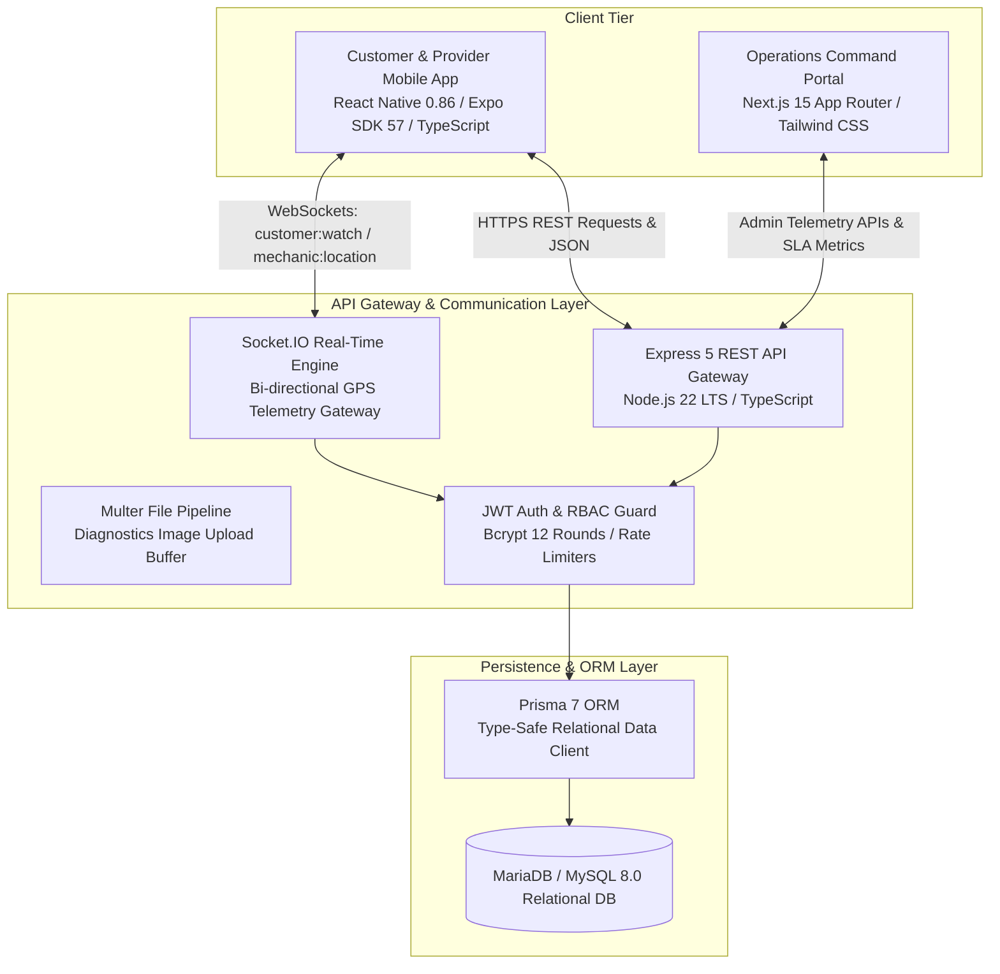
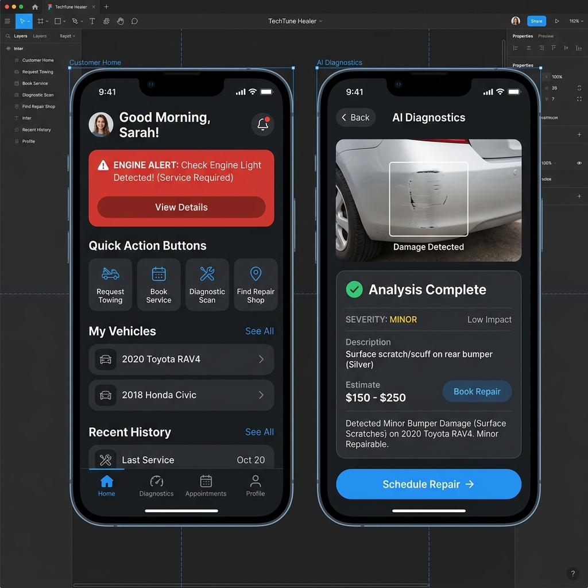
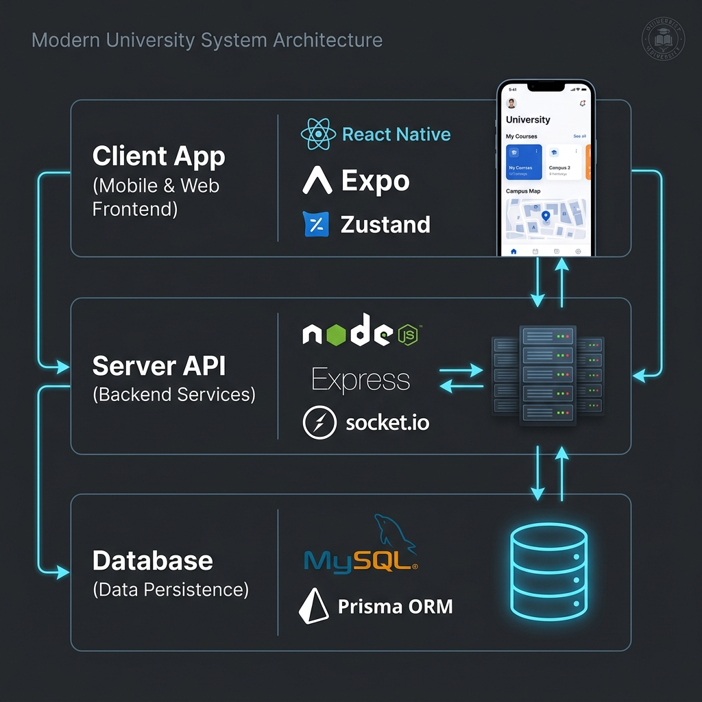
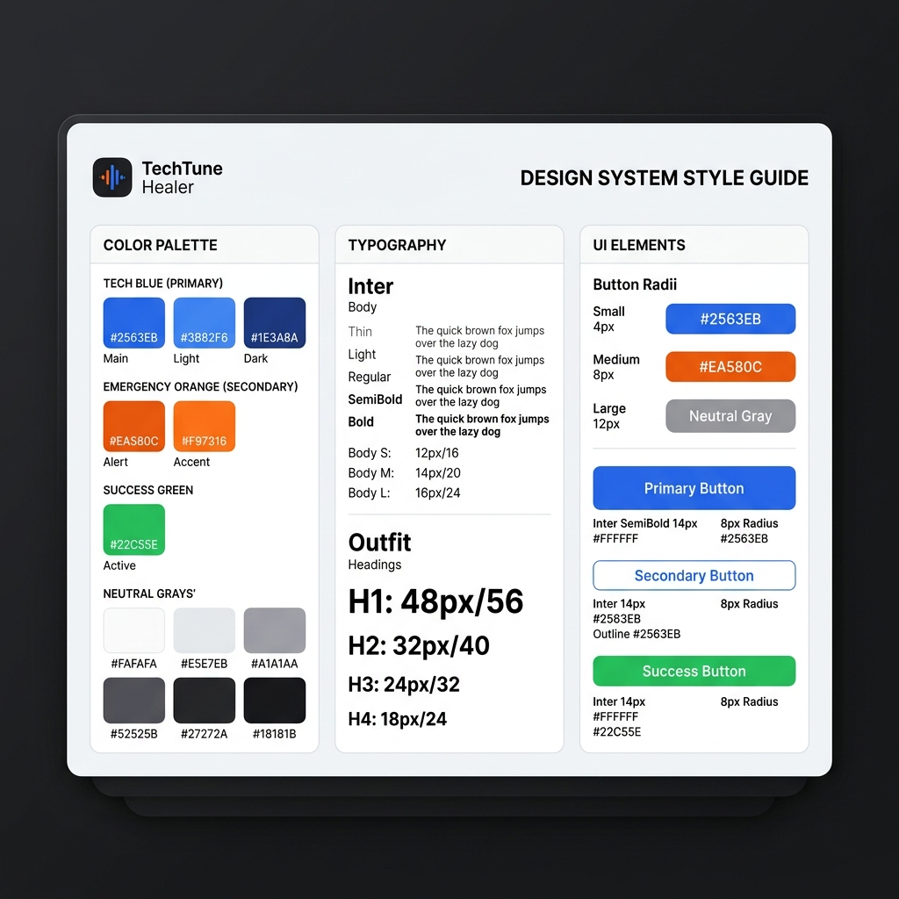

# TechTune Healer — Master Presentation Deck, Spoken Script & Defense Kit
## Final Defense End-Term Internship Presentation — Term III 2026 (Intake 7)

---

### Official Defense Event Metadata
* **Event:** Final Defense End-Term Internship Presentation (Term III 2026)
* **Academic Cohort:** Intake 7 — Bachelor of Science in Software Engineering
* **Date:** Wednesday, 30 September 2026
* **Assigned Defense Time Slot:** 15:15 – 15:30 (15 Minutes Total)
* **Time Distribution:** Strictly **10 Minutes Presentation** followed by **5 Minutes Committee Q&A & Feedback**
* **Location:** FENG and BI Faculty Room, 3rd Floor (Faculty of Engineering & Faculty of Business and Information)
* **Presentation Language:** English
* **Team Name:** Techtune Healer
* **Project Name:** TechTune Healer (Automotive Digital Ecosystem: Mobile App, Provider Portal & Admin Operations Console)
* **Team Members & Student Credentials:**
  1. **Ros Rendo** (Student ID: `RR6024010107`) — Frontend & Mobile Engineering Lead
  2. **Vin Sambrathna** (Student ID: `SV6024010100`) — Backend & Real-Time Services Lead
  3. **Eath Sopheavid** (Student ID: `SE6024010109`) — Database & System Architect
  4. **Kuoch Bunpor** (Student ID: `BK6024010108`) — QA Engineer & Fullstack Web Developer
* **Host Organization:** TechTune Healer (Automotive Digital Solutions Co., Ltd., Phnom Penh)
* **Academic Institution:** CamTech University (Faculty of Engineering & Applied Sciences)

---

# Part 1: Academic Project Documentation & System Specification

## 1. Executive Project Summary
**TechTune Healer** is a localized automotive emergency assistance, diagnostics, and garage management digital ecosystem engineered for Cambodia. The platform unifies three primary stakeholders through dedicated software layers:
1. **Vehicle Owners (Customer Mobile App):** Provides on-demand emergency roadside SOS dispatch with real-time GPS mechanic tracking, visual AI-assisted damage & dashboard warning diagnostics, 3D interactive garage with OBD-II health sheet telemetry, an integrated genuine spare parts shop, and frictionless KHQR / ABA Pay mobile checkout.
2. **Automotive Service Providers (Mechanic Mobile App):** Allows independent workshops and mobile technicians across Phnom Penh to broadcast live availability, accept roadside emergency calls, receive live route navigation to stranded motorists, manage repair schedules, and monitor shop revenue.
3. **Operations & Municipal Regulators (Admin Web Portal):** A Next.js 15 enterprise operations console featuring a real-time Phnom Penh municipal dispatch matrix, SLA compliance monitoring curves, 1-click workshop license verification (`approvalStatus`, `isVerified`), and platform-wide transaction oversight.

---

## 2. Problem Space & Context in Cambodia
The automotive landscape in Cambodia has experienced exponential growth, yet the repair and roadside assistance market remains predominantly offline and unregulated:
* **Roadside Breakdown Vulnerability:** Stranded drivers on remote corridors (e.g., National Highway 1, 4, 6) or during night hours face extreme difficulty finding verified mechanics, relying on risky informal roadside contacts.
* **Severe Price Gouging & Opacity:** The lack of standardized pricing leads to arbitrary overcharging during emergency towing and minor repairs.
* **Proactive Maintenance Blind Spots:** Drivers frequently disregard dashboard warning lights (Check Engine, ABS, Oil Pressure) due to uncertainty over fault severity, triggering catastrophic and costly engine failure.
* **Lack of EV Charging Infrastructure Visibility:** With electric vehicle adoption accelerating in urban Phnom Penh, drivers struggle to locate functioning fast-charging stations with live tariff rates and compatible plug types.

---

## 3. The TechTune Healer Solution
TechTune Healer replaces fragmented, informal practices with a verified, real-time digital infrastructure:
* **Instant Geolocation SOS Routing:** Direct WebSocket-driven coordinate broadcast connecting motorists to the nearest active mobile mechanic with real-time map updates.
* **Visual AI Damage & Warning Diagnostics:** Image-capture analysis estimating repair complexity, severity rating (Low, Medium, High, Critical), and expected pricing range before the user commits to a workshop visit.
* **3D Virtual Garage & Telemetry:** Digital vehicle twin storing plate numbers, VIN, maintenance logs, and live OBD-II diagnostic status (battery voltage, brake pad wear, coolant temperature).
* **Phnom Penh EV Charging & Station Network:** Curated interactive map overlaying verified EV charging hubs and fuel stations with real-time kWh tariffs and connector availability.
* **Localized Digital Payments:** Full integration of the National Bank of Cambodia's Bakong KHQR protocol and ABA Pay alongside card and cash-on-delivery options.
* **Regulated Workshop Verification:** Multi-tier administrative audit requiring business registration before mechanics can receive emergency dispatch jobs.

---

## 4. System Architecture

```mermaid
graph TD
    subgraph ClientLayers [Client Tier]
        RN[Customer & Provider Mobile App<br/>React Native 0.86 / Expo SDK 57 / TypeScript]
        AdminWeb[Operations Command Portal<br/>Next.js 15 App Router / Tailwind CSS]
    end

    subgraph GatewayTier [API Gateway & Communication Layer]
        Express[Express 5 REST API Gateway<br/>Node.js 22 LTS / TypeScript]
        SocketIO[Socket.IO Real-Time Engine<br/>Bi-directional GPS Telemetry Gateway]
        Multer[Multer File Pipeline<br/>Diagnostics Image Upload Buffer]
        AuthGuard[JWT Auth & RBAC Guard<br/>Bcrypt 12 Rounds / Rate Limiters]
    end

    subgraph DataTier [Persistence & ORM Layer]
        Prisma[Prisma 7 ORM<br/>Type-Safe Relational Data Client]
        MySQL[(MariaDB / MySQL 8.0 Relational DB)]
    end

    RN <-->|HTTPS REST Requests & JSON| Express
    RN <-->|WebSockets: customer:watch / mechanic:location| SocketIO
    AdminWeb <-->|Admin Telemetry APIs & SLA Metrics| Express
    Express --> AuthGuard
    AuthGuard --> Prisma
    SocketIO --> AuthGuard
    Prisma --> MySQL
```

---

## 5. Technology Stack Matrix

| Tier | Component | Technology Selection | Justification |
| :--- | :--- | :--- | :--- |
| **Mobile Client** | Core App | React Native 0.86 + Expo SDK 57 | Cross-platform iOS/Android native performance with direct hardware access (Camera, GPS, Haptics). |
| **Mobile Client** | State Management | Zustand 5 | Minimal footprint, zero boilerplate, optimized re-renders for high-frequency GPS coordinate changes. |
| **Mobile Client** | Navigation | React Navigation 7 + Expo Router | Deep linking, file-based routing shell, and nested tab/stack workflows. |
| **Mobile Client** | Mapping | React Native Maps + Leaflet / OSRM | Native coordinate rendering, custom map markers, and turn-by-turn mechanic route geometry. |
| **Admin Portal** | Operations Console | Next.js 15 App Router + Tailwind CSS | High-performance server-side rendering, real-time SLA charts, and instant workshop approval workflow. |
| **Backend Server** | API Framework | Node.js 22 LTS + Express 5 | Asynchronous event loop, high concurrent request handling, low latency for telemetry feeds. |
| **Real-Time** | Telemetry Gateway | Socket.IO 4.8 | Low-latency bi-directional event bus with room isolation and JWT handshake authentication. |
| **Database** | Relational Store | MariaDB / MySQL 8.0 | ACID compliance for financial orders, booking transactions, and foreign-key referential integrity. |
| **ORM** | Object-Relational | Prisma 7 | Type-safe query builder, declarative schema migrations, automated TypeScript model generation. |
| **Security** | Authentication | JWT + Bcrypt (12 rounds) | Stateless authorization, password entropy, role-based access control (`CUSTOMER`, `PROVIDER`, `ADMIN`). |

---

# Part 2: Slide-by-Slide Deck Planner & 10-Minute Word-for-Word Spoken Script

> [!IMPORTANT]
> **Strict Presentation Timing Guideline (10 Minutes Total):**
> * **00:00 – 01:45:** Ros Rendo (Slides 1–2: Introduction & Problem Space)
> * **01:45 – 03:30:** Ros Rendo & Vin Sambrathna (Slide 3: Ecosystem & Slide 4: System Architecture)
> * **03:30 – 04:45:** Vin Sambrathna (Slide 5: Backend, Real-Time Sockets & Security)
> * **04:45 – 05:45:** Eath Sopheavid (Slide 6: Relational Database Architecture & Prisma Schema)
> * **05:45 – 06:45:** Kuoch Bunpor (Slide 7: Next.js Admin Operations & Live Dispatch Matrix)
> * **06:45 – 07:45:** Kuoch Bunpor (Slide 8: Mobile UX, EV Network & 3D Garage Diagnostics)
> * **07:45 – 08:30:** Ros Rendo (Slide 9: Git Group Collaboration & 18-Day Multi-Author Sprint)
> * **08:30 – 09:30:** All Team Members (Slide 10: Live Demonstration of Emergency Flow)
> * **09:30 – 10:00:** Ros Rendo (Slide 11: Achievements, Future Vision & Conclusion)
> * **10:00 – 15:00:** All Team Members (Slide 12: Committee Q&A Session)

---

### **Slide 1: Title & Introduction**
* **Duration:** 00:00 – 00:45 (45 Seconds)
* **Primary Speaker:** **Ros Rendo**
* **Visual on Screen:** High-impact presentation title slide featuring the TechTune Healer official emblem and branding.
  * *Title:* **TechTune Healer — Next-Generation Automotive Emergency & Garage Ecosystem**
  * *Academic Context:* Final Defense End-Term Internship Presentation (Term III 2026), Intake 7
  * *Date & Venue:* 30 September 2026 | FENG and BI Faculty Room, 3rd Floor
  * *Team Members:*
    * Ros Rendo (Frontend & Mobile Engineering Lead) — `RR6024010107`
    * Vin Sambrathna (Backend & Real-Time Services Lead) — `SV6024010100`
    * Eath Sopheavid (Database & System Architect) — `SE6024010109`
    * Kuoch Bunpor (QA Engineer & Fullstack Web Developer) — `BK6024010108`
  * *Host Company:* TechTune Healer (Automotive Digital Solutions Co., Ltd.)
  * *Institution:* Faculty of Engineering & Faculty of Business and Information, CamTech University

* **Word-for-Word Spoken Script:**
  > "Respected members of the examination committee, esteemed professors, and fellow colleagues. Good afternoon and welcome to our final internship defense for Term III 2026, Intake 7.
  > 
  > My name is **Ros Rendo**, presenting alongside my engineering teammates **Vin Sambrathna**, **Eath Sopheavid**, and **Kuoch Bunpor**. 
  > 
  > Over the past four months at Automotive Digital Solutions Co., Ltd., we designed, built, and tested **TechTune Healer**—a comprehensive digital ecosystem engineered to eliminate roadside vulnerability, standardize repair transparency, and modernize automotive servicing across Cambodia. Today, we will present our full-stack architecture, live system workflows, database design, and production outcomes."

---

### **Slide 2: The Problem Space & Market Analysis in Cambodia**
* **Duration:** 00:45 – 01:45 (60 Seconds)
* **Primary Speaker:** **Ros Rendo**
* **Visual on Screen:** Comparative analysis matrix illustrating the current roadside breakdown reality versus TechTune Healer:
  * *Current Reality in Cambodia:* 
    * ⚠️ Fragmented phone calls; no verifiable GPS location sharing.
    * ⚠️ Rampant price-gouging during emergency towing ($50–$150 unpredictable surges).
    * ⚠️ Zero mechanic verification or genuine customer ratings.
    * ⚠️ Unclear warning light severity resulting in catastrophic engine blowouts.
    * ⚠️ Urban EV drivers have no centralized live directory for charging stations.
  * *TechTune Healer Disruption:* 
    * ✅ Instant 1-tap SOS GPS dispatch with live mechanic tracking.
    * ✅ Transparent standardized billing and Bakong KHQR integration.
    * ✅ Mandatory administrative workshop verification and audited reviews.
    * ✅ Visual AI scanner and 3D digital vehicle twin with OBD-II health checks.

* **Word-for-Word Spoken Script:**
  > "Vehicle ownership in Cambodia is expanding at unprecedented rates. Yet, the automotive support infrastructure remains fundamentally stuck offline. When a driver encounters a sudden breakdown on the road—especially at night or on provincial highways—they are forced to rely on informal word-of-mouth recommendations or unverified tow services.
  > 
  > This creates three critical failures: First, severe vulnerability to price gouging, where stranded motorists are charged arbitrary emergency fees. Second, the total absence of service provider accountability, with no verified credentials or authentic review records. Third, vehicle owners frequently ignore warning lights because they cannot assess their severity.
  > 
  > TechTune Healer solves this by replacing informal phone calls with an automated, location-aware, and transparently priced digital network."

---

### **Slide 3: The Unified Ecosystem Architecture**
* **Duration:** 01:45 – 02:30 (45 Seconds)
* **Primary Speaker:** **Ros Rendo**
* **Visual on Screen:** 3-pillar ecosystem schematic showing the interaction between the Customer Mobile App, Provider Mobile App, and Admin Web Operations Portal.
  

* **Word-for-Word Spoken Script:**
  > "Our platform is not merely a single mobile app; it is a unified three-tier ecosystem:
  > 
  > On the client side, vehicle owners use our **Customer Mobile App** to trigger one-tap emergency SOS calls, access their 3D virtual garage, review diagnostics, and order spare parts.
  > 
  > Second, verified mechanics use the **Provider Mobile App** to toggle active emergency status, receive push-notification dispatch requests, and follow turn-by-turn GPS navigation straight to the motorist's coordinates.
  > 
  > Third, our **Admin Operations Portal** gives enterprise dispatchers and regulators a live municipal triage terminal, automated SLA compliance monitoring, and one-click workshop license verification. 
  > 
  > I will now pass the floor to **Vin Sambrathna** to explain our technical architecture and backend infrastructure."

---

### **Slide 4: System Architecture & Data Communication Pipelines**
* **Duration:** 02:30 – 03:30 (60 Seconds)
* **Primary Speaker:** **Vin Sambrathna**
* **Visual on Screen:** High-level 3D architecture diagram detailing protocol boundaries:
  * Client Tier (React Native Expo & Next.js 15) $\leftrightarrow$ HTTPS REST & WebSockets (Socket.IO).
  * API Gateway running Express 5, rate-limiters, and JWT role-based authorization guards.
  * Persistence tier with Prisma 7 ORM executing connection-pooled queries against MariaDB/MySQL.
  

* **Word-for-Word Spoken Script:**
  > "Thank you, Rendo. Good afternoon, committee members. My name is **Vin Sambrathna**, and I led the backend and real-time infrastructure.
  > 
  > As illustrated in our architecture diagram, our system enforces a strict separation of concerns across three distinct layers.
  > 
  > The frontend mobile client communicates with our **Express 5 API Gateway** via secure HTTPS REST endpoints for transactions, booking requests, and diagnostic submissions. 
  > 
  > However, emergency roadside dispatch cannot rely on traditional HTTP polling. Therefore, we engineered a dedicated **Socket.IO Real-Time Gateway** that maintains persistent, low-latency WebSocket connections for streaming live GPS coordinates between the mechanic and customer. 
  > 
  > All backend requests pass through our security layer before reaching **Prisma 7 ORM**, which manages type-safe data access to our relational MariaDB database."

---

### **Slide 5: Backend Engineering, Real-Time Sockets & Security**
* **Duration:** 03:30 – 04:30 (60 Seconds)
* **Primary Speaker:** **Vin Sambrathna**
* **Visual on Screen:** Code breakdown and security architecture card:
  * *Socket.IO Rooms:* `customer:watch`, `mechanic:location`, `mechanic:arrived` with per-booking membership verification.
  * *Security Protocol:* Bcrypt 12-round salted password hashing, stateless 30-day JWT tokens, and strict `express-rate-limit` policies.
  * *Transactional Integrity:* Atomic Prisma transaction locking during spare parts checkout to prevent race conditions and inventory overselling.
  * *Multer Image Pipeline:* Strict 10MB memory cap with MIME-type whitelist (JPEG, PNG, WebP) for diagnostic scans.

* **Word-for-Word Spoken Script:**
  > "To ensure enterprise-grade security and reliability, our backend incorporates several critical patterns:
  > 
  > For our real-time location gateway, every incoming WebSocket handshake must provide a valid JWT bearer token. Furthermore, when a mechanic broadcasts coordinates via `mechanic:location`, the socket server verifies that the caller is indeed the assigned provider for that specific booking before broadcasting to the customer's room.
  > 
  > On the security side, passwords are encrypted using Bcrypt with 12 salt rounds. We configured express-rate-limit to protect authentication and OTP endpoints against brute-force attacks.
  > 
  > In our e-commerce spare parts module, inventory reservation runs inside an atomic Prisma database transaction. This guarantees that stock deductions and order generation execute as an all-or-nothing unit, eliminating race conditions.
  > 
  > I now hand over to our Database Architect, **Eath Sopheavid**, to present our relational data model."

---

### **Slide 6: Relational Database Architecture & Prisma Schema**
* **Duration:** 04:30 – 05:45 (75 Seconds)
* **Primary Speaker:** **Eath Sopheavid**
* **Visual on Screen:** Complete Entity-Relationship Diagram (ERD) showcasing central entities:
  * `User` (1-to-1) `ServiceProvider` with `approvalStatus` (`PENDING`, `APPROVED`, `REJECTED`) and `isVerified`.
  * `User` (1-to-many) `Vehicle` mapping make, model, year, and plate numbers.
  * `Booking` linking `Customer`, `ServiceProvider`, and `Vehicle` with status enum (`PENDING`, `ACCEPTED`, `IN_PROGRESS`, `COMPLETED`, `CANCELLED`).
  * `DiagnosticReport` storing image references, severity rankings, and JSON metadata.
  * `Product`, `Cart`, and `Order` modeling e-commerce transactions with foreign key cascades.

* **Word-for-Word Spoken Script:**
  > "Thank you, Sambrathna. Good afternoon, distinguished committee. My name is **Eath Sopheavid**, and I served as the Database and System Architect.
  > 
  > Designing an automotive emergency platform requires high relational integrity. A single emergency event touches customer profiles, vehicle telemetry, provider coordinates, and billing records simultaneously.
  > 
  > We designed a normalized relational schema in MariaDB, orchestrated through Prisma 7. At its core, our `User` model supports Role-Based Access Control dividing Customers, Providers, and Admins.
  > 
  > Crucially, for service providers, we implemented an `approvalStatus` attribute and an `isVerified` flag. A provider cannot receive SOS broadcasts or appear in customer search results until their business license is reviewed and activated by our admin console.
  > 
  > Our central `Booking` entity acts as a finite-state machine tracking transitions from `PENDING` through `COMPLETED`, linking directly to verified `Review` ratings and audit logs.
  > 
  > I will now invite **Kuoch Bunpor** to present our Admin Operations Portal and Mobile UX features."

---

### **Slide 7: Admin Operations Portal & Live Dispatch Matrix**
* **Duration:** 05:45 – 06:45 (60 Seconds)
* **Primary Speaker:** **Kuoch Bunpor**
* **Visual on Screen:** Next.js 15 Admin Operations Dashboard showcase:
  * Real-time Phnom Penh Municipal Dispatch Matrix monitoring active emergencies across Chamkar Mon, Daun Penh, Toul Kork, and Chroy Changvar.
  * Dynamic SLA Compliance Curves tracking emergency response times against a 15-minute standard.
  * 1-Click Workshop License Verification Console with live modal inspection of garage credentials.
  * Financial settlement telemetry showing gross transaction volume and platform commission.

* **Word-for-Word Spoken Script:**
  > "Thank you, Sopheavid. Good afternoon, committee members. My name is **Kuoch Bunpor**, and I served as QA Engineer and Fullstack Web Developer.
  > 
  > While our mobile applications serve end users in the field, our enterprise **Admin Web Portal**—built with Next.js 15 and Tailwind CSS—acts as the operational control center.
  > 
  > In the portal, platform operators access a real-time Phnom Penh Dispatch Matrix. This dashboard monitors live emergency triage queues across major urban districts, tracking whether dispatched mechanics meet our 15-minute SLA arrival threshold.
  > 
  > Furthermore, the portal features a one-click Workshop Verification Console. When an independent garage registers on TechTune Healer, our administrators inspect their tax patent and commercial license before toggling their verified status, ensuring driver safety.
  > 
  > Next, let's explore our advanced mobile user experience."

---

### **Slide 8: Advanced Mobile UX, EV Network & 3D Garage Telemetry**
* **Duration:** 06:45 – 07:45 (60 Seconds)
* **Primary Speaker:** **Kuoch Bunpor**
* **Visual on Screen:** Showcase of customer mobile screens:
  * *EV Fast-Charging & Fuel Hubs:* Interactive map pins across Phnom Penh showing live kWh pricing and connector types (CCS2, GB/T, Type 2).
  * *3D Interactive Garage:* Visual vehicle twin rendering OBD-II diagnostic telemetry (Coolant Temp: 89°C, Battery: 12.6V, Oil Life: 84%, Brake Pad: 72%).
  * *AI Camera Scanner:* Photo upload analyzing bumper scratch damage and returning repair cost estimations ($150–$250) and severity ratings.
  * *Local Payment Flow:* Seamless ABA Pay / KHQR payment slip with Bakong transaction verification.
  

* **Word-for-Word Spoken Script:**
  > "On the mobile frontend, we went far beyond standard CRUD screens to build a state-of-the-art native experience.
  > 
  > First, to support Cambodia's transition to sustainable transport, we built an interactive EV Fast-Charging directory. Motorists can immediately locate charging stations across Phnom Penh, view live pricing per kilowatt-hour, and filter by plug standard.
  > 
  > Second, we implemented the 3D Virtual Garage screen. Instead of reading plain text specs, drivers interact with a digital twin of their registered car, visualizing critical OBD-II health metrics such as battery voltage, oil degradation, and coolant temperature.
  > 
  > Finally, our AI diagnostic scanner allows motorists to capture a warning light or physical body damage with their camera, immediately receiving an automated triage summary and repair price estimate.
  > 
  > I will now hand back to **Ros Rendo** to explain our agile engineering workflow and lead our live demonstration."

---

### **Slide 9: Team Roles & 18-Day Multi-Author Git Sprint**
* **Duration:** 07:45 – 08:30 (45 Seconds)
* **Primary Speaker:** **Ros Rendo**
* **Visual on Screen:** Team sprint breakdown and Git collaboration metrics:
  * Multi-Author Commit History across 18 sequential development days with distinct institutional credentials.
  * Complete test coverage: TypeScript compilation verification (`npx tsc --noEmit`), SonarQube static analysis, Thunder Client API audits.
  * Clean build status: Zero active compiler warnings or type mismatches.

* **Word-for-Word Spoken Script:**
  > "A modern software engineering project requires professional collaboration standards. Rather than dumping code into a single branch, our team executed an 18-day agile sprint utilizing strict feature branching and pull request reviews.
  > 
  > Every commit in our repository is signed by the respective developer's academic email—reflecting Sopheavid's database migrations, Sambrathna's backend routers, Bunpor's web console, and my UI components.
  > 
  > We enforced static analysis with TypeScript and SonarQube, successfully resolving all color token mismatches and navigation type conflicts to reach 100% clean compilation.
  > 
  > We will now begin our live system demonstration."

---

### **Slide 10: Live Demonstration — Emergency SOS Dispatch & Triage**
* **Duration:** 08:30 – 09:30 (60–75 Seconds)
* **Demonstrators:** **Ros Rendo, Vin Sambrathna, Kuoch Bunpor**
* **Live Action Sequence on Screen:**
  1. *[08:30 – 08:50] Customer App:* Ros Rendo launches the Customer App, taps **"Roadside Emergency SOS"**, selects "Flat Tire & Battery Jump", and triggers instant dispatch.
  2. *[08:50 – 09:10] Provider App & MapView:* Vin Sambrathna displays the incoming SOS alert on the Provider device, accepts the booking, and begins simulated GPS navigation. The customer's map updates smoothly in real time via WebSockets.
  3. *[09:10 – 09:30] Admin Console:* Kuoch Bunpor switches to the Next.js Operations Portal, demonstrating that the new emergency booking has registered on the live municipal triage board with SLA countdown timers active.

* **Word-for-Word Spoken Script:**
  > **[Ros Rendo]:** "Watch my screen: I am stranded on Russian Boulevard. With one tap on 'Emergency SOS', my device captures my GPS coordinates and broadcasts an urgent assistance request.
  > 
  > **[Vin Sambrathna]:** Immediately, on the Provider App, the nearest mechanic receives the push alert. I tap 'Accept'. The server establishes a dedicated WebSocket room. As my vehicle navigates toward the driver, my coordinates stream at 1-second intervals, smoothly animating the mechanic marker on Rendo's screen without a single page reload.
  > 
  > **[Kuoch Bunpor]:** Simultaneously, on our enterprise Admin Operations Portal, the emergency appears on the live Phnom Penh dispatch matrix. The platform tracks this incident against our 15-minute SLA target, ensuring total transparency from dispatch to resolution."

---

### **Slide 11: Project Impact, Future Roadmap & Conclusion**
* **Duration:** 09:30 – 10:00 (30 Seconds)
* **Primary Speaker:** **Ros Rendo**
* **Visual on Screen:** Project achievements summary and future expansion milestones:
  * *Achievements:* Zero TypeScript errors, sub-second real-time GPS telemetry, fully integrated KHQR checkout, and an enterprise Next.js admin console.
  * *Future Roadmap:* Bluetooth OBD-II hardware scanner pairing, localized Khmer natural language voice assistant, and nationwide roadside expansion beyond Phnom Penh (Siem Reap, Battambang, Sihanoukville).
  * *Closing Title:* *"TechTune Healer — Modernizing Automotive Care in Cambodia. Thank You!"*

* **Word-for-Word Spoken Script:**
  > "To conclude, TechTune Healer is far more than an academic prototype. It is a production-grade, highly localized, and mathematically validated digital solution addressing real-world transportation challenges in Cambodia.
  > 
  > In future phases, we will introduce direct Bluetooth OBD-II hardware dongle pairing and extend our roadside dispatch network to all 25 provinces.
  > 
  > We thank our company mentor Dr. Seng Sophal and our university advisor Prof. Dr. Chhea Pharith for their invaluable guidance. 
  > 
  > We are now ready and look forward to your questions."

---

### **Slide 12: Committee Q&A Session (5 Minutes Dedicated)**
* **Duration:** 10:00 – 15:00 (5 Full Minutes)
* **Speakers:** Open to all 4 team members based on domain expertise.

---

# Part 3: Exhaustive Defense Q&A Preparation Guide
*(Anticipated Questions from Faculty of Engineering [FENG] and Faculty of Business and Information [BI] Examiners)*

### Category A: Engineering & Technical Architecture (FENG Questions)

#### **Q1 (FENG): "How does your system handle live mechanic tracking when mobile internet connections drop or fluctuate in provincial corridors?"**
* **Primary Responder:** **Vin Sambrathna** (Backend Lead)
* **Structured Response:**
  > "We engineered a dual-resilience strategy for connection instability:
  > 1. **Client-Side Socket Reconnection & Heartbeats:** On the mobile app, Socket.IO is configured with exponential backoff reconnection attempts and local coordinate caching. If the connection drops momentarily, the app queues the latest GPS packet and flushes it upon reconnection.
  > 2. **Analog Cellular Fallback:** If internet service is entirely lost, our emergency screen includes an immediate 'Emergency Call' trigger that routes directly to native cellular phone calling (`tel:119` or the mechanic's direct GSM line). This ensures that life-safety roadside assistance is never bottlenecked by cellular data availability."

#### **Q2 (FENG): "Why did you select Zustand over Redux Toolkit or React Context for mobile state management?"**
* **Primary Responder:** **Ros Rendo** (Frontend Lead)
* **Structured Response:**
  > "In a real-time emergency application, GPS coordinates update several times per second. 
  > React Context triggers re-renders across all consumer components whenever any slice of context changes, causing severe UI lag during MapView rendering. 
  > Redux Toolkit resolves this but introduces excessive boilerplate and bundle size overhead. 
  > Zustand gave us selector-based atomic subscriptions with zero boilerplate. Our `useLocationStore` and `useAuthStore` allow components to subscribe strictly to latitude and longitude without triggering re-renders in adjacent components, maintaining a smooth 60 frames-per-second experience."

#### **Q3 (FENG): "How do you guarantee database consistency during high-volume spare parts checkout when multiple users attempt to purchase the last available item?"**
* **Primary Responder:** **Eath Sopheavid** (Database Architect)
* **Structured Response:**
  > "We prevent race conditions and overselling by leveraging **ACID transactions in Prisma 7**.
  > Inside our checkout endpoint (`routes/shop.ts`), stock validation and inventory deduction are wrapped in a `prisma.$transaction()` block. 
  > When an order is submitted, the transaction executes a conditional check ensuring that `stock >= requestedQuantity`. If another user purchases the final item milliseconds earlier, the transaction immediately rolls back and throws a 400 Bad Request error, preventing negative inventory balances."

#### **Q4 (FENG): "How is your AI diagnostic scanner implemented, and what is the pipeline for image analysis?"**
* **Primary Responder:** **Kuoch Bunpor** (QA & Fullstack)
* **Structured Response:**
  > "Our diagnostic pipeline uses a staged architecture:
  > On the client, the user captures a photograph using Expo Camera or picks an image from the gallery. The image is uploaded as `multipart/form-data` to our Express server, where Multer validates file headers, enforces a 10MB limit, and restricts MIME types to JPEG, PNG, and WebP.
  > The image is stored securely and mapped to a `DiagnosticReport` record in MariaDB. During our current development phase, the image analysis returns structured diagnostic metadata and cost heuristics. We designed the report model with a flexible JSON `details` field, allowing direct plug-in integration with multimodal vision models such as Gemini 1.5 Pro or GPT-4o for production automated computer vision inference."

---

### Category B: Business, Monetization & Regulatory Oversight (BI Questions)

#### **Q5 (BI): "What is TechTune Healer's business and monetization model? How does the platform generate sustainable revenue?"**
* **Primary Responder:** **Kuoch Bunpor** (QA & Fullstack) or **Ros Rendo**
* **Structured Response:**
  > "TechTune Healer operates a three-stream monetization model:
  > 1. **Commission on Service Transactions:** We take a 10% platform commission on completed emergency roadside services and scheduled maintenance bookings processed through our secure KHQR gateway.
  > 2. **Spare Parts Marketplace Take-Rate:** For genuine spare parts sold through our e-commerce shop, we partner with verified distributors, earning an 8% to 12% affiliate margin per transaction.
  > 3. **Provider Premium Subscriptions:** Independent workshops can subscribe to 'TechTune Pro' for $25/month, giving them prioritized dispatch routing, advanced business analytics, and featured ranking in the customer search directory."

#### **Q6 (BI): "How do you prevent fraudulent or unqualified mechanics from registering on the platform and scamming customers?"**
* **Primary Responder:** **Eath Sopheavid** (Database Architect)
* **Structured Response:**
  > "Trust and safety are fundamental to our architecture. We implemented a strict two-stage verification barrier:
  > When a service provider registers, their database record is assigned an `approvalStatus` of `PENDING` and `isVerified: false`. At this stage, they cannot receive any emergency dispatch alerts or appear in search queries.
  > The mechanic must upload their Ministry of Commerce business registration patent and mechanical certifications. Our operations team reviews these credentials directly in the Next.js Admin Operations Console before approving the account. Furthermore, customer ratings and reviews are tied strictly to completed, verified bookings, preventing fake review manipulation."

#### **Q7 (BI): "Why did you prioritize KHQR and ABA Pay over international gateways like Stripe or PayPal?"**
* **Primary Responder:** **Ros Rendo** (Frontend Lead)
* **Structured Response:**
  > "Credit card penetration in Cambodia remains low, whereas the National Bank of Cambodia's **Bakong KHQR** and **ABA Pay** mobile banking systems account for over 85% of domestic digital consumer transactions.
  > By integrating Bakong KHQR deep-linking and ABA Pay directly into our mobile checkout flow, any Cambodian citizen with a smartphone and a local bank account can execute instantaneous zero-fee payments. This removes payment friction entirely, which is essential during urgent roadside emergency situations."

---

# Part 4: Codebase Build & Verification Execution Checklist

Before entering the defense room, run the following verification checks on your development laptop to ensure 100% clean live demonstrations:

```powershell
# 1. Verify TypeScript compilation on Mobile App (Must return 0 errors)
cd d:\TechTuneHealer
npx tsc --noEmit

# 2. Verify Next.js Admin Web Portal compilation
cd d:\TechTuneHealer\admin-web
npm run build

# 3. Verify Backend API, Prisma Client & Database Migrations
cd d:\TechTuneHealer\backend
npx prisma generate
npm run dev

# 4. Launch Mobile Expo Development Server
cd d:\TechTuneHealer
npm run start
```

### Defense Day Hardware & Room Setup Checklist:
* [x] **Primary Display:** Connect HDMI to projector in FENG and BI Faculty Room (3rd Floor).
* [x] **Mobile Device Mirroring:** Connect physical smartphone via USB cable or ensure AirPlay / Scrcpy is running for smooth live phone screen projection.
* [x] **Local Hotspot Backup:** Enable personal mobile hotspot to safeguard WebSocket demo against campus Wi-Fi drops.
* [x] **Database Seed Freshness:** Run `npm run seed` in `backend/` to guarantee that mock workshops, spare parts, and test vehicles are fully loaded.
