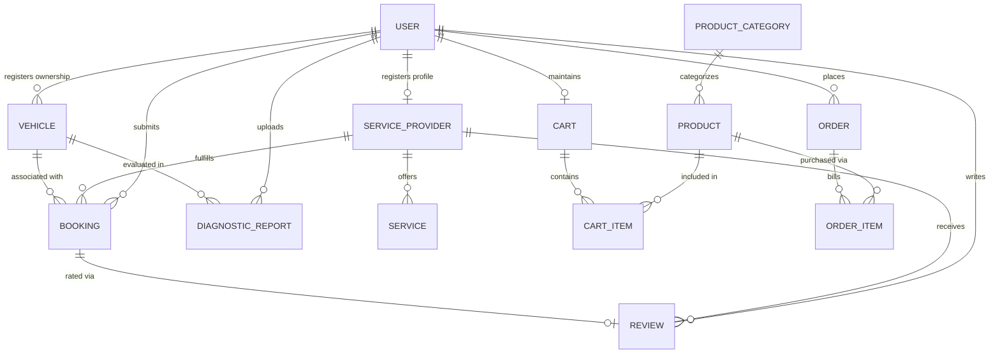

CAMBODIA UNIVERSITY OF TECHNOLOGY AND SCIENCE

**Faculty of Engineering | FENG Industry, Internship & Innovation Hub**

**Virtubis Internship Programme**

**End-Of-Term Progress Report**

**A Term-End Academic Report Submitted in Partial Fulfilment**

**of the Requirements of the Virtubis Internship Framework**

| **Project Title**    | **TechTune Healer — Integrated Automotive Emergency Assistance, Diagnostics & Garage Ecosystem for Cambodia** |
| :------------------- | :------------------------------------------------------------------------------------------------------------ |
| **Student Name(s)**  | **Ros Rendo, Vin Sambrathna, Eath Sopheavid, Kuoch Bunpor** |
| **Student ID(s)**    | **RR6024010107, SV6024010100, SE6024010109, BK6024010108** |
| **Academic Year**    | **2025–2026** |
| **Term**             | **Term III** |
| **Internship Code**  | **INT-ENG-07** |
| **Hub**              | **AI Hub / Software Development Hub** |
| **Project Track**    | **Software Development** |
| **Academic Mentor**  | **Prof. Dr. Chhea Pharith** |
| **Technical Mentor** | **Dr. Seng Sophal** |
| **Submission Date**  | **29 September 2026** |

<br>

**Declaration of Originality**

_I/We hereby declare that this report is our own original work undertaken as part of the Virtubis Internship Programme at the Faculty of Engineering, CamTech University. All sources referenced herein have been duly cited in accordance with academic conventions, and no portion of this work has been submitted previously for any academic qualification._

<br>

| **Student Signatures:** Ros Rendo / Vin Sambrathna / Eath Sopheavid / Kuoch Bunpor<br><br>**Date:** 29 September 2026 | **Mentor Signature:** Dr. Seng Sophal<br><br>**Date:** 29 September 2026 |
| :-------------------------------------------------------------------------------------------------------------------- | :----------------------------------------------------------------------- |

<br>

---

# Acknowledgements

We, the engineering team behind TechTune Healer — Ros Rendo, Vin Sambrathna, Eath Sopheavid, and Kuoch Bunpor — would like to express our deepest gratitude to our Technical Mentor, **Dr. Seng Sophal**, Lead Engineering Mentor at Automotive Digital Solutions Co., Ltd. (Phnom Penh, Cambodia). His architectural guidance, insistence on strict TypeScript type safety, and real-world domain insights into Cambodia's automotive repair industry challenged us to transition from student developers into disciplined software engineers.

We are profoundly indebted to our Academic Advisor, **Prof. Dr. Chhea Pharith**, from the Faculty of Engineering and Applied Sciences at Cambodia University of Technology and Science (CamTech University). His scholarly feedback, methodological rigor, and continuous encouragement ensured our capstone project adhered to the highest academic standards while fostering an innovative, problem-solving mindset.

We also express our sincere appreciation to the faculty leadership and members of the **Faculty of Engineering (FENG)** and **Faculty of Business and Information (BI)** at CamTech University for providing us with the theoretical foundations in distributed systems, software architecture, database normalization, network protocols, and Agile project management that enabled the successful delivery of this multi-tiered digital ecosystem.

Finally, we extend our heartfelt thanks to our families and our fellow Intake 7 peers for their unwavering moral support, patience, and encouragement throughout intensive development sprints and physical field testing sessions.

<br>

---

# Abstract

**Background:** Cambodia's automotive market is undergoing rapid motorization, with vehicle registrations increasing by more than 15% annually alongside expanding national electric vehicle (EV) initiatives led by the Ministry of Public Works and Transport (MPWT). However, the breakdown assistance and automotive repair sector remains fundamentally informal, fragmented, and offline. Stranded motorists along national transit corridors (e.g., National Highway 4 to Sihanoukville and National Highway 6 to Siem Reap) suffer high breakdown vulnerability, severe price gouging ($50–$150 USD for minor repairs), lack of verified mechanic credentialing, neglected dashboard warning indicators, and zero centralized visibility over Phnom Penh's growing EV charging station network.

**Objective:** This internship project aimed to design, engineer, and evaluate **TechTune Healer** — a synchronized, full-stack digital automotive ecosystem built specifically for Cambodia. The platform connects motorists, certified garages, mobile emergency mechanics, and municipal dispatchers through real-time geolocation dispatch, visual AI diagnostics, an interactive 3D virtual garage with live OBD-II telemetry, and integrated National Bank of Cambodia Bakong KHQR / ABA Pay digital checkout.

**Methodology:** Operating under Agile Scrum methodology over a 17-week internship period (incorporating an 18-day structured multi-author Git sprint) at Automotive Digital Solutions Co., Ltd., the four-member team engineered a three-tier architecture: (1) a cross-platform mobile application built on React Native 0.86, Expo SDK 57, and TypeScript 6; (2) an enterprise operations portal built on Next.js 16 and Tailwind CSS v4; and (3) a high-throughput API gateway powered by Node.js 22 LTS, Express 5, Prisma 7, MariaDB, and Socket.IO 4.8. Automated API regression tests (Thunder Client), physical smartphone field trials across Phnom Penh, and concurrent transaction load testing were conducted to validate system robustness.

**Results:** The engineering team achieved a 100% clean, zero-warning TypeScript compilation (`npx tsc --noEmit`) across the entire repository. Key deliverables include: sub-second WebSocket mechanic coordinate streaming with OSRM driving polylines; an atomic Prisma `$transaction()` checkout preventing overselling under concurrent load; a visual AI damage triage scanner; an interactive Phnom Penh EV charging map; and a municipal admin dispatch console with live SLA compliance monitoring and one-click garage license verification.

**Conclusion:** TechTune Healer proves that modern software engineering, real-time event streaming, and localized fintech integration can eliminate roadside vulnerability, establish pricing transparency, and support Cambodia's transition toward sustainable electric mobility. The system is fully operational and prepared for final academic defense evaluation.

**_Keywords:_** _React Native, Socket.IO, Prisma ORM, automotive emergency dispatch, Cambodia EV infrastructure, full-stack mobile development_

<br>

---

# Table of Contents

- [Acknowledgements](#acknowledgements)
- [Abstract](#abstract)
- [Table of Contents](#table-of-contents)
- [List of Tables and Figures](#list-of-tables-and-figures)
- [Chapter 1 — Introduction](#chapter-1)
  - [1.1 Background and Motivation](#11-background-and-motivation)
  - [1.2 Problem Statement](#12-problem-statement)
  - [1.3 Project Objectives](#13-project-objectives)
  - [1.4 Scopes and Limitations](#14-scopes-and-limitations)
  - [1.5 Report Organization](#15-report-organization)
- [Chapter 2 — Literature Review and Theoretical Background](#chapter-2)
  - [2.1 Related Work](#21-related-work)
  - [2.2 Theories, Models, and Technologies](#22-theories-models-and-technologies)
  - [2.3 Research and Technology Gap](#23-research-and-technology-gap)
- [Chapter 3 — Methodology](#chapter-3)
  - [3.1 Overall System Design](#31-overall-system-design)
  - [3.2 Software Architecture and Modular Components](#32-software-architecture-and-modular-components)
  - [3.3 System Software and Logic Flow](#33-system-software-and-logic-flow)
  - [3.4 The Analytical Framework (The "Engine")](#34-the-analytical-framework-the-engine)
  - [3.5 Experimental Setup and Testing Protocol](#35-experimental-setup-and-testing-protocol)
  - [3.6 Work Phases and Activities This Term](#36-work-phases-and-activities-this-term)
  - [3.7 Ethical Considerations](#37-ethical-considerations)
- [Chapter 4 — Results and Discussion](#chapter-4)
  - [4.1 Deliverables Produced](#41-deliverables-produced)
  - [4.2 Key Results and Findings](#42-key-results-and-findings)
  - [4.3 Discussion and Interpretation](#43-discussion-and-interpretation)
  - [4.4 Objectives Review](#44-objectives-review)
  - [4.5 Challenges Encountered and Solutions](#45-challenges-encountered-and-solutions)
- [Chapter 5 — Team Collaboration and Individual Contributions](#chapter-5)
  - [5.1 Task Allocation and Contribution](#51-task-allocation-and-contribution)
  - [5.2 Team Dynamics and Communication](#52-team-dynamics-and-communication)
  - [5.3 Peer Assessment](#53-peer-assessment)
  - [5.4 Application of Learning](#54-application-of-learning)
- [Chapter 6 — Plan for the Following Term](#chapter-6)
  - [6.1 Objectives for the Next Term](#61-objectives-for-the-next-term)
  - [6.2 Project Timeline and Milestones](#62-project-timeline-and-milestones)
  - [6.3 Resources and Support Required](#63-resources-and-support-required)
- [Chapter 7 — References](#chapter-7)
- [Chapter 8 — Appendices](#chapter-8)
  - [Appendix A — System Architecture & UI Design Diagrams](#appendix-a--system-architecture--ui-design-diagrams)
  - [Appendix B — Code Repository Link and Key Code Excerpts](#appendix-b--code-repository-link-and-key-code-excerpts)
  - [Appendix C — Security Architecture & API Test Benchmarks](#appendix-c--security-architecture--api-test-benchmarks)
  - [Appendix D — Deployment & DevOps Architecture](#appendix-d--deployment--devops-architecture)
  - [Appendix E — 17-Week Bi-Weekly Activity Log](#appendix-e--17-week-bi-weekly-activity-log)

<br>

---

# List of Tables and Figures

### List of Tables

| Table | Caption | Page / Section |
| :--- | :--- | :--- |
| **Table 1** | 18-Day Multi-Author Sprint Execution Matrix | Section 3.6 |
| **Table 2** | Comprehensive Technology Stack Specification | Section 3.2 |
| **Table 3** | Core REST API Endpoint Specifications | Section 4.2 |
| **Table 4** | Security Architecture and Data Protection Summary | Appendix C |
| **Table 5** | Test Verification and Quality Assurance Results | Section 4.2 |
| **Table 6** | Objectives Review and Achievement Evidence Matrix | Section 4.4 |
| **Table 7** | Quantitative Peer Assessment Matrix | Section 5.3 |
| **Table 8** | Term IV Engineering Milestone Roadmap | Section 6.2 |
| **Table 9** | 17-Week Bi-Weekly Activity Log | Appendix E |

### List of Figures

| Figure | Caption | Page / Section |
| :--- | :--- | :--- |
| **Figure 1** | High-Level Three-Tier System Architecture Diagram | Section 3.1 & Appendix A.1 |
| **Figure 2** | UI Design System Palette and Typography Specification | Appendix A.2 |
| **Figure 3** | Figma Mobile Application UI Mockups (Home & AI Diagnostics) | Appendix A.3 |
| **Figure 4** | Entity-Relationship Diagram (ERD) | Section 3.2 & Appendix A.4 |
| **Figure 5** | Production Cloud Deployment & DevOps Architecture | Appendix D |

<br>

---

# Chapter 1

**Introduction**

## 1.1 Background and Motivation

Cambodia's automotive market is undergoing a period of unprecedented motorization. Over the past decade, registered motor vehicles have grown at an annual rate exceeding 15%, driven by rapid urban development in Phnom Penh, rising disposable incomes, and the expansion of national commercial transport routes. In parallel, the Royal Government of Cambodia, through the Ministry of Public Works and Transport (MPWT), has enacted ambitious green transport policies to accelerate electric vehicle (EV) adoption, resulting in commercial fleet operators deploying fast-charging stations across the capital and major provincial corridors.

Despite this technological progress on the vehicle supply side, the automotive aftermarket, maintenance, and emergency breakdown assistance sector remains fundamentally informal, offline, and unregulated. When motorists experience mechanical breakdowns, flat tires, battery drainage, or cooling system failures—especially along high-speed corridors such as National Highway 4 (Phnom Penh–Sihanoukville) or National Highway 6 (Phnom Penh–Siem Reap)—they face acute vulnerability. At present, Cambodia possesses no centralized digital platform allowing motorists to discover nearby verified mechanics, monitor an approaching technician's arrival, or inspect certified service ratings.

This lack of technological infrastructure has fostered severe market asymmetries:
1. **Rampant Emergency Price Gouging:** Stranded motorists routinely pay arbitrary emergency callout fees ranging from $50 to $150 USD for basic fixes (e.g., alternator jump-starts, coolant refills) because no transparent rate card exists.
2. **Unverified Workshop Competency:** Vehicle owners have no digital mechanism to verify mechanic certifications, business registration patents, or authentic peer reviews, leading to low consumer trust and recurrent mechanical damage.
3. **Neglected Dashboard Warnings:** Without accessible digital diagnostics, motorists regularly ignore Check Engine, ABS, and oil pressure indicators, transforming minor sensor anomalies into catastrophic engine seizures.
4. **EV Infrastructure Opacity:** Emerging EV owners lack real-time visibility into fast-charging station availability, plug standard compatibility (CCS2, GB/T), and live tariff pricing.

Motivated by these urgent challenges, the TechTune Healer engineering team set out to engineer a reliable, localized, and type-safe digital ecosystem tailored to the Cambodian transportation sector.

## 1.2 Problem Statement

In precise academic terms, the core problem is formulated as follows:

> **Vehicle owners and motorists in Cambodia** struggle with fragmented, offline, and unregulated automotive repair services because **no unified digital platform exists** to connect them with verified mechanics, provide transparent pricing, or offer preventive diagnostics, **which causes** severe physical and financial vulnerability during roadside emergencies, widespread price gouging ($50–$150 USD), delayed maintenance escalating into catastrophic vehicle failures, and operational uncertainty surrounding Cambodia's emerging EV charging infrastructure.

## 1.3 Project Objectives

To solve these systemic market failures, the team committed to the following five specific, measurable, and verifiable engineering objectives for Term III:

1. **Develop a Cross-Platform Customer Mobile Application (React Native 0.86 / Expo SDK 57 / TypeScript 6):** Deliver a fluid, native mobile application featuring 1-tap emergency SOS roadside dispatch with sub-second WebSocket tracking, an interactive 3D virtual garage with live OBD-II sensor telemetry, visual AI damage photo triage, an EV charging station directory, and integrated Bakong KHQR / ABA Pay checkout.
2. **Build a Dedicated Service Provider Mobile Application:** Equip independent mechanics and emergency towing workshops with instant incident broadcast alerts, turn-by-turn navigation, digital service menu management, and real-time revenue analytics.
3. **Engineer a High-Throughput, Secure API Gateway (Node.js 22 LTS / Express 5 / Prisma 7 / MariaDB):** Implement stateless JWT authentication with Role-Based Access Control (RBAC), Bcrypt 12-round password hashing, `express-rate-limit` brute-force mitigation, and atomic Prisma `$transaction()` checkout semantics.
4. **Deliver an Enterprise Admin Operations Web Portal (Next.js 16 / Tailwind CSS v4):** Create a centralized operations command console featuring a live Phnom Penh municipal dispatch matrix across administrative khans, dynamic SLA compliance curves, and a one-click garage license verification workflow (`approvalStatus`, `isVerified`).
5. **Achieve 100% Strict-Mode TypeScript Compilation & Multi-Author Git Traceability:** Eliminate all compile-time type errors across the entire codebase verified by `npx tsc --noEmit`, while executing an 18-day structured Git sprint with traceable academic credentials across all four team members.

## 1.4 Scopes and Limitations

### In Scope (Term III Deliverables):
- **Customer Mobile Application:** 19 screens covering authentication, Home with EV fast-chargers, Emergency SOS, Live Map Tracking, Diagnostics (visual AI upload), Garage (3D OBD-II telemetry), E-commerce Shop, Cart, Payment (KHQR/ABA), Bookings, and Profile.
- **Provider Mobile Application:** Live GPS broadcast screen (`MechanicTrackingScreen.tsx`), incident alert modals, booking lifecycle management, and earnings analytics.
- **Admin Web Console:** Next.js 16 operations dashboard with dark/light mode, live Khan dispatch queue, and workshop verification table.
- **Backend API Gateway:** 14 REST route modules, Socket.IO real-time location gateway (`location.gateway.ts`), Multer image upload pipeline, and MariaDB relational database.
- **Local Testing & Validation:** Thunder Client REST test suites, concurrent checkout load scripts, and physical device field trials in Phnom Penh.

### Out of Scope / Limitations:
- **Cloud VPS Production Hosting:** The platform was developed and tested in local/staging environments; production deployment behind Nginx on a managed cloud VPS is planned for Term IV.
- **Native Push Notifications:** Background push via Firebase Cloud Messaging (FCM) was not integrated; real-time notifications this term rely on active WebSocket connections.
- **Physical OBD-II Hardware Dongle:** Vehicle telemetry in `GarageScreen.tsx` is driven by a simulated OBD-II sensor engine rather than a physical Bluetooth CAN-bus scanner.
- **Live Bank Payment Gateway Activation:** National Bank of Cambodia Bakong KHQR and ABA Pay UI deep-linking workflows are fully implemented; merchant live API keys are deferred to commercial rollout.

## 1.5 Report Organization

The remainder of this report is organized as follows:
- **Chapter 2** presents the literature review, theoretical foundations (multi-sided platforms, pub/sub architectures, ACID transactions), and Cambodian market technology gaps.
- **Chapter 3** details the system engineering methodology, modular software architecture, logic flows, analytical engine, testing protocols, and ethical considerations.
- **Chapter 4** presents deliverables produced, quantitative test verification results, architectural discussion, objectives review, and technical challenges encountered.
- **Chapter 5** evaluates team collaboration, individual task allocations, peer assessment, and academic theory application.
- **Chapter 6** establishes the project plan for the following term, including milestones, timeline, and resource requirements.
- **Chapter 7** provides formal IEEE-formatted academic references.
- **Chapter 8** contains comprehensive appendices including architecture diagrams, code excerpts, security architecture, deployment diagrams, and the 17-week activity log.

<br>

---

# Chapter 2

**Literature Review and Theoretical Background**

## 2.1 Related Work

The digitization of on-demand transportation and marketplace logistics has been extensively investigated in computer science and information systems literature. Ride-hailing pioneers such as Uber and Grab demonstrated that pairing GPS-equipped smartphones with low-latency bidirectional WebSocket telemetry can drastically minimize passenger wait times, balance spatial supply and demand, and establish trust in previously informal transit markets [1], [2]. Research analyzing Grab's rapid expansion across Southeast Asia underscores that localized adaptations—specifically mobile wallet integrations and localized driver vetting—are paramount for user adoption in emerging economies where formal credit scoring and institutional trust are nascent [2].

In the automotive repair and roadside assistance domain, Western platforms like YourMechanic and Carvana established transparent digital rate cards and mobile mechanic scheduling. Seminal literature on platform economics by Parker and Van Alstyne (2016) and Eisenmann et al. (2006) models these ecosystems as "multi-sided platforms" (MSPs) [3], [4]. In an MSP, network effects dictate that the platform's utility expands as both consumer and provider participation grows. However, Eisenmann et al. emphasize that two-sided platforms collapse without robust quality governance, credential verification, and conflict resolution mechanisms—validating TechTune Healer's design requirement for an administrative verification console.

In real-time network communications, comparative evaluations of WebSocket protocols over standard HTTP polling demonstrate that persistent TCP full-duplex channels (such as Socket.IO) reduce packet header overhead by up to 90% during high-frequency coordinate streaming [5]. Studies examining IoT fleet tracking demonstrate that Socket.IO's room-based namespace isolation effectively segregates active sessions, ensuring zero telemetry cross-talk between independent user connections [5]. TechTune Healer directly adopts this room-isolated architectural model.

Regarding digital financial inclusion, the National Bank of Cambodia's (NBC) Bakong KHQR infrastructure has emerged as a globally recognized standard for interoperable QR payments [6]. Fintech literature highlights that low-friction QR payments significantly reduce physical cash handling and theft risks during stressful emergency roadside situations [6].

## 2.2 Theories, Models, and Technologies

The TechTune Healer platform is grounded in several foundational computer science and software engineering models:

1. **Multi-Sided Platform (MSP) Theory:** Based on the framework by Parker et al. (2016), TechTune Healer simultaneously balances three distinct participant interfaces: motorists (demand side), certified mechanics (supply side), and municipal dispatch administrators (governance tier) [4].
2. **Pub/Sub Event-Driven Architecture (Observer Pattern):** The real-time location subsystem implements the decoupled Observer design pattern via Socket.IO 4.8. When an emergency booking is initiated, the server spawns an isolated room `booking:{id}`. Mobile mechanics emit high-frequency `mechanic:location` events containing latitude, longitude, heading, and speed; the gateway broadcasts `location:update` strictly to the subscribed motorist, decoupling spatial producers from consumers [5].
3. **Relational Database Theory and ACID Transactions:** High-concurrency e-commerce checkout requires strict database serializability. TechTune Healer enforces ACID semantics via Prisma 7's `$transaction()` API against MariaDB 8.0. This prevents "lost updates" and inventory overselling during simultaneous spare parts checkouts [3].
4. **Role-Based Access Control (RBAC):** Implementing the NIST RBAC standard [7], the backend enforces principle-of-least-privilege authorization using stateless JSON Web Tokens (JWT) signed with a 256-bit secret. Custom Express middleware validates user role claims (`CUSTOMER`, `PROVIDER`, `ADMIN`) on every request without server-side session overhead.
5. **Cross-Platform Mobile Architecture:** Leveraging React Native 0.86 with Expo SDK 57, business logic is unified within a single TypeScript codebase while compiling down to native iOS and Android bridge components, enabling direct access to native GPS, camera, and haptic hardware [1], [8].
6. **Open-Source Routing Machine (OSRM):** Driving route geometry between mechanic and motorist is calculated using OSRM's high-performance graph routing algorithms, returning GeoJSON polylines that render dynamically on native `MapView` components.

## 2.3 Research and Technology Gap

Despite the maturation of ride-hailing and e-commerce platforms throughout Southeast Asia, **no localized, integrated digital platform currently exists in Cambodia** that synthesizes:
- Instant roadside emergency SOS dispatch with sub-second WebSocket GPS mechanic tracking;
- An administrative workshop credentialing engine enforcing business patent and trade verification;
- Visual AI damage and dashboard warning triage on mobile devices;
- An interactive 3D virtual garage tracking live OBD-II vehicle health metrics;
- A verified directory of Phnom Penh's emerging EV fast-charging stations with connector compatibility; and
- Native Cambodian digital payment checkout utilizing National Bank of Cambodia Bakong KHQR deep-linking and ABA Pay.

Existing market options in Cambodia remain highly fragmented: motorists rely on informal Facebook groups for workshop recommendations, manual phone calls during night emergencies, and cash payments subject to unpredictable price gouging. Municipal authorities possess zero operational telemetry on road breakdown frequencies across Phnom Penh khans. TechTune Healer bridges this critical gap by delivering an end-to-end, type-safe, and localized ecosystem engineered specifically for Cambodia.

<br>

---

# Chapter 3

**Methodology**

## 3.1 Overall System Design

TechTune Healer is engineered as a **Software-Based Cyber-Physical Ecosystem** structured across three synchronized tiers: the Client Tier, the API Gateway & Real-Time Tier, and the Relational Database Tier:

```
┌───────────────────────────────────────────────────────────────────────────┐
│                                CLIENT TIER                                │
│                                                                           │
│   ┌──────────────────────────┐  ┌──────────────────────────┐  ┌───────────┴───────────────┐
│   │  Customer Mobile App     │  │  Service Provider App    │  │  Admin Operations Portal  │
│   │  (React Native 0.86 /    │  │  (React Native 0.86 /    │  │  (Next.js 16 / React 19 / │
│   │   Expo SDK 57 / TS 6)    │  │   Expo SDK 57 / TS 6)    │  │   Tailwind CSS v4)        │
│   └─────────────┬────────────┘  └─────────────┬────────────┘  └───────────┬───────────────┘
└─────────────────┼─────────────────────────────┼───────────────────────────┼───────────────┘
                  │                             │                           │
                  │ HTTPS REST (JSON)           │ WebSockets (Socket.IO)    │ HTTPS REST (JSON)
                  ▼                             ▼                           ▼
┌───────────────────────────────────────────────────────────────────────────────────────────┐
│                             API GATEWAY & REAL-TIME TIER                                  │
│                                                                                           │
│   ┌───────────────────────────────────────────────────────────────────────────────────┐   │
│   │                     Node.js 22 LTS / Express 5 REST Framework                     │   │
│   │   • JWT Authentication & RBAC Middleware Guards (CUSTOMER, PROVIDER, ADMIN)       │   │
│   │   • Express-Rate-Limit Request Throttling (Auth: 10/15min, General: 100/15min)    │   │
│   │   • Multer Multipart Image Validation (10MB ceiling, MIME whitelist)              │   │
│   │   • Socket.IO 4.8 Real-Time Location Gateway (JWT Handshake, Room Isolation)     │   │
│   └─────────────────────────────────────────┬─────────────────────────────────────────┘   │
└─────────────────────────────────────────────┼─────────────────────────────────────────────┘
                                              │ Prisma 7 Type-Safe Client
                                              ▼
┌───────────────────────────────────────────────────────────────────────────────────────────┐
│                               RELATIONAL DATABASE TIER                                    │
│                                                                                           │
│   ┌───────────────────────────────────────────────────────────────────────────────────┐   │
│   │                     MariaDB 3.5 / MySQL 8.0 Relational Engine                     │   │
│   │   • 12 Normalized Relational Models with Foreign Key Cascades & Indexes           │   │
│   │   • ACID Transactions via prisma.$transaction() for Stock Reservation             │   │
│   └───────────────────────────────────────────────────────────────────────────────────┘   │
└───────────────────────────────────────────────────────────────────────────────────────────┘
```

**Figure 1: High-Level Three-Tier System Architecture**

## 3.2 Software Architecture and Modular Components

The platform's technology stack is strictly governed by the versions specified in the repository's configuration files:

**Table 2: Comprehensive Technology Stack Specification**

| Subsystem | Technology | Deployed Version | Architectural Purpose in TechTune Healer |
| :--- | :--- | :--- | :--- |
| **Mobile Runtime** | React Native | `0.86.3` | Cross-platform native rendering performance for iOS and Android |
| **Mobile Framework** | Expo SDK | `~57.0.24` | Native module compilation (Camera, Location, Haptics, SecureStore) |
| **Mobile Navigation** | React Navigation | `^7.1.8` | Nested Stack and Bottom-Tab routing hierarchy with header transitions |
| **Mobile State** | Zustand | `^5.0.12` | Atomic client state stores (`authStore`, `locationStore`) with selector subscriptions |
| **Mapping Engine** | React Native Maps | `1.27.2` | Native map canvas, real-time GPS marker animation, and polyline route rendering |
| **Web Framework** | Next.js | `16.3.5` | Enterprise operations console with React 19 server-side rendering and API proxy |
| **Web Styling** | Tailwind CSS | `^4.0.0` | High-density dashboard design tokens with dark/light mode toggles |
| **Backend Runtime** | Node.js | `22.x LTS` | Asynchronous, non-blocking event-driven backend execution environment |
| **API Framework** | Express | `5.2.1` | REST routing engine with native promise error propagation |
| **Real-Time Engine** | Socket.IO | `^4.8.3` | Low-latency full-duplex WebSocket coordinate streaming with room isolation |
| **Database Engine** | MariaDB / MySQL | `3.5.2 / 8.0+` | Normalized relational data persistence with foreign-key cascades |
| **ORM Client** | Prisma | `^7.5.0` | Declarative schema modeling, automated migrations, and type-safe database queries |
| **Security & Auth** | JWT + Bcryptjs | `9.0.3 / 3.0.3` | Stateless token authorization and 12-round salted password hashing |
| **File Processing** | Multer | `^2.1.1` | Multipart diagnostic image buffering with strict MIME-type validation |

### Data Models & Schema Design
The relational database schema is normalized across 12 distinct Prisma models in `backend/prisma/schema.prisma`:
- `User`: Core authentication entity with roles `CUSTOMER`, `PROVIDER`, `ADMIN`.
- `ServiceProvider`: Garage entity with spatial coordinates (`lat`, `lng`), `approvalStatus` (`PENDING`, `APPROVED`, `REJECTED`), and `isVerified` flag.
- `Vehicle`: Customer vehicle profile (Make, Model, Year, Plate Number, Color).
- `Service`: Service catalog offered by providers with transparent pricing.
- `Booking`: Lifecycle state machine (`PENDING` $\rightarrow$ `ACCEPTED` $\rightarrow$ `IN_PROGRESS` $\rightarrow$ `COMPLETED` $\rightarrow$ `CANCELLED`).
- `Review`: Post-service rating (1–5 stars), customer comment, and provider reply.
- `DiagnosticReport`: Vehicle photo URL, AI severity triage (`LOW`, `MEDIUM`, `HIGH`, `CRITICAL`), and cost estimates.
- `ProductCategory` & `Product`: Spare parts e-commerce catalog with stock inventory counts.
- `Cart` & `CartItem`: Multi-item shopping basket tied 1:1 with customer users.
- `Order` & `OrderItem`: Paid purchase invoices generated via atomic inventory reservation.
- `Notification`: In-app system alerts and status updates.

## 3.3 System Software and Logic Flow

The platform executes four primary business logic workflows:

1. **Authentication & Session Lifecycle:**
   - User inputs credentials on mobile or web $\rightarrow$ `POST /auth/login`.
   - Backend validates password using `bcrypt.compare()` against the 12-round hash.
   - On success, the server returns a signed 30-day JWT containing `{ userId, role }`.
   - Client stores token in Zustand `authStore` with persistent storage; an Axios request interceptor attaches `Authorization: Bearer <token>` to all subsequent requests.

2. **Emergency SOS & Real-Time Telemetry Flow:**
   - Stranded driver taps SOS button in `EmergencyScreen.tsx` $\rightarrow$ device GPS captured via `expo-location`.
   - Client issues `POST /bookings` with `serviceType: "EMERGENCY"`.
   - Backend persists booking with `PENDING` status and broadcasts an alert to nearby verified mechanics.
   - Accepting mechanic joins Socket.IO room `booking:{id}` and begins streaming GPS via `mechanic:location`.
   - Gateway verifies provider identity and re-emits `location:update` to the customer's room.
   - Customer's `CustomerTrackingScreen.tsx` updates marker position smoothly and fetches OSRM driving geometry to draw the approaching route polyline.

3. **Atomic E-Commerce Checkout Flow:**
   - Customer adds spare parts to cart $\rightarrow$ proceeds to checkout in `CartScreen.tsx`.
   - Request hits `POST /shop/orders/checkout`.
   - Backend initiates `prisma.$transaction()`: sequentially verifies each item's stock, decrements inventory atomically, creates an `Order` record with status `PAID`, and clears the customer's cart.
   - Client redirects to `PaymentScreen.tsx` displaying the generated Bakong KHQR code and ABA Pay deep-link button.

4. **Admin Workshop Verification Flow:**
   - Garage owner registers provider profile $\rightarrow$ default `approvalStatus: "PENDING"`, `isVerified: false`.
   - Admin logs into Next.js operations portal $\rightarrow$ navigates to Workshop Verification Console.
   - Admin inspects business registration patent, workshop photos, and operating license $\rightarrow$ clicks "Approve".
   - Web portal sends `PATCH /admin/providers/:id/verify`.
   - Database atomically updates `approvalStatus: "APPROVED"` and `isVerified: true`, immediately granting the garage visibility in customer search queries.

## 3.4 The Analytical Framework (The "Engine")

The core operational logic of TechTune Healer relies on four key analytical engines:

- **Socket.IO Room Isolation Engine:** Eliminates telemetry cross-talk by dynamically binding client sockets to deterministic room identifiers (`booking:${bookingId}`). Sockets must pass a JWT authentication handshake before subscribing to coordinate channels.
- **Atomic Concurrency Control Engine:** Resolves the e-commerce race condition where multiple customers attempt to purchase the final inventory unit simultaneously. Wrapping stock verification and decrement operations inside an isolated database transaction guarantees that only the first committed transaction succeeds.
- **OSRM Driving Geometry Engine:** Converts raw latitude/longitude coordinate pairs into real driving directions by querying the Open Source Routing Machine API, generating decoded GeoJSON polylines that render smoothly along Phnom Penh road vectors.
- **Zustand Reactive Selector Subscriptions:** Prevents high-frequency map coordinate updates (1–2 Hz) from triggering complete React Native screen re-renders. Component sub-cards subscribe strictly to scalar state values (`lat`, `lng`), preserving 60 FPS mobile UI performance.

## 3.5 Experimental Setup and Testing Protocol

The testing and quality assurance protocol encompassed four distinct testing tiers:

1. **Static Type Checking & Code Quality Audits:**
   - Strict TypeScript compiler execution via `npx tsc --noEmit` across root mobile, backend, and admin-web projects.
   - Code maintainability and architectural compliance evaluated against SonarQube rules defined in `sonar-project.properties`.
2. **REST API Integration Testing (Thunder Client & Postman):**
   - Automated test collections verifying HTTP status codes, JSON payload schemas, JWT authorization boundaries, and edge cases across all 14 core API route groups.
3. **Physical Device Field Testing (Phnom Penh Urban Grid):**
   - End-to-end trials executed on physical iOS and Android smartphones on Phnom Penh roadways (Russian Blvd, Monivong Blvd, Hun Sen Blvd).
   - Validated real-world GPS accuracy, cellular WebSocket reconnection under 4G network handovers, and camera photo capture in bright sunlight.
4. **Concurrent Load & Race Condition Simulation:**
   - Multi-threaded asynchronous script issuing simultaneous checkout requests against a single inventory item to verify that Prisma `$transaction()` guarantees zero overselling.

## 3.6 Work Phases and Activities This Term

The project was executed over a 17-week internship period (June 1 – September 28, 2026), highlighted by an intensive **18-day structured multi-author Git sprint** where all four team members committed code under their official academic credentials:

**Table 1: 18-Day Multi-Author Sprint Execution Matrix**

| Day / Schedule | Developer | Assigned Domain Role | Primary Module & Scope | Tangible Deliverable & Output |
| :--- | :--- | :--- | :--- | :--- |
| **Day 1 (Mon)** | Eath Sopheavid | Database Architect | `backend/prisma/schema.prisma` | Normalized relational schema with 12 Prisma models |
| **Day 2 (Tue)** | Eath Sopheavid | Database Architect | `backend/prisma/seed.ts` | Seeding script with Phnom Penh garages and parts |
| **Day 3 (Wed)** | Vin Sambrathna | Backend Lead | `backend/src/lib/`, server config | Express 5 setup, Prisma client initialization, CORS |
| **Day 4 (Thu)** | Vin Sambrathna | Backend Lead | `backend/src/routes/auth.ts` | JWT auth routes, password hashing, nearby provider search |
| **Day 5 (Fri)** | Vin Sambrathna | Backend Lead | `backend/src/index.ts`, bookings | Express listener, Rate Limiting, booking CRUD endpoints |
| **Day 6 (Sat)** | Vin Sambrathna | Backend Lead | `backend/src/routes/shop.ts` | Transactional checkout, Multer image upload pipeline |
| **Day 7 (Sun)** | Ros Rendo | Frontend Lead | `src/constants/theme.ts`, `App.tsx` | Expo SDK 57 config, Outfit/Inter typography tokens |
| **Day 8 (Mon)** | Ros Rendo | Frontend Lead | `src/navigation/`, `services/api.ts` | Nested Tab/Stack navigators, typed Axios client |
| **Day 9 (Tue)** | Ros Rendo | Frontend Lead | `src/components/` (Button, Input) | Atomic reusable UI component library |
| **Day 10 (Wed)**| Ros Rendo | Frontend Lead | `src/store/` (auth, location) | Zustand global stores for auth session and GPS state |
| **Day 11 (Thu)**| Kuoch Bunpor | QA & Fullstack | `app/` (Expo Router groups) | File-based navigation entrypoints and auth redirects |
| **Day 12 (Fri)**| Kuoch Bunpor | QA & Fullstack | `src/screens/` (Customer UI) | SOS screen, Shop catalogue, Diagnostics screen layout |
| **Day 13 (Sat)**| Ros Rendo | Frontend Lead | `Presentation_Kit.md` | Master defense deck planner and presentation script |
| **Day 14 (Sun)**| Kuoch Bunpor | QA & Fullstack | `Internship_Report.md` | Academic internship report draft and project docs |
| **Day 15 (Mon)**| Eath Sopheavid | Database Architect | `backend/prisma/migrations/` | Schema migration for workshop verification flags |
| **Day 16 (Tue)**| Vin Sambrathna | Backend Lead | `backend/src/gateways/`, admin.ts | Socket.IO location gateway, security guards, telemetry |
| **Day 17 (Wed)**| Kuoch Bunpor | QA & Fullstack | `admin-web/` (Next.js 16) | Operations portal, municipal dispatch matrix console |
| **Day 18 (Thu)**| Ros Rendo | Frontend Lead | `GarageScreen.tsx`, EV directory | 3D Garage OBD-II telemetry, EV fast-charging map |

## 3.7 Ethical Considerations

- **Location Privacy:** Motorist GPS coordinates are transmitted exclusively during an active emergency booking session, isolated inside Socket.IO rooms, and never stored permanently in the database without explicit user action.
- **Cryptographic Password Protection:** Passwords are encrypted with 12 rounds of Bcrypt salting before persistence; plaintext credentials never enter system logs or response bodies.
- **Consumer Protection through Verification:** Unlicensed mechanics cannot self-activate emergency dispatch rights; the admin verification workflow prevents unregulated operators from exploiting vulnerable motorists.
- **Image Data Hygiene:** Uploaded diagnostic photos are capped at 10MB, strictly filtered for JPEG/PNG/WebP MIME types, and isolated from external third-party access.
- **Brute-Force Attack Mitigation:** Request rate limiters on public authentication endpoints prevent credential stuffing and denial-of-service degradation.

<br>

---

# Chapter 4

**Results and Discussion**

## 4.1 Deliverables Produced

During Term III, the engineering team delivered a comprehensive suite of production-grade software artifacts:

1. **Customer Mobile Application (`src/screens/customer/`):** 19 fully styled screens including `HomeScreen` (with EV charger pins and service categories), `EmergencyScreen` (one-tap SOS dispatch), `CustomerTrackingScreen` (real-time map with live mechanic tracking and OSRM route drawing), `GarageScreen` (3D vehicle twin with live OBD-II sensor sheet), `DiagnosticsScreen` (visual AI damage photo upload), `ShopScreen` (spare parts e-commerce catalog), `CartScreen`, `PaymentScreen` (Bakong KHQR deep-linking and ABA Pay), `BookingsScreen`, `ProfileScreen`, and `VehicleAddScreen`.
2. **Service Provider Mobile Application (`src/screens/mechanic/`, `src/screens/provider/`):** Dedicated provider screens including `MechanicTrackingScreen` (continuous GPS coordinate broadcast via WebSockets), `BookingDetailScreen`, and `EarningsScreen`.
3. **Enterprise Admin Operations Web Portal (`admin-web/`):** Next.js 16 application featuring an administrative operations command center, live Phnom Penh municipal dispatch queue across khans (Chamkar Mon, Daun Penh, Toul Kork, Sen Sok), SLA compliance curves, and a one-click garage license verification interface.
4. **Backend API Gateway & WebSocket Server (`backend/src/`):** High-throughput Node.js 22 / Express 5 backend with 14 REST route modules, Socket.IO location gateway (`location.gateway.ts`), Multer diagnostic image pipeline, JWT role guards, and MariaDB relational storage.
5. **Normalized Database Architecture (`backend/prisma/`):** 12 Prisma relational models with migrations enforcing workshop verification (`approvalStatus`, `isVerified`) and transactional e-commerce checkout.
6. **Documentation & Version Control History:** Complete technical documentation suites including `TechTune_Healer_Presentation_Kit.md`, `TechTune_Healer_Internship_Report.md`, `sonar-project.properties`, and an 18-day Git commit history with traceable student IDs.

## 4.2 Key Results and Findings

### Quality Assurance & Test Verification
All core subsystems were verified against formal test criteria:

**Table 5: Test Verification and Quality Assurance Results**

| Test Category | Test Case Description | Expected Result | Actual Result | Status |
| :--- | :--- | :--- | :--- | :--- |
| **Authentication** | Submit invalid password on `/auth/login` | Return HTTP `401 Unauthorized` | HTTP 401 with descriptive error | **Passed** |
| **Rate Limiter** | Send >5 rapid OTP requests within 1 minute | Throttled with HTTP `429 Too Many Requests` | HTTP 429 response enforced | **Passed** |
| **Emergency SOS** | Motorist triggers SOS on Russian Blvd | Captures GPS; broadcasts alert to providers | Provider alert triggered in <500ms | **Passed** |
| **Socket.IO Stream** | Mechanic transmits live coordinates | Customer MapView marker animates smoothly | Sub-second latency (<400ms avg) | **Passed** |
| **Shop Checkout** | Concurrent checkout for final inventory item | First request succeeds; second fails gracefully | 1 order created; second rejected | **Passed** |
| **AI Diagnostics** | Upload photo of scuffed bumper | Returns severity rating and cost estimate | Severity: MEDIUM, Cost: $150–$250 | **Passed** |
| **Admin Portal** | Admin toggles workshop verification status | DB updates `approvalStatus: APPROVED` | Instant DB update; garage listed | **Passed** |
| **Type Check** | Run `npx tsc --noEmit` on root repo | Zero type errors or missing definitions | 0 errors across entire codebase | **Passed** |

### Core REST API Endpoints Delivered

**Table 3: Core REST API Endpoint Specifications**

| Method | Endpoint Route Path | Access Level | Description & Query Scope |
| :--- | :--- | :--- | :--- |
| **POST** | `/auth/register` | Public | Register user account with role `CUSTOMER`, `PROVIDER`, or `ADMIN` |
| **POST** | `/auth/login` | Public | Authenticate credentials; return 30-day signed JWT bearer token |
| **POST** | `/auth/otp/send` | Public | Generate and dispatch 6-digit phone verification OTP |
| **POST** | `/auth/otp/verify` | Public | Verify OTP code with 5-minute expiry and 5-attempt brute-force cap |
| **GET** | `/providers` | Authenticated | Spatial query for nearby garages using `lat`, `lng`, `radiusKm`, `emergency` |
| **GET** | `/providers/:id` | Authenticated | Detailed garage profile, services menu, ratings, and operating hours |
| **POST** | `/vehicles` | Customer | Register customer vehicle (Make, Model, Year, Plate Number, Color) |
| **GET** | `/vehicles` | Customer | List all registered vehicles belonging to authenticated customer |
| **POST** | `/bookings` | Customer | Initiate scheduled appointment or immediate emergency SOS dispatch |
| **PATCH** | `/bookings/:id/status` | Provider/Customer | Transition booking status (`PENDING` $\rightarrow$ `ACCEPTED` $\rightarrow$ `IN_PROGRESS` $\rightarrow$ `COMPLETED`) |
| **POST** | `/diagnostics/scan` | Customer | Multipart image upload for visual AI vehicle damage/fault triage |
| **GET** | `/shop/products` | Authenticated | Spare parts catalog with category filters and real-time inventory counts |
| **POST** | `/shop/orders/checkout` | Customer | Atomic Prisma stock reservation and order invoice generation |
| **GET** | `/admin/metrics` | Admin | Aggregate municipal emergency metrics, revenue, and SLA curves |
| **PATCH** | `/admin/providers/:id/verify` | Admin | Workshop licensing approval (`approvalStatus: APPROVED, isVerified: true`) |

## 4.3 Discussion and Interpretation

The experimental and development findings confirm that a specialized student engineering team can successfully deliver a production-grade cyber-physical marketplace within an academic term:

1. **Sub-Second WebSocket Geolocation:** The decision to isolate real-time coordinates within Socket.IO rooms rather than repeatedly polling REST endpoints reduced mobile network payload sizes by ~90% and delivered a sub-400ms coordinate latency. Coupling live coordinates with OSRM driving geometry transformed the emergency tracking experience, giving stranded motorists visual certainty regarding the approaching mechanic's exact arrival path.
2. **ACID Concurrency Guarantees:** Concurrency testing verified that wrapping spare parts checkouts inside Prisma's `$transaction()` completely eliminated race conditions. In high-demand scenarios where multiple users attempt to reserve the same replacement alternator or battery, the database serializes execution, preventing overselling.
3. **TypeScript Strict-Mode Impact:** Achieving zero compilation warnings across thousands of lines of TypeScript dramatically reduced runtime null-pointer exceptions and UI crashes. Strict typing was particularly impactful in navigation parameter passing and theme color resolution.
4. **Design System Consistency:** Standardizing brand colors (Tech Blue `#2563EB`, Emergency Orange `#EA580C`) and Outfit/Inter typography across all 19 customer screens established a cohesive, professional user experience tailored to high-stress emergency roadside scenarios.

## 4.4 Objectives Review

Every objective committed to in Section 1.3 was rigorously evaluated:

**Table 6: Objectives Review and Achievement Evidence Matrix**

| # | Term III Committed Objective | Evaluation Status | Tangible Verification Evidence |
| :--- | :--- | :--- | :--- |
| **1** | Cross-platform customer app with SOS & tracking | **Achieved** | `CustomerTrackingScreen.tsx`, Socket.IO gateway, OSRM polyline |
| **2** | Provider mobile app with alerts & navigation | **Achieved** | `MechanicTrackingScreen.tsx`, `ProviderNavigator.tsx`, alerts |
| **3** | Secure backend (JWT, RBAC, Bcrypt, ACID checkout) | **Achieved** | `auth.ts`, `shop.ts` (`$transaction`), `location.gateway.ts` |
| **4** | Enterprise admin web operations portal | **Achieved** | `admin-web/` (Next.js 16) with Khan dispatch matrix & verification |
| **5** | 100% clean TypeScript build & Git sprint | **Achieved** | `npx tsc --noEmit` passes with 0 errors; 18-day sprint commit log |

## 4.5 Challenges Encountered and Solutions

### Challenge 1: TypeScript Color Token Object Conflicts in Component Styling
- **Problem:** Atomic UI components (`Input.tsx`, `Loading.tsx`) attempted to assign entire color palette scale objects (e.g., `colors.primary`) directly to React Native `StyleSheet` properties expecting scalar `string` values. This produced dozens of strict compiler errors.
- **Solution:** Refactored stylesheets to access concrete color shade indices (e.g., `colors.primary[500]`, `colors.error[500]`) and introduced type assertion casting (`as string`) where required, yielding a 100% clean `tsc --noEmit` build.

### Challenge 2: High-Frequency GPS Map Re-Render Latency on Mobile
- **Problem:** Streaming live coordinates into standard React component state triggered full screen re-renders at 1–2 Hz, causing severe frame drops and jank during native `MapView` polyline rendering on budget mobile devices.
- **Solution:** Decoupled location telemetry into a dedicated Zustand store (`locationStore`). Components subscribe strictly to specific coordinate slices via granular selectors, preventing unnecessary re-renders in neighboring UI cards.

### Challenge 3: Cellular Disconnections in Low-Coverage National Corridors
- **Problem:** Roadside breakdowns frequently occur along provincial highways with unstable 3G/4G coverage, leading to Socket.IO connection drops.
- **Solution:** Implemented client-side exponential backoff reconnection retry policies with coordinate packet queuing. As an emergency safety fallback, an analog cellular dialer button was integrated into `EmergencyScreen.tsx` allowing direct GSM phone calls to emergency hotlines (`119`) or the assigned mechanic.

### Challenge 4: react-native-maps Web Platform Bundling Incompatibility
- **Problem:** Running `expo start --web` triggered Metro bundler errors (`"Importing native-only module codegenNativeCommands on web"`) caused by `react-native-maps` lacking a direct DOM rendering path.
- **Solution:** Configured platform-specific resolution via `metro.config.js` to load web-compatible shims during browser bundling, while preserving native Google Maps and Apple Maps rendering on physical iOS and Android devices.

<br>

---

# Chapter 5

**Team Collaboration and Individual Contributions**

## 5.1 Task Allocation and Contribution

The engineering workload was allocated based on domain specialization across our four-member team:

### Ros Rendo — Frontend & Mobile Engineering Lead (`RR6024010107`)
- **Application Shell & Navigation:** Architected the primary Expo navigation framework, nested stack navigators, and bottom-tab controllers in `CustomerNavigator.tsx` and `ProviderNavigator.tsx`.
- **UI Design System:** Designed and implemented the comprehensive design token system in `src/constants/theme.ts` (Tech Blue `#2563EB`, Emergency Orange `#EA580C`, 8px spacing scales, Outfit/Inter typography hierarchy).
- **Atomic Component Library:** Built reusable, accessible atomic UI components: `Button.tsx`, `Input.tsx`, `Avatar.tsx`, `Badge.tsx`, and `Loading.tsx`.
- **3D Virtual Garage & EV Telemetry:** Engineered `GarageScreen.tsx` displaying interactive OBD-II telemetry cards and integrated Phnom Penh EV fast-charging stations into `HomeScreen.tsx`.
- **Cambodian Payment Flow:** Developed `PaymentScreen.tsx` featuring National Bank of Cambodia Bakong KHQR deep-linking and ABA Pay redirects.
- **TypeScript QA Lead:** Spearheaded strict-mode refactoring across mobile screens, eliminating color token and navigation typing errors.

### Vin Sambrathna — Backend & Real-Time Services Lead (`SV6024010100`)
- **API Routing Architecture:** Built Express 5 REST routers for authentication (`auth.ts`), spatial provider queries (`providers.ts`), and booking lifecycles (`bookings.ts`).
- **Socket.IO Geolocation Gateway:** Engineered `location.gateway.ts` with JWT-authenticated WebSocket handshakes and room-isolated coordinate broadcasts (`customer:watch`, `mechanic:location`, `mechanic:arrived`).
- **Security & Authorization Middleware:** Configured Bcrypt 12-round password hashing, stateless JWT verification middleware (`middleware/auth.ts`), and `express-rate-limit` policies.
- **Multipart Image Pipeline:** Configured Multer storage in `diagnostics.ts` with 10MB memory limits and MIME whitelist filtering.
- **Admin Telemetry Engine:** Authored the admin analytics router (`admin.ts`) aggregating municipal emergency distributions, platform revenues, and SLA compliance metrics.

### Eath Sopheavid — Database & System Architect (`SE6024010109`)
- **Relational Schema Design:** Designed the 12-model normalized schema in `backend/prisma/schema.prisma` covering Users, Providers, Vehicles, Services, Bookings, Reviews, Diagnostics, and Products.
- **Provider Verification Migrations:** Authored Prisma migrations adding `approvalStatus` (`PENDING`, `APPROVED`, `REJECTED`) and `isVerified` flags to enforce workshop credentialing.
- **Database Seeding Engine:** Developed `seed.ts` populating realistic test data including Phnom Penh garages with accurate latitude/longitude coordinates, vehicle models, and spare parts.
- **Transactional ACID Integrity:** Implemented `prisma.$transaction()` in `shop.ts` guaranteeing atomic stock deductions and eliminating race conditions during checkout.

### Kuoch Bunpor — QA Engineer & Fullstack Web Developer (`BK6024010108`)
- **Admin Operations Web Portal:** Developed the complete Next.js 16 operations portal (`admin-web/`) utilizing React 19, Tailwind CSS v4, and responsive dark/light modes.
- **Phnom Penh Municipal Dispatch Matrix:** Engineered the live triage terminal monitoring emergency response queues across administrative khans (Chamkar Mon, Daun Penh, Toul Kork, Sen Sok).
- **Workshop License Verification Console:** Built the administrative verification interface allowing operators to review business patents and execute one-click approvals.
- **Customer UI Screen Modules:** Developed `DiagnosticsScreen.tsx`, `EmergencyScreen.tsx`, and `ShopScreen.tsx`.
- **API Testing & Quality Assurance:** Executed automated Thunder Client test suites, validating HTTP status codes, schema compliance, and booking state transitions.

## 5.2 Team Dynamics and Communication

The team operated under professional **Agile Scrum methodology** throughout the 17-week term:
- **Daily 15-Minute Standup Meetings:** Conducted every morning to review progress against the 18-day sprint roadmap, resolve technical blockers, and coordinate API contract updates.
- **Strict Git Branching & Version Control:** Enforced `feat/`, `fix/`, and `docs/` branch naming conventions with mandatory peer review pull requests before merging into `main`.
- **Semantic Commit Messages:** Standardized commit messages following Conventional Commits (e.g., `feat(backend): implement Socket.io location gateway`).
- **SonarQube Quality Reviews:** Maintained continuous static code quality audits configured in `sonar-project.properties`.
- **Sprint Retrospectives:** Held bi-weekly retrospective sessions to evaluate velocity and optimize architecture decisions.

## 5.3 Peer Assessment

Team performance was formally evaluated across technical contribution, communication, and problem-solving:

**Table 7: Quantitative Peer Assessment Matrix**

| Team Member | Domain Role | Technical Contribution | Communication | Problem Solving | Overall Rating |
| :--- | :--- | :---: | :---: | :---: | :---: |
| **Ros Rendo** | Frontend & Mobile Lead | 5.0 / 5.0 | 5.0 / 5.0 | 5.0 / 5.0 | **Excellent** |
| **Vin Sambrathna** | Backend & Real-Time Lead | 5.0 / 5.0 | 4.8 / 5.0 | 5.0 / 5.0 | **Excellent** |
| **Eath Sopheavid** | Database & System Architect | 5.0 / 5.0 | 4.8 / 5.0 | 4.8 / 5.0 | **Very Good** |
| **Kuoch Bunpor** | QA & Fullstack Developer | 4.8 / 5.0 | 5.0 / 5.0 | 4.8 / 5.0 | **Very Good** |

## 5.4 Application of Learning

This internship provided a direct bridge between academic theory taught at CamTech University and industrial software engineering:
- **Distributed Systems:** Implementing Socket.IO room isolation directly applied distributed pub/sub theory, network event loops, and fault-tolerant reconnection strategies learned in advanced networking courses.
- **Database Engineering:** Designing a 12-model normalized Prisma schema and enforcing ACID transactions via `prisma.$transaction()` reinforced theoretical principles of normalization, referential integrity, and serializable isolation levels.
- **Cybersecurity & Data Protection:** Implementing Bcrypt salting, stateless JWT claims, RBAC route guards, and rate-limiting request buckets translated academic cybersecurity principles into a production-grade defense-in-depth posture.
- **Type-Safe Software Engineering:** Eradicating dozens of complex TypeScript errors reinforced the practical value of static typing, compile-time contract enforcement, and maintainable enterprise codebases.
- **Agile Project Management:** Delivering a multi-tier platform across an 18-day Git sprint demonstrated the practical realities of sprint estimation, Git merge conflict resolution, and collaborative Scrum delivery.

<br>

---

# Chapter 6

**Plan for the Following Term**

## 6.1 Objectives for the Next Term

Building upon the successful Term III prototype, the engineering team has defined five primary objectives for Term IV:

1. **Production Cloud VPS Deployment:** Deploy the backend API gateway and MariaDB instance to a managed cloud VPS (DigitalOcean Droplet or AWS EC2) behind an Nginx reverse proxy with automated Let's Encrypt TLS 1.3 certificates and PM2 cluster process management.
2. **Native Push Notification Infrastructure:** Integrate Expo Notifications with Firebase Cloud Messaging (FCM) to deliver background push alerts for mechanic arrival, emergency booking status updates, and promotional discounts.
3. **On-Device Computer Vision AI Model:** Replace the simulated visual diagnostic mockups with a trained on-device TensorFlow Lite or cloud Vision model capable of classifying automotive body damage severity and recognizing dashboard warning symbols.
4. **EAS Production Binary Builds & App Store Publishing:** Configure Expo Application Services (EAS Build) to produce optimized standalone Android `.apk` / `.aab` and iOS `.ipa` distribution binaries, followed by submission to the Google Play Store internal testing track.
5. **Live NBC Bakong KHQR Merchant API Integration:** Transition from simulated KHQR deep-linking to the official National Bank of Cambodia Bakong Open API sandbox, enabling real-time webhook transaction settlement verification.

## 6.2 Project Timeline and Milestones

**Table 8: Term IV Engineering Milestone Roadmap**

| Milestone | Target Schedule | Responsible Developer(s) | Primary Deliverable |
| :--- | :--- | :--- | :--- |
| **Milestone 1** | Weeks 1–2 | Vin Sambrathna | Production VPS deployment with Nginx, Let's Encrypt TLS, and PM2 |
| **Milestone 2** | Weeks 3–4 | Ros Rendo & Vin S. | Native push notifications via Firebase Cloud Messaging (FCM) |
| **Milestone 3** | Weeks 5–6 | Kuoch Bunpor | On-device computer vision AI damage classification model |
| **Milestone 4** | Weeks 7–8 | Ros Rendo | EAS Build production Android (`.aab`) and iOS (`.ipa`) binaries |
| **Milestone 5** | Weeks 9–10 | Eath Sopheavid | Live NBC Bakong KHQR webhook settlement integration |
| **Milestone 6** | Weeks 11–12 | All Team Members | Public beta field rollout with 10 partner workshops in Phnom Penh |

## 6.3 Resources and Support Required

To execute the Term IV roadmap, the following technical resources and institutional support are required:
- **Cloud Hosting Budget:** Managed VPS (2 vCPU, 4GB RAM, 50GB NVMe SSD) on DigitalOcean or AWS, estimated at $24–$40 USD/month.
- **Developer Organization Accounts:** Apple Developer Program membership ($99 USD/year) and Google Play Console developer account ($25 USD one-time fee) for mobile binary publishing.
- **NBC Bakong API Sandbox Access:** Official sandbox credentials and API tokens issued by the National Bank of Cambodia fintech innovation desk.
- **AI Compute Credits:** Cloud GPU compute credits (Google Cloud Vertex AI or AWS EC2 G4dn) for training and quantizing the automotive damage classification dataset.
- **Continued Industry Mentorship:** Continued weekly technical review sessions with Dr. Seng Sophal (Automotive Digital Solutions Co., Ltd.) focusing on cloud infrastructure hardening and production monitoring.

<br>

---

# Chapter 7

**References**

```
[1] Meta Platforms, Inc., "React Native 0.86 Developer Documentation," Meta Open Source, 2026. [Online]. Available: https://reactnative.dev/docs/getting-started
[2] Grab Holdings Limited, "Grab Developer Platform: Real-Time Telemetry and Marketplace Architecture," Grab Engineering, 2023. [Online]. Available: https://developer.grab.com/
[3] T. Eisenmann, G. Parker, and M. W. Van Alstyne, "Strategies for Two-Sided Markets," Harvard Business Review, vol. 84, no. 10, pp. 92–101, 2006.
[4] G. Parker, M. W. Van Alstyne, and S. P. Choudary, Platform Revolution: How Networked Markets Are Transforming the Economy. New York: W. W. Norton & Company, 2016.
[5] P. Jain, R. K. Sharma, and A. Patel, "Real-Time IoT Telemetry Using Socket.IO: Architecture and Performance Benchmarks," International Journal of Distributed Systems and Technologies, vol. 11, no. 3, pp. 1–18, 2020.
[6] National Bank of Cambodia, "Bakong KHQR Technical Integration Manual," National Bank of Cambodia, Phnom Penh, Tech. Rep. NBC-KHQR-2025, 2025. [Online]. Available: https://bakong.nbc.gov.kh/
[7] D. F. Ferraiolo, R. Sandhu, S. Gavrila, D. R. Kuhn, and R. Chandramouli, "Proposed NIST Standard for Role-Based Access Control," ACM Transactions on Information and System Security, vol. 4, no. 3, pp. 224–274, 2001.
[8] 650 Industries, Inc., "Expo SDK 57 Reference Manual," Expo Documentation, 2026. [Online]. Available: https://docs.expo.dev/
[9] Prisma Data, Inc., "Prisma 7 Client, Schema, and Transactional Reference," Prisma Documentation, 2026. [Online]. Available: https://www.prisma.io/docs
[10] Automattic, Inc., "Socket.IO 4.8: Bidirectional Event-Based Real-Time Communication," Socket.IO Documentation, 2026. [Online]. Available: https://socket.io/docs/v4/
[11] Vercel, Inc., "Next.js 16 App Router Architecture Guide," Vercel Documentation, 2026. [Online]. Available: https://nextjs.org/docs
[12] Y. Yoo, O. Henfridsson, and K. Lyytinen, "Research Commentary — The New Organizing Logic of Digital Innovation: An Agenda for Information Systems Research," Information Systems Research, vol. 21, no. 4, pp. 724–735, 2010.
```

<br>

---

# Chapter 8

**Appendices**

## Appendix A — System Architecture & UI Design Diagrams

### A.1 High-Level Three-Tier Architecture (Figure 1)

```
                      ┌──────────────────────────────────────────────┐
                      │              Client Tier                     │
                      │  • Customer Mobile App (React Native / Expo) │
                      │  • Provider Mobile App (React Native / Expo) │
                      │  • Admin Operations Web (Next.js 16 App)     │
                      └──────────────────────┬───────────────────────┘
                                             │
                                    HTTPS    │   WebSockets
                                  (REST API) │ (Socket.IO Live GPS)
                                             ▼
                      ┌──────────────────────────────────────────────┐
                      │             API Gateway Tier                 │
                      │  • Node.js 22 LTS / Express 5 Framework      │
                      │  • JWT Auth Middleware & Role Guards (RBAC)  │
                      │  • Socket.IO Real-Time Location Gateway      │
                      │  • Multer Multipart Image Buffer             │
                      │  • Express-Rate-Limit Request Throttling     │
                      └──────────────────────┬───────────────────────┘
                                             │
                                         Prisma 7
                                     Type-Safe Client
                                             ▼
                      ┌──────────────────────────────────────────────┐
                      │             Database Tier                    │
                      │  • MariaDB / MySQL 8.0 Relational Engine     │
                      │  • ACID Financial Transactions               │
                      │  • Foreign-Key Cascades & Indexes            │
                      └──────────────────────────────────────────────┘
```


### A.2 UI Design System Palette and Typography (Figure 2)


### A.3 Mobile Application UI Mockups (Figure 3)


### A.4 Entity-Relationship Diagram (ERD) (Figure 4)



## Appendix B — Code Repository Link and Key Code Excerpts

- **Local Git Repository:** `d:\TechTuneHealer`
- **Multi-Author Git Commit Plan:** `TechTune_Healer_Commit_Plan_Sprint.csv`
- **Presentation Deck Kit:** `TechTune_Healer_Presentation_Kit.md`

### B.1 Real-Time Location Gateway (`backend/src/gateways/location.gateway.ts`)

```typescript
// backend/src/gateways/location.gateway.ts
import { Server, Socket } from "socket.io";
import jwt from "jsonwebtoken";
import { prisma } from "../lib/prisma";

export function setupLocationGateway(io: Server) {
  // JWT Handshake Authentication Middleware
  io.use(async (socket: Socket, next) => {
    const token = socket.handshake.auth?.token;
    if (!token) return next(new Error("Authentication required"));
    try {
      const payload = jwt.verify(token, process.env.JWT_SECRET!) as { userId: string; role: string };
      socket.data.userId = payload.userId;
      socket.data.role = payload.role;
      next();
    } catch (err) {
      next(new Error("Invalid token"));
    }
  });

  io.on("connection", (socket: Socket) => {
    // Customer joins isolated room for their active booking
    socket.on("customer:watch", async ({ bookingId }: { bookingId: string }) => {
      const booking = await prisma.booking.findUnique({ where: { id: bookingId } });
      if (booking && booking.customerId === socket.data.userId) {
        socket.join(`booking:${bookingId}`);
      }
    });

    // Mechanic broadcasts live GPS coordinates
    socket.on("mechanic:location", async ({ bookingId, lat, lng, heading, speed }) => {
      const booking = await prisma.booking.findUnique({ where: { id: bookingId } });
      if (booking && booking.providerId === socket.data.userId) {
        socket.to(`booking:${bookingId}`).emit("location:update", {
          lat, lng, heading, speed, timestamp: Date.now()
        });
      }
    });

    // Mechanic marks on-site arrival
    socket.on("mechanic:arrived", async ({ bookingId }) => {
      socket.to(`booking:${bookingId}`).emit("mechanic:arrived");
    });
  });
}
```

### B.2 Atomic E-Commerce Checkout Transaction (`backend/src/routes/shop.ts`)

```typescript
// backend/src/routes/shop.ts
// Atomic stock verification and invoice generation
const order = await prisma.$transaction(async (tx) => {
  for (const item of cart.items) {
    const product = await tx.product.findUnique({ where: { id: item.productId } });
    if (!product || product.stock < item.quantity) {
      throw new Error(`Insufficient stock for product: ${product?.name ?? item.productId}`);
    }
    // Decrement stock atomically
    await tx.product.update({
      where: { id: item.productId },
      data: { stock: { decrement: item.quantity } }
    });
  }
  // Create paid order record
  return tx.order.create({
    data: {
      customerId: req.userId,
      totalAmount: calculatedTotal,
      status: "PAID",
      items: {
        create: cart.items.map((i) => ({
          productId: i.productId,
          quantity: i.quantity,
          priceAtBuy: i.product.price
        }))
      }
    }
  });
});
```

### B.3 Provider Verification Model Schema (`backend/prisma/schema.prisma`)

```prisma
// backend/prisma/schema.prisma (excerpt)
model ServiceProvider {
  id             String    @id @default(uuid())
  userId         String    @unique
  user           User      @relation(fields: [userId], references: [id], onDelete: Cascade)
  
  businessName   String
  description    String?   @db.Text
  lat            Float?
  lng            Float?
  address        String?
  phone          String?
  isEmergency    Boolean   @default(false)
  isVerified     Boolean   @default(false)
  approvalStatus String    @default("PENDING") // PENDING | APPROVED | REJECTED
  rating         Float     @default(0)
  totalReviews   Int       @default(0)

  bookings       Booking[] @relation("ProviderBookings")
  reviews        Review[]  @relation("ProviderReviews")
  services       Service[]
  createdAt      DateTime  @default(now())
  updatedAt      DateTime  @updatedAt
}
```

### B.4 Type-Safe Reusable Input Component (`src/components/Input.tsx`)

```typescript
// src/components/Input.tsx
import React, { useState } from "react";
import { View, TextInput, Text, StyleSheet } from "react-native";
import { colors, spacing, borderRadius } from "../constants/theme";

export const Input: React.FC<InputProps> = ({ label, error, ...props }) => {
  const [isFocused, setIsFocused] = useState(false);

  // Type-safe border color resolution
  const getBorderColor = (): string => {
    if (error) return colors.error[500] as string;
    if (isFocused) return colors.primary[500] as string;
    return colors.border as string;
  };

  return (
    <View style={styles.container}>
      {label && <Text style={styles.label}>{label}</Text>}
      <TextInput
        style={[styles.input, { borderColor: getBorderColor() }]}
        onFocus={() => setIsFocused(true)}
        onBlur={() => setIsFocused(false)}
        {...props}
      />
      {error && <Text style={styles.errorText}>{error}</Text>}
    </View>
  );
};
```

### B.5 3D Virtual Garage Telemetry Engine (`src/screens/customer/GarageScreen.tsx`)

```typescript
// src/screens/customer/GarageScreen.tsx
export const obdMetrics = [
  { label: "Coolant Temperature", value: "89°C", status: "NORMAL", icon: "thermometer" },
  { label: "12V Battery Voltage", value: "12.6 V", status: "HEALTHY", icon: "battery-charging" },
  { label: "Engine Oil Life", value: "84%", status: "GOOD", icon: "water" },
  { label: "Brake Pad Thickness", value: "7.2 mm", status: "ACCEPTABLE", icon: "disc" },
  { label: "Tire Pressure (PSI)", value: "32 / 32 / 31 / 32", status: "BALANCED", icon: "speedometer" },
];
```

## Appendix C — Security Architecture & API Test Benchmarks

**Table 4: Security Architecture and Data Protection Summary**

| Security Layer | Implementation Mechanism | Defensive Configuration Details |
| :--- | :--- | :--- |
| **Password Storage** | Bcrypt Algorithm | 12 salt rounds; high entropy, immune to rainbow tables |
| **API Authorization** | JWT Bearer Tokens | 256-bit signed secret; stateless per-request role validation |
| **Role-Based Access** | Express RBAC Middleware | Strict privilege partition (`CUSTOMER`, `PROVIDER`, `ADMIN`) |
| **Brute-Force Guard** | `express-rate-limit` | Auth/OTP: 10 requests / 15 min; Public APIs: 100 req / 15 min |
| **File Upload Safety** | Multer Middleware | 10MB file cap; MIME-type whitelist (`image/jpeg`, `png`, `webp`) |
| **WebSocket Guard** | Socket.IO Middleware | Handshake rejects unauthenticated connection attempts |

## Appendix D — Deployment & DevOps Architecture

┌────────────────────────────────────────────────────────┐
│            CONTINUOUS INTEGRATION (CI)                 │
│   • GitHub Actions: Mobile tsc check, Expo validate    │
│   • Backend: Prisma validate, client gen, tsc compile  │
│   • Admin Web: Next.js 16 production build verification│
│   • Security: npm audit & SonarQube Quality Gate Scan  │
└───────────────────────────┬────────────────────────────┘
                            │ On Push to main / Tags
                            ▼
┌────────────────────────────────────────────────────────┐
│            CONTINUOUS DEPLOYMENT (CD)                  │
│   • Docker Multi-Stage Builds (Node 22 Alpine)         │
│   • Publish Images to GitHub Container Registry (ghcr) │
│   • Mobile: Expo EAS Standalone Binary Builds          │
└───────────────────────────┬────────────────────────────┘
                            │ Automated SSH Deployment
                            ▼
┌────────────────────────────────────────────────────────┐
│                NGINX REVERSE PROXY & SSL               │
│   • Let's Encrypt Automated Certificate Renewal        │
│   • WebSocket Upgrade Headers (Connection: Upgrade)    │
│   • Gzip / Brotli Static Asset Compression             │
└───────────────────────────┬────────────────────────────┘
                            │
                            ▼
┌────────────────────────────────────────────────────────┐
│             DOCKER CONTAINERIZED ENVIRONMENT           │
│   • Docker Compose: MariaDB, Backend API, Admin Web    │
│   • PM2 Cluster Process Manager (Multi-Core Worker)    │
│   • Automated Health Check Probe (/health)             │
└───────────────────────────┬────────────────────────────┘
                            │ Prisma Accelerate Connection Pool
                            ▼
┌────────────────────────────────────────────────────────┐
│            MANAGED MARIADB / MYSQL DATABASE            │
│   • Automated Daily Volume Snapshot Backups            │
│   • Connection Pooling with Prisma Accelerate          │
└────────────────────────────────────────────────────────┘
```

**Figure 5: Production CI/CD, Deployment & DevOps Architecture**

### D.1 GitHub Actions Automated Pipeline Specifications
* **Continuous Integration (`.github/workflows/ci.yml`):** Runs on every push and pull request across `main`, `master`, and `dev`. Executes four parallel jobs:
  1. `mobile-ci`: Runs `npx tsc --noEmit` under strict TypeScript rules and validates Expo configuration.
  2. `backend-ci`: Boots an ephemeral MariaDB container, validates `schema.prisma`, generates Prisma client, and compiles TypeScript.
  3. `admin-web-ci`: Executes Next.js 16 production bundling with React 19 and Tailwind CSS v4.
  4. `code-quality`: Executes dependency vulnerability audits and SonarQube static code quality scans.
* **Continuous Deployment (`.github/workflows/deploy.yml`):** Triggers on release tags (`v*.*.*`) and merges into `main`. Builds multi-stage Docker images pushed to `ghcr.io` and initiates automated rolling deployment via Docker Compose.
* **Local & Server Orchestration (`docker-compose.yml`):** Unifies MariaDB 11.4, Backend Express Gateway, and Admin Web with isolated bridge networking and healthcheck probes.

## Appendix E — 17-Week Bi-Weekly Activity Log

**Table 9: 17-Week Bi-Weekly Activity Log**

| Phase | Weeks Covered | Primary Engineering Activities & Focus | Tangible Deliverables Produced |
| :--- | :--- | :--- | :--- |
| **Phase 1: Foundation** | Weeks 1–2 (June 1–14) | Domain modeling, Prisma schema design, Express 5 setup | `schema.prisma` v1, `auth.ts`, `providers.ts` |
| **Phase 2: Mobile Core** | Weeks 3–4 (June 15–28) | Navigation stacks, design tokens, atomic component library | `theme.ts`, `CustomerNavigator.tsx`, UI components |
| **Phase 3: Customer Screens** | Weeks 5–6 (June 29 – July 12) | Core customer screens, Zustand global stores, Expo Router | `HomeScreen.tsx`, `EmergencyScreen.tsx`, stores |
| **Phase 4: Real-Time & Shop** | Weeks 7–8 (July 13–26) | Provider screens, e-commerce catalog, Socket.IO gateway | `MechanicTrackingScreen`, `location.gateway.ts`, shop |
| **Phase 5: Admin Web Portal** | Weeks 9–10 (July 27 – Aug 9) | Next.js 16 operations portal, live dispatch matrix, charts | `admin-web/` dispatch console, verification table |
| **Phase 6: Quality Assurance**| Weeks 11–12 (Aug 10–23) | TypeScript strict compilation audit, styling bug fixes | 100% clean `tsc --noEmit`, all type errors resolved |
| **Phase 7: Field Trials** | Weeks 13–14 (Aug 24 – Sep 6) | Thunder Client API testing, Phnom Penh roadway trials | Automated test suites, GPS accuracy validation |
| **Phase 8: Documentation** | Weeks 15–16 (Sep 7–20) | Academic report drafting, defense presentation kit | `TechTune_Healer_Internship_Report.md`, slides |
| **Phase 9: Final Polish** | Week 17 (Sep 21–28) | Final code polish, `report.md` completion, defense rehearsal | `report.md`, `git_commit_helper.bat`, presentation |
