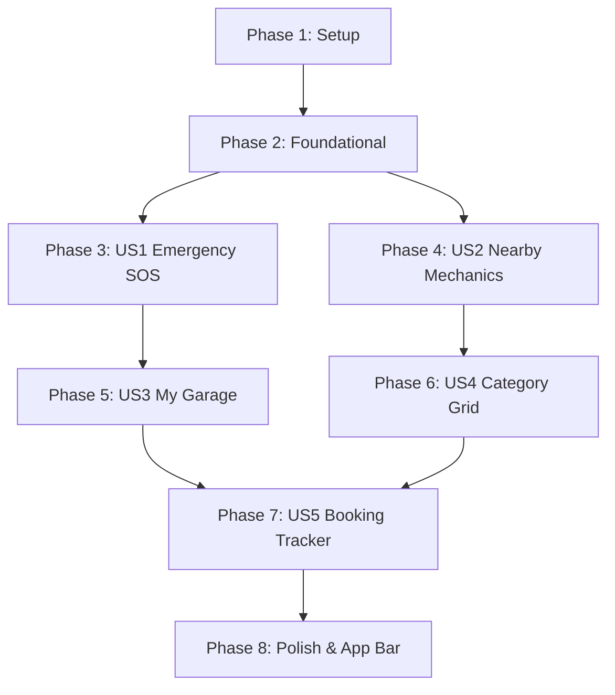

# Tasks: Redesign Customer Home Page

**Feature**: [001-redesign-customer-home](spec.md) | **Plan**: [plan.md](plan.md)

## Phase 1: Setup & Prerequisite Validation

**Purpose**: Verify dependencies and ensure client runtime and backend APIs are active.

- [X] T001 Verify backend server is active on `http://192.168.100.171:4000` via health query
- [X] T002 Verify `expo-linear-gradient` and `@expo/vector-icons` bindings in `package.json`

---

## Phase 2: Foundational Architecture & Helper Layer

**Purpose**: Shared utilities, theme tokens, and data-fetching hooks needed by all home page components.

- [X] T003 [P] Verify and expand Haversine distance unit formatting (`< 1 km` in meters `m`, `>= 1 km` in `km`) in `src/utils/helpers.ts`
- [X] T004 [P] Verify vehicle API service methods (`api.vehicles.getAll()`) in `src/services/api.ts`
- [X] T005 [P] Verify active booking fetch and status filtering in `src/store/index.ts`

**Checkpoint**: Core data fetching and distance formatting verified.

---

## Phase 3: User Story 1 - Instant Emergency Roadside Rescue (Priority: P1) 🎯 MVP

**Goal**: Provide an unmistakable, high-impact 24/7 Roadside Rescue SOS card with a 1-tap route to emergency dispatch.

**Independent Test**: Tapping the Emergency widget immediately opens `EmergencyScreen` with location pre-filled.

- [X] T006 [US1] Build high-contrast Roadside Rescue SOS component with pulsating alert badge in `src/screens/customer/HomeScreen.tsx`
- [X] T007 [US1] Bind 1-tap navigation trigger to `Emergency` route in `src/screens/customer/HomeScreen.tsx`
- [X] T008 [US1] Add responsive styling and emergency color gradients in `src/screens/customer/HomeScreen.tsx`

**Checkpoint**: User Story 1 (Emergency SOS) is fully functional and independently testable.

---

## Phase 4: User Story 2 - Discover Nearby Mechanics with Meter/KM Distance (Priority: P1) 🎯 MVP

**Goal**: Display nearby mechanics sorted by proximity with dynamic meters/kilometers distance badges, star ratings, and 1-tap profile/booking navigation.

**Independent Test**: Mechanics feed populates with `450 m` or `1.4 km` badges; tapping any card opens `ProviderDetailScreen`.

- [X] T009 [US2] Implement enhanced `NearbyMechanicsSection` with horizontal or vertical card feed in `src/screens/customer/HomeScreen.tsx`
- [X] T010 [US2] Bind `getFormattedDistance(currentLocation, provider.location)` to compute accurate meter/km badges for each mechanic in `src/screens/customer/HomeScreen.tsx`
- [X] T011 [US2] Render verified badges, star rating, review counts, and availability dots (`Available` / `Busy`) in `src/screens/customer/HomeScreen.tsx`
- [X] T012 [US2] Add 1-tap "Book Now" and card press navigation to `ProviderDetail` in `src/screens/customer/HomeScreen.tsx`

**Checkpoint**: User Story 2 (Nearby Mechanics Feed) is functional and verified.

---

## Phase 5: User Story 3 - "My Garage" Vehicle Health Card & AI Diagnostic (Priority: P2)

**Goal**: Showcase the customer's registered vehicle specs, health status, and a 1-tap shortcut to AI Diagnostics.

**Independent Test**: User's registered car (e.g. `2020 Toyota Camry • 2A-1234`) renders with health indicators; tapping "AI Scan" opens `DiagnosticsScreen`.

- [X] T013 [US3] Add vehicle state fetching using `api.vehicles.getAll()` inside `HomeScreen.tsx`
- [X] T014 [US3] Build `GarageVehicleCard` component rendering primary vehicle name, plate number, and health status in `src/screens/customer/HomeScreen.tsx`
- [X] T015 [US3] Build empty-state prompt ("Add Your Vehicle") navigating to `VehicleAdd` if no vehicles exist in `src/screens/customer/HomeScreen.tsx`
- [X] T016 [US3] Add 1-tap "Run AI Scan" action button navigating to `Diagnostics` in `src/screens/customer/HomeScreen.tsx`

**Checkpoint**: User Story 3 ("My Garage" Widget) is functional and verified.

---

## Phase 6: User Story 4 - Interactive Automotive Service Category Grid (Priority: P2)

**Goal**: Provide 6 automotive service category pills (Diagnostics, Towing, Oil & Lube, Tires, Battery, Auto Parts) that pre-filter the Search screen.

**Independent Test**: Tapping "Battery" transitions to the Search screen filtered to battery mechanics.

- [X] T017 [US4] Design 6 automotive service category tiles with icons and badge accents in `src/screens/customer/HomeScreen.tsx`
- [X] T018 [US4] Implement category selection handler navigating to `CustomerTabs` -> `Search` with category param in `src/screens/customer/HomeScreen.tsx`
- [X] T019 [US4] Ensure "Shop Parts" tile navigates directly to `Shop` in `src/screens/customer/HomeScreen.tsx`

**Checkpoint**: User Story 4 (Category Grid) is functional and verified.

---

## Phase 7: User Story 5 - Live Active Booking Tracker Banner (Priority: P3)

**Goal**: Display a prominent, real-time status banner whenever an active or in-progress booking exists.

**Independent Test**: With an active booking, the home screen renders an ETA card with 1-tap link to `CustomerTrackingScreen`.

- [X] T020 [US5] Query `useBookingStore` for active bookings (`CONFIRMED` or `IN_PROGRESS`) in `src/screens/customer/HomeScreen.tsx`
- [X] T021 [US5] Render `ActiveBookingBanner` with mechanic name, service type, and live tracking button in `src/screens/customer/HomeScreen.tsx`
- [X] T022 [US5] Bind tracking action to open `CustomerTracking` screen in `src/screens/customer/HomeScreen.tsx`

**Checkpoint**: User Story 5 (Booking Tracker) is functional and verified.

---

## Phase 8: Polish, App Bar & Cross-Cutting Concerns

**Purpose**: Modern app bar, pull-to-refresh synchronization, and visual polish across all sections.

- [X] T023 [P] Build modern top app bar with live location chip (`📍 Olympic Stadium, Phnom Penh`), customer avatar, and notification badge in `src/screens/customer/HomeScreen.tsx`
- [X] T024 [P] Implement pull-to-refresh syncing location, nearby providers, vehicles, and bookings in `src/screens/customer/HomeScreen.tsx`
- [X] T025 [P] Validate TypeScript types and bundle iOS bundle via `npx expo export --platform ios --no-bytecode`
- [X] T026 Execute verification checklist according to `quickstart.md`

---

## Dependencies & Execution Order

### Parallel Opportunities
- Tasks T003, T004, T005 in Phase 2 can run in parallel.
- US1 (Emergency SOS) and US2 (Nearby Mechanics) can be developed in parallel.
- Polish tasks T023 and T024 can be finalized concurrently.
