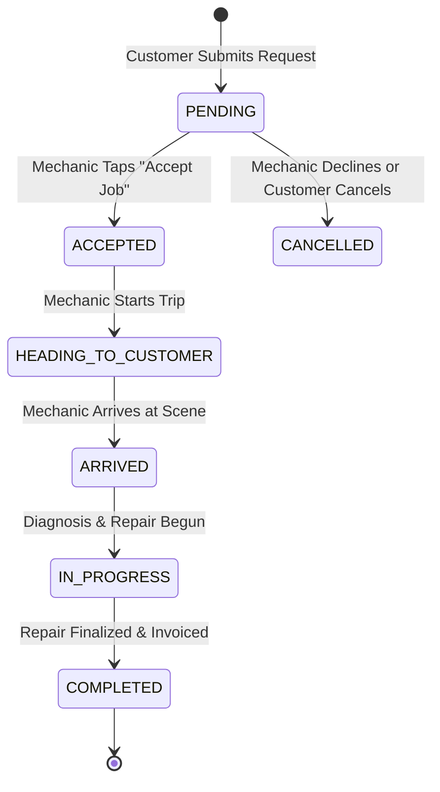

# Data Model: Modern Mechanic Design & Provider Experience

**Feature**: Modern Mechanic Design & Provider Experience  
**Spec**: [specs/002-mechanic-design-view/spec.md](spec.md)  
**Date**: 2026-09-19

## 1. Core Entities

### ServiceProvider
Represents the automotive specialist, mobile mechanic, or garage workshop on the platform.

| Field | Type | Required | Description |
| :--- | :--- | :---: | :--- |
| `id` | String (UUID) | Yes | Unique provider identifier. |
| `userId` | String (UUID) | Yes | Foreign key to User account. |
| `businessName` | String | Yes | Name of garage or technician trading name (e.g. "Sokha Auto Repair"). |
| `description` | String | No | Workshop bio, specializations, and tooling equipment. |
| `address` | String | Yes | Physical workshop address or mobile operating base. |
| `latitude` | Float | Yes | Geographical latitude for proximity calculations. |
| `longitude` | Float | Yes | Geographical longitude for proximity calculations. |
| `rating` | Float | Yes | Aggregate rating score (1.0 to 5.0). Default `4.8`. |
| `reviewCount` | Int | Yes | Total customer reviews recorded. Default `0`. |
| `isAvailable` | Boolean | Yes | Real-time duty status: `true` (Online) / `false` (Offline). |
| `isVerified` | Boolean | Yes | Platform verification status badge. |
| `services` | ServiceItem[] | No | Array of provided automotive services. |

---

### Booking & Dispatch Request
Represents an emergency roadside rescue or scheduled maintenance reservation.

| Field | Type | Required | Description |
| :--- | :--- | :---: | :--- |
| `id` | String (UUID) | Yes | Unique booking reference (e.g. `#BK-8902`). |
| `customerId` | String (UUID) | Yes | Stranded motorist / car owner identifier. |
| `providerId` | String (UUID) | Yes | Assigned mechanic / workshop identifier. |
| `serviceType` | String | Yes | Categorized service (e.g. "Emergency Roadside", "Battery Jumpstart"). |
| `status` | BookingStatus | Yes | Current lifecycle stage (see state machine below). |
| `isEmergency` | Boolean | Yes | Urgent flag prioritizing roadside rescue dispatch. |
| `scheduledDate` | DateTime | Yes | Scheduled appointment date or instant timestamp. |
| `scheduledTime` | String | Yes | Human-readable time slot (e.g. "Immediate Dispatch" or "10:00 AM"). |
| `totalPrice` | Float | Yes | Total fare including labor, dispatch callout, and parts ($ USD). |
| `vehicleMake` | String | No | Vehicle make (e.g. "Toyota"). |
| `vehicleModel` | String | No | Vehicle model (e.g. "Hilux"). |
| `vehiclePlate` | String | No | License plate number (e.g. "Phnom Penh 2B-8899"). |
| `notes` | String | No | Customer breakdown symptoms / driver instructions. |
| `pickupLocation`| Object | No | Customer GPS coordinates `{ latitude, longitude, address }`. |

---

## 2. Booking Lifecycle State Machine

### Transition Validation Rules
1. **PENDING &rarr; ACCEPTED**: Can only be triggered by the assigned provider. Emits push alert to customer with mechanic name and ETA.
2. **ACCEPTED &rarr; HEADING_TO_CUSTOMER**: Starts GPS route updates on `MechanicTrackingScreen.tsx`.
3. **HEADING_TO_CUSTOMER &rarr; ARRIVED**: Permitted when mechanic GPS is within proximity or manually triggered at breakdown location.
4. **IN_PROGRESS &rarr; COMPLETED**: Requires mechanic confirmation of final price and service breakdown. KHQR or cash payment confirmation generated.
