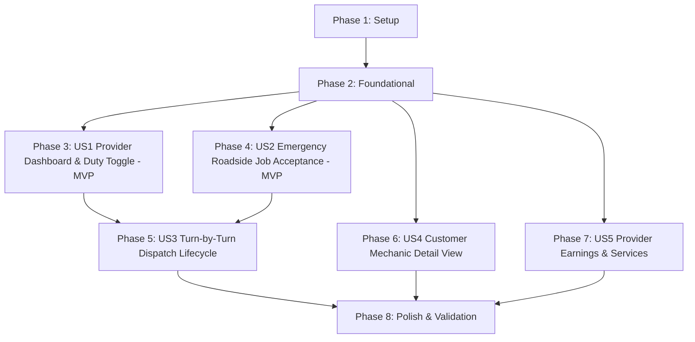

# Tasks: Modern Mechanic Design & Provider Experience

**Branch**: `002-mechanic-design-view` | **Date**: 2026-09-19 | **Spec**: [spec.md](spec.md) | **Plan**: [plan.md](plan.md)

## Phase 1: Setup (Shared Infrastructure)

**Purpose**: Verify backend and mobile foundation for mechanic provider operations

- [x] T001 Verify provider authentication and role authorization in `src/navigation/ProviderNavigator.tsx`
- [x] T002 [P] Verify seed data accounts (`sokha@test.com` provider and `customer@test.com`) in `backend/prisma/seed.ts`
- [x] T003 [P] Configure provider API service helper functions in `src/services/api.ts`

---

## Phase 2: Foundational (Blocking Prerequisites)

**Purpose**: Core state and backend endpoints required across all mechanic user stories

**⚠️ CRITICAL**: Must be completed before user story implementation begins

- [x] T004 Implement provider availability endpoint `PATCH /providers/me/availability` in `backend/src/routes/providers.ts`
- [x] T005 [P] Implement booking status transition endpoint `PATCH /bookings/:id/status` in `backend/src/routes/bookings.ts`
- [x] T006 [P] Add `isAvailable` duty state and toggle handler to `useAuthStore` in `src/store/index.ts`
- [x] T007 Extend `useBookingStore` in `src/store/index.ts` to support real-time status transitions (`ACCEPTED`, `HEADING_TO_CUSTOMER`, `ARRIVED`, `IN_PROGRESS`, `COMPLETED`)

**Checkpoint**: Foundation ready — user story implementation can now proceed

---

## Phase 3: User Story 1 - Provider Operations Dashboard & Duty Toggle (Priority: P1) 🎯 MVP

**Goal**: Provide mechanics with a high-contrast operational dashboard displaying a real-time Online/Offline duty switch and daily business metrics.

**Independent Test**: Sign in as `sokha@test.com`, toggle the duty switch in the header between Online and Offline, and verify that the status badge updates instantly and metric cards reflect active counts.

### Implementation for User Story 1

- [x] T008 [US1] Create interactive Online/Offline duty toggle switch component in `src/screens/provider/DashboardScreen.tsx`
- [x] T009 [P] [US1] Wire duty toggle to `PATCH /providers/me/availability` and optimistic state in `src/store/index.ts`
- [x] T010 [US1] Elevate 4 primary KPI cards (Today's Bookings, Pending Requests, Completed Month, Rating) with automotive styling in `src/screens/provider/DashboardScreen.tsx`
- [x] T011 [US1] Implement pull-to-refresh logic to synchronize metrics and provider bookings in `src/screens/provider/DashboardScreen.tsx`

**Checkpoint**: User Story 1 is functional — mechanics can control duty status and view operational statistics.

---

## Phase 4: User Story 2 - Urgent Roadside Rescue & Job Acceptance Workflow (Priority: P1) 🎯 MVP

**Goal**: Deliver high-contrast emergency dispatch alert cards surfacing customer vehicle details, breakdown symptoms, distance/ETA, and 1-tap Accept/Decline.

**Independent Test**: Trigger or view a pending emergency booking; verify that vehicle make/model, symptoms tag, and distance appear on the card, and tapping "Accept Job" transitions status to `ACCEPTED` in 1 tap.

### Implementation for User Story 2

- [x] T012 [US2] Redesign `BookingItem` in `src/screens/provider/DashboardScreen.tsx` to distinguish `EMERGENCY SOS` dispatches with pulsating badges and vehicle details
- [x] T013 [P] [US2] Display vehicle make, model, license plate, and breakdown symptoms directly on the card in `src/screens/provider/DashboardScreen.tsx`
- [x] T014 [US2] Implement 1-tap "Accept Job" handler connecting to `PATCH /bookings/:id/status` in `src/screens/provider/DashboardScreen.tsx`
- [x] T015 [US2] Implement "Decline" modal with quick reason selector in `src/screens/provider/DashboardScreen.tsx`

**Checkpoint**: User Stories 1 & 2 deliver an end-to-end MVP for provider dispatch monitoring.

---

## Phase 5: User Story 3 - Interactive Turn-by-Turn Dispatch & Job Lifecycle (Priority: P2)

**Goal**: Guide the mechanic along the physical journey with turn-by-turn route tracking, direct customer contact, and step-by-step milestone transitions.

**Independent Test**: Navigate to `MechanicTrackingScreen.tsx`, verify the route map and customer info, and tap each status milestone button ("Heading to Customer", "Arrived at Scene", "Complete Job").

### Implementation for User Story 3

- [x] T016 [US3] Connect route parameters and live customer GPS coordinates in `src/screens/mechanic/MechanicTrackingScreen.tsx`
- [x] T017 [P] [US3] Add quick-contact buttons (Direct Call and In-App Chat) in `src/screens/mechanic/MechanicTrackingScreen.tsx`
- [x] T018 [US3] Implement sequential progress buttons (`HEADING_TO_CUSTOMER` → `ARRIVED` → `IN_PROGRESS` → `COMPLETED`) in `src/screens/mechanic/MechanicTrackingScreen.tsx`
- [x] T019 [US3] Render invoice summary modal upon job completion showing labor, parts, and payment status in `src/screens/mechanic/MechanicTrackingScreen.tsx`

**Checkpoint**: Complete dispatch lifecycle is operational from dispatch acceptance to job completion.

---

## Phase 6: User Story 4 - Customer-Facing Mechanic Detail & Workshop Showcase (Priority: P2)

**Goal**: Overhaul the customer's view of a mechanic with a modern garage header, verified credential tags, meter/km distance indicators, itemized service pricing, and reviews.

**Independent Test**: Open `ProviderDetailScreen.tsx` from the customer home screen, verify map preview, check that distance displays in meters or km, and switch between About, Services, and Reviews tabs.

### Implementation for User Story 4

- [x] T020 [US4] Modernize hero header with map preview, verified garage badge, and aggregate star rating in `src/screens/customer/ProviderDetailScreen.tsx`
- [x] T021 [P] [US4] Format real-time distance using `getFormattedDistance` (`X m` or `X.X km`) in `src/screens/customer/ProviderDetailScreen.tsx`
- [x] T022 [US4] Refactor 3-tab content segmented controller (About Garage, Services Menu, Verified Reviews) in `src/screens/customer/ProviderDetailScreen.tsx`
- [x] T023 [US4] Implement sticky bottom action bar with 1-tap "Call Garage", "Chat", and "Book Emergency Dispatch" in `src/screens/customer/ProviderDetailScreen.tsx`

**Checkpoint**: Customer-facing workshop showcase provides complete transparency and 1-tap booking.

---

## Phase 7: User Story 5 - Provider Earnings & Service Catalog Customizer (Priority: P3)

**Goal**: Enable workshop providers to review gross/net earnings breakdowns, transaction histories, and customize their service menu and prices.

**Independent Test**: Navigate to Earnings and Services tabs in provider portal; verify revenue totals, platform fee deductions, and service pricing updates.

### Implementation for User Story 5

- [x] T024 [P] [US5] Modernize earnings summary cards (Gross, Platform Fee 10%, Net Payout) in `src/screens/provider/EarningsScreen.tsx`
- [x] T025 [US5] Render itemized transaction payout history with KHQR/Cash badges in `src/screens/provider/EarningsScreen.tsx`
- [x] T026 [P] [US5] Add service availability toggle and price editor in `src/screens/provider/ServicesScreen.tsx`

**Checkpoint**: Full business management capabilities enabled for mechanics and repair workshops.

---

## Phase 8: Polish & Cross-Cutting Concerns

**Purpose**: Cross-cutting enhancements, aesthetic refinements, and end-to-end verification

- [x] T027 [P] Verify smooth navigation between `DashboardScreen.tsx` and `MechanicTrackingScreen.tsx` in `src/navigation/ProviderNavigator.tsx`
- [x] T028 [P] Run static TypeScript type validation (`npx tsc --noEmit`) across frontend and backend
- [x] T029 Execute full quickstart verification scenarios in `specs/002-mechanic-design-view/quickstart.md`
- [x] T030 Final UI polish for high-contrast automotive color tokens and haptic feedback simulation

---

## Dependencies & Execution Order

### Phase Dependencies

### Parallel Opportunities

- **Setup Phase**: T002 & T003 can execute in parallel.
- **Foundational Phase**: T005, T006, and T007 can execute in parallel once T004 is active.
- **User Story 1 & 2**: Can be implemented in parallel once Foundational (Phase 2) is complete.
- **User Story 4 (Customer View)**: Operates on `ProviderDetailScreen.tsx` and can be implemented in parallel with Provider Dashboard work.
- **User Story 5 (Earnings & Services)**: Can be developed concurrently with US3.

---

## Implementation Strategy

### MVP Scope (User Stories 1 & 2)
1. Complete **Phase 1: Setup** & **Phase 2: Foundational**.
2. Implement **User Story 1**: Duty switch & dashboard KPI cards.
3. Implement **User Story 2**: Emergency roadside SOS request cards with 1-tap Accept/Decline.
4. **Validate MVP**: Sign in as `sokha@test.com` and accept a live emergency job.
