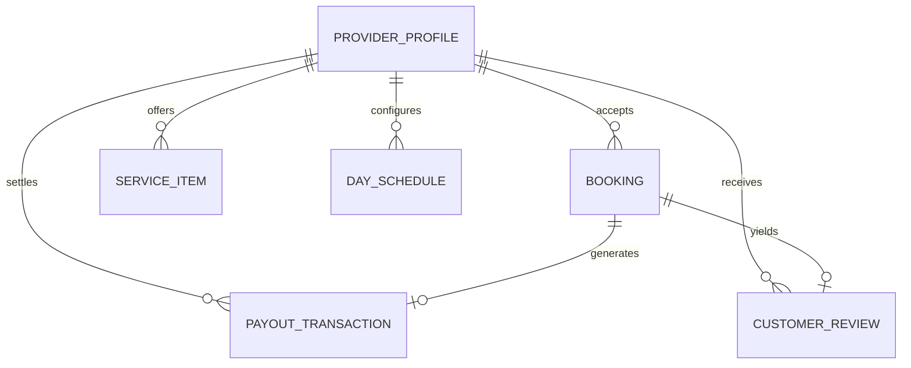
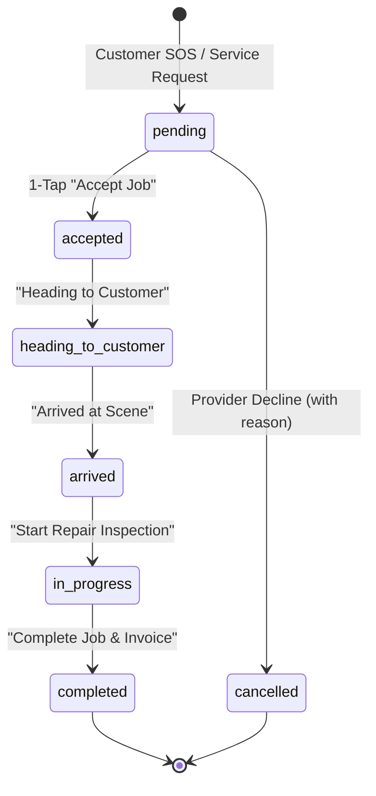

# Data Model & Schema Specifications: Full Provider Portal Redesign

**Feature Branch**: `003-provider-portal-redesign`  
**Date**: 2026-09-19  
**Status**: Completed  
**Spec**: [spec.md](spec.md) | **Plan**: [plan.md](plan.md)

---

## 1. Entity Definitions & Schemas

### ProviderProfile
Represents the workshop or mobile mechanic's business identity, credentials, and dispatch settings.

```typescript
interface ProviderProfile {
  id: string;
  userId: string;
  businessName: string;
  ownerName: string;
  phone: string;
  email: string;
  avatarUrl: string;
  coverImageUrl: string;
  address: string;
  coordinates: {
    latitude: number;
    longitude: number;
  };
  dispatchRadiusKm: number;      // 5 to 50 km
  isDutyOnline: boolean;          // Active duty switch
  isEmergencyOnCall: boolean;     // 24/7 night-shift emergency dispatch
  certifications: string[];      // e.g., ["ASE Certified", "Master Hybrid Specialist"]
  rating: number;                // e.g., 4.9
  reviewCount: number;           // e.g., 128
  totalJobsCompleted: number;    // e.g., 342
  khqrAccount: {
    bankName: string;            // e.g., "ABA Bank"
    accountName: string;         // e.g., "SOKHA AUTO REPAIR"
    accountNumber: string;       // e.g., "001 234 567"
  };
}
```

---

### Booking (Extended Provider View)
Represents customer service and roadside rescue dispatches.

```typescript
type BookingStatus = 
  | 'pending'
  | 'accepted'
  | 'heading_to_customer'
  | 'arrived'
  | 'in_progress'
  | 'completed'
  | 'cancelled';

interface Booking {
  id: string;
  customerId: string;
  customerName: string;
  customerPhone: string;
  customerAvatar?: string;
  vehicle: {
    make: string;
    model: string;
    year: number;
    licensePlate: string;
    color: string;
  };
  serviceType: string;           // e.g., "Emergency Roadside - Flat Tire"
  isEmergency: boolean;          // true for 24/7 SOS dispatches
  symptoms: string;              // Reported breakdown symptoms
  status: BookingStatus;
  distanceKm: number;            // Distance from provider to vehicle
  etaMinutes: number;            // Estimated arrival time
  estimatedPrice: number;        // Total USD
  createdAt: string;
  scheduledTime?: string;
}
```

---

### ServiceItem
Workshop service catalog offering.

```typescript
type ServiceCategory = 
  | 'Maintenance'
  | 'Inspection'
  | 'Diagnostics'
  | 'Brakes'
  | 'Tires'
  | 'Electric/Hybrid'
  | 'Engine'
  | 'Repair';

interface ServiceItem {
  id: string;
  providerId: string;
  name: string;
  category: ServiceCategory;
  description: string;
  price: number;                 // USD
  durationMinutes: number;       // Estimated duration (e.g., 45)
  isActive: boolean;             // Customer booking visibility
}
```

---

### ScheduleRule & DaySchedule
Working hours and weekly availability.

```typescript
interface DaySchedule {
  day: string;                   // 'Monday', 'Tuesday', ...
  shortDay: string;              // 'Mon', 'Tue', ...
  isEnabled: boolean;            // true if workshop open
  startTime: string;             // '08:00'
  endTime: string;               // '18:00'
  emergencyNightShift?: boolean; // true if available for 24/7 SOS after-hours
}

interface AppointmentSlot {
  id: string;
  time: string;                  // '09:00'
  isBooked: boolean;
  bookingId?: string;
  customerName?: string;
  vehicleModel?: string;
  serviceName?: string;
}
```

---

### PayoutTransaction
Financial ledger records and KHQR settlements.

```typescript
interface PayoutTransaction {
  id: string;
  providerId: string;
  bookingId?: string;
  type: 'earning' | 'withdrawal' | 'platform_fee';
  amount: number;                // USD
  feeAmount: number;             // USD (10% platform fee)
  netAmount: number;             // USD
  paymentMethod: 'KHQR' | 'CASH' | 'CARD';
  description: string;
  status: 'completed' | 'pending' | 'processing';
  createdAt: string;
}
```

---

### CustomerReview
Reputation feedback and mechanic replies.

```typescript
interface CustomerReview {
  id: string;
  providerId: string;
  customerName: string;
  customerAvatar?: string;
  vehicleTag: string;            // e.g., "Lexus RX350 (2024)"
  serviceType: string;           // e.g., "Brake Pad Replacement"
  rating: number;                // 1 to 5
  comment: string;
  date: string;
  reply?: {
    text: string;
    repliedAt: string;
  };
}
```

---

## 2. Mermaid Entity Relationship Diagram



---

## 3. Booking Lifecycle State Transitions


