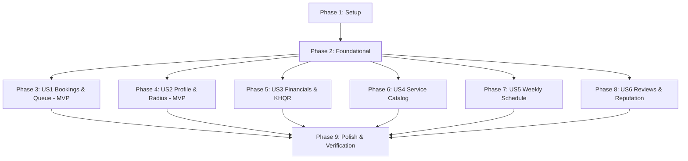

# Tasks: Full Provider Portal Redesign

**Branch**: `003-provider-portal-redesign` | **Date**: 2026-09-19 | **Spec**: [spec.md](spec.md) | **Plan**: [plan.md](plan.md)

## Phase 1: Setup (Shared Infrastructure)

**Purpose**: Verify mobile and backend foundations across all provider navigation routes and design tokens

- [x] T001 Verify provider navigation routes in `src/navigation/ProviderNavigator.tsx` and route param types in `src/navigation/types.ts`
- [x] T002 [P] Verify provider API helper definitions in `src/services/api.ts`
- [x] T003 [P] Verify automotive design tokens (`colors.primary`, `colors.success`, `colors.error`, `colors.warning`, `shadows.md`) in `src/constants/theme.ts`

---

## Phase 2: Foundational (Blocking Prerequisites)

**Purpose**: Core state, helper models, and backend endpoints required across all 6 provider screens

**⚠️ CRITICAL**: Must be completed before user story implementation begins

- [x] T004 Implement provider settings endpoint `PATCH /providers/me/settings` in `backend/src/routes/providers.ts`
- [x] T005 [P] Extend `useAuthStore` in `src/store/index.ts` with dispatch settings (`dispatchRadiusKm`, `isEmergencyOnCall`)
- [x] T006 [P] Extend `useBookingStore` in `src/store/index.ts` with multi-criteria booking search and filter helpers
- [x] T007 [P] Create mock dataset for provider reviews and appointment schedule in `src/data/mockProviderData.ts`

**Checkpoint**: Foundation ready — user story implementation can now proceed in parallel.

---

## Phase 3: User Story 1 - Unified Bookings & Emergency Dispatch Queue (Priority: P1) 🎯 MVP

**Goal**: Deliver a high-contrast bookings hub in `BookingsScreen.tsx` with real-time status filtering (All, Pending SOS, Active, Completed, Cancelled), vehicle plate search, and elevated dispatch cards.

**Independent Test**: Sign in as `sokha@test.com`, navigate to Bookings tab, filter by "Pending SOS", search for "2A-8888", and tap "Accept Job" to verify status transition.

### Implementation for User Story 1

- [x] T008 [US1] Redesign status filter tabs (`All`, `Pending SOS`, `Active`, `Completed`, `Cancelled`) with automotive pill styling in `src/screens/provider/BookingsScreen.tsx`
- [x] T009 [P] [US1] Implement live search input (filtering by customer name, phone, plate, or vehicle model) in `src/screens/provider/BookingsScreen.tsx`
- [x] T010 [US1] Redesign booking card item with vehicle make/model pill, license plate (`🇰🇭 2A-8888`), symptoms tag, and proximity badge in `src/screens/provider/BookingsScreen.tsx`
- [x] T011 [US1] Wire 1-tap quick actions (Accept Job, Decline, Track/Navigate, Call Customer, Chat) in `src/screens/provider/BookingsScreen.tsx`
- [x] T012 [US1] Add modern empty state illustration and pull-to-refresh sync in `src/screens/provider/BookingsScreen.tsx`

**Checkpoint**: User Story 1 is fully functional and testable independently as an MVP dispatch triage hub.

---

## Phase 4: User Story 2 - Workshop Identity, Service Radius & Profile Settings (Priority: P1) 🎯 MVP

**Goal**: Deliver a comprehensive workshop Profile Screen in `ProfileScreen.tsx` with hero garage banner, verified technician credentials, interactive dispatch radius slider, 24/7 on-call toggle, and KHQR settings.

**Independent Test**: Open the Profile tab, verify the hero garage photo and verified badges, adjust the dispatch radius slider to 25 km, toggle 24/7 On-Call switch, and verify store persistence.

### Implementation for User Story 2

- [x] T013 [US2] Build hero workshop banner card with garage photo, verified technician credentials, and aggregate rating in `src/screens/provider/ProfileScreen.tsx`
- [x] T014 [P] [US2] Implement interactive Service Radius Slider (5 km - 50 km) with live km badge and optimistic persistence in `src/screens/provider/ProfileScreen.tsx`
- [x] T015 [US2] Implement 24/7 Roadside On-Call night shift toggle with emerald active badge in `src/screens/provider/ProfileScreen.tsx`
- [x] T016 [P] [US2] Add ABA KHQR Settlement Card and account linking modal in `src/screens/provider/ProfileScreen.tsx`
- [x] T017 [US2] Modernize grouped account settings rows (Language, Notifications, Terms, Logout) in `src/screens/provider/ProfileScreen.tsx`

**Checkpoint**: User Stories 1 & 2 deliver a complete operational MVP for provider dispatching and identity.

---

## Phase 5: User Story 3 - Financial Analytics, KHQR Settlement & Payout Hub (Priority: P2)

**Goal**: Overhaul `EarningsScreen.tsx` with Gross, 10% platform fee, Net withdrawable balance cards, period trend selector (`Week`, `Month`, `Year`), ABA KHQR withdrawal sheet, and itemized transaction ledger.

**Independent Test**: Navigate to Earnings, switch between Week and Month tabs, verify gross vs net calculation, tap "Withdraw via KHQR", and check payment method badges in transaction logs.

### Implementation for User Story 3

- [x] T018 [US3] Elevate 3 primary financial summary cards (Gross Revenue, Platform Fee 10%, Net Withdrawable) in `src/screens/provider/EarningsScreen.tsx`
- [x] T019 [P] [US3] Implement 3-way time period segmented controller (`Week`, `Month`, `Year`) with visual revenue trend comparison in `src/screens/provider/EarningsScreen.tsx`
- [x] T020 [US3] Implement interactive "Withdraw via KHQR" sheet with instant Bakong settlement simulator in `src/screens/provider/EarningsScreen.tsx`
- [x] T021 [P] [US3] Redesign itemized transaction ledger with method badges (`KHQR`, `Cash`, `Card`) and settlement status pills in `src/screens/provider/EarningsScreen.tsx`

**Checkpoint**: Complete financial tracking and frictionless digital withdrawal capabilities operational.

---

## Phase 6: User Story 4 - Workshop Service Catalog & Dynamic Pricing Manager (Priority: P2)

**Goal**: Redesign `ServicesScreen.tsx` with automotive category filter chips, active switches, inline price/duration editing, and a modal for adding new service packages.

**Independent Test**: Open Services tab, switch between category chips, toggle service active switch, edit service price, and add a new custom package.

### Implementation for User Story 4

- [x] T022 [US4] Implement horizontal automotive category filter chips (Maintenance, Inspection, Diagnostics, Brakes, Tires, EV/Hybrid) in `src/screens/provider/ServicesScreen.tsx`
- [x] T023 [P] [US4] Redesign service offering cards with active switch, price tag in USD, estimated duration, and category icon in `src/screens/provider/ServicesScreen.tsx`
- [x] T024 [US4] Implement interactive Add/Edit Service modal with category picker, price input, and validation in `src/screens/provider/ServicesScreen.tsx`
- [x] T025 [P] [US4] Wire service updates and deletions to local store with instant visual feedback in `src/screens/provider/ServicesScreen.tsx`

**Checkpoint**: Service catalog management and dynamic pricing are operational.

---

## Phase 7: User Story 5 - Weekly Operating Hours, Shift Management & On-Call Schedule (Priority: P3)

**Goal**: Redesign `ScheduleScreen.tsx` with a 7-day weekly schedule manager, opening/closing time pickers, 24/7 roadside night-shift card, and a daily appointment timeline.

**Independent Test**: Navigate to Schedule, toggle Sunday open/closed, change Monday opening hours, and inspect booked customer appointment slots in the daily timeline.

### Implementation for User Story 5

- [x] T026 [US5] Redesign 7-day weekly schedule manager with day toggle switches and opening/closing time selectors in `src/screens/provider/ScheduleScreen.tsx`
- [x] T027 [P] [US5] Add Emergency Night Shift on-call card with 24/7 roadside dispatch readiness badge in `src/screens/provider/ScheduleScreen.tsx`
- [x] T028 [US5] Build interactive daily appointment timeline showing chronological customer booking slots and availability status in `src/screens/provider/ScheduleScreen.tsx`

**Checkpoint**: Operating hours and appointment timeline are fully controllable.

---

## Phase 8: User Story 6 - Customer Reputation, Verified Reviews & Feedback Loop (Priority: P3)

**Goal**: Redesign `ReviewsScreen.tsx` with aggregate star rating hero, 5-star to 1-star percentage distribution bars, verified vehicle tags, and in-app mechanic reply capability.

**Independent Test**: Open Reviews, verify rating distribution bars, filter by 5-star reviews, and submit a reply to an unreplied customer review.

### Implementation for User Story 6

- [x] T029 [US6] Elevate aggregate rating hero card (4.9 ★) with 5-to-1 star percentage distribution bars in `src/screens/provider/ReviewsScreen.tsx`
- [x] T030 [P] [US6] Implement star filter selector (All, 5★, 4★, 3★, 2★, 1★) with instant review filtering in `src/screens/provider/ReviewsScreen.tsx`
- [x] T031 [US6] Redesign customer review cards with verified vehicle tags (*Lexus RX350 (2024)*) and service badges in `src/screens/provider/ReviewsScreen.tsx`
- [x] T032 [US6] Implement "Reply to Customer" composer modal and nested official workshop response display in `src/screens/provider/ReviewsScreen.tsx`

**Checkpoint**: Workshop reputation hub and customer feedback loop are operational.

---

## Phase 9: Polish & Cross-Cutting Concerns

**Purpose**: Navigation polish, theme consistency, and end-to-end verification

- [x] T033 [P] Verify bottom navigation tab bar styling and active icons across all provider screens in `src/navigation/ProviderNavigator.tsx`
- [x] T034 [P] Run static TypeScript type validation (`npx tsc --noEmit`) across root and backend
- [x] T035 Execute full end-to-end quickstart validation scenarios from `specs/003-provider-portal-redesign/quickstart.md`
- [x] T036 Final UI polish for smooth scrolling, shadow consistency, and zero text clipping across screens

---

## Dependencies & Execution Order

### Phase Dependencies

### Parallel Opportunities

- **Setup & Foundational**: T002, T003, T005, T006, and T007 can execute in parallel.
- **User Stories**: Once Foundational (Phase 2) is complete, all 6 user story phases operate on separate screen files and can be executed independently.
  - US1: `BookingsScreen.tsx`
  - US2: `ProfileScreen.tsx`
  - US3: `EarningsScreen.tsx`
  - US4: `ServicesScreen.tsx`
  - US5: `ScheduleScreen.tsx`
  - US6: `ReviewsScreen.tsx`

---

## Implementation Strategy

### MVP Scope (User Stories 1 & 2)
1. Complete **Phase 1: Setup** & **Phase 2: Foundational**.
2. Implement **User Story 1**: High-contrast Bookings queue & emergency triage.
3. Implement **User Story 2**: Workshop Profile with service radius & on-call settings.
4. **Validate MVP**: Sign in as `sokha@test.com` and verify booking triage and profile settings.

### Full Delivery
5. Implement **User Story 3**: Financial Analytics & KHQR Payouts.
6. Implement **User Story 4**: Service Catalog & Dynamic Pricing.
7. Implement **User Story 5**: Weekly Schedule & On-Call Shift Manager.
8. Implement **User Story 6**: Customer Reviews & Feedback Loop.
9. Run full TypeScript verification and quickstart scenario tests.
